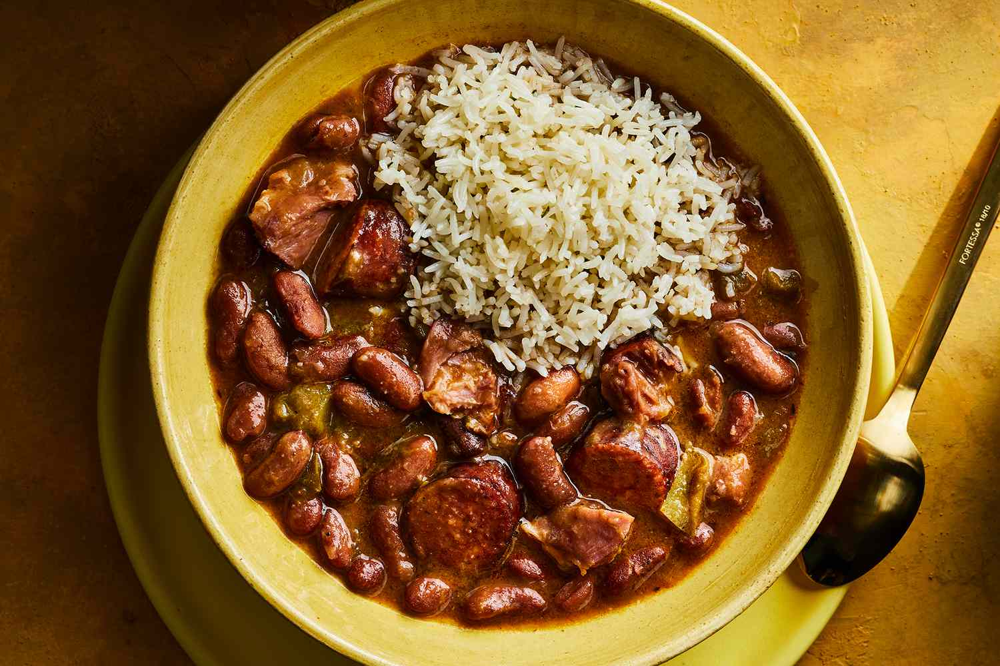

# Louisiana Red Beans and Rice

*Louisiana's Monday dish: red kidney beans slow-cooked with smoked pork (ham hock or smoked sausage), the trinity, bay leaves, thyme and Cajun spices till creamy and thick, served over fluffy white rice. The wash-day Monday tradition; the traditional New Orleans Monday meal for generations.*

**Serves:** 6-8

**Prep Time:** 20 minutes (plus overnight bean soak)

**Cook Time:** 2.5 hours

## Overview
Louisiana red beans and rice is the traditional Monday dish in New Orleans: dried red kidney beans soaked overnight, slow-cooked with a smoked ham hock (or smoked sausage; or both) for the pork backbone, the trinity (onion, celery, green pepper), garlic, bay leaves, thyme, Cajun spices, hot sauce, and water for 2.5 hours till the beans are tender and the broth has thickened to creamy. Served over fluffy white rice. The dish has Monday associations because Monday was traditional laundry day in New Orleans, and beans could slow-cook unattended while the cook ran the washing.

## Ingredients

- 500 g dried red kidney beans (soaked overnight, drained)
- 1 large smoked ham hock (about 800 g)
- 400 g andouille sausage (sliced into rounds)
- 2 large onions (chopped)
- 6 sticks celery (chopped)
- 2 green bell peppers (chopped)
- 10 garlic cloves (crushed)
- 4 tablespoons vegetable oil
- 2 bay leaves
- 1 tablespoon dried thyme
- 1 tablespoon paprika
- 1 tablespoon Cajun seasoning
- 1 teaspoon cayenne
- 1 ½ teaspoons fine sea salt
- 1 teaspoon ground black pepper
- 2 tablespoons Worcestershire sauce
- 1 tablespoon hot sauce
- 2 litres water (or chicken stock)

### To finish
- 1 bunch spring onions (sliced)
- 1 small bunch fresh parsley
- Hot sauce (Crystal or Tabasco)

### To serve
- Steamed long-grain rice
- Cornbread
- Pickled okra

## Method

### Stage 1 - Sauté
1. Heat oil in heavy pot.
2. Add onion, celery, green pepper; cook 8 min.
3. Add garlic; cook 30 sec.

### Stage 2 - Add pork
1. Add ham hock and andouille rounds.
2. Cook 4 min.

### Stage 3 - Add beans and liquid
1. Add soaked drained beans.
2. Add bay leaves, thyme, paprika, Cajun seasoning, cayenne, salt, pepper, Worcestershire, hot sauce.
3. Pour in water/stock.

### Stage 4 - Simmer slow
1. Bring to simmer.
2. Reduce to lowest heat.
3. Cover slightly ajar.
4. Cook 2.5 hours till beans creamy and broth thickened.

### Stage 5 - Shred pork
1. Remove ham hock.
2. Discard skin, bone, fat.
3. Shred meat; return to pot.

### Stage 6 - Mash some beans
1. Mash a cupful of beans against the side of the pot.
2. Stir back in for creamier texture.

### Stage 7 - Adjust and serve
1. Taste; adjust salt.
2. Spoon rice into bowls.
3. Ladle beans over.
4. Top with spring onion, parsley, hot sauce.

## Notes
- **Smoked pork essential.**
- **Slow-cook 2.5 hours:** for creamy texture.
- **Mash some beans:** thickens the broth.

## Variations
- **Vegetarian:** skip pork; use smoked paprika + liquid smoke + vegetable stock.
- **Without andouille:** ham hock only.
- **Spicier:** double cayenne + extra hot sauce.
- **With pickled pork:** add a small piece (very traditional).

## Serving
- Monday dinner. Over rice with hot sauce, cornbread.

## Storage
- Keeps refrigerated 5 days; famously better day 2.
- Freezes 3 months.
- Reheat slowly with splash of water.
