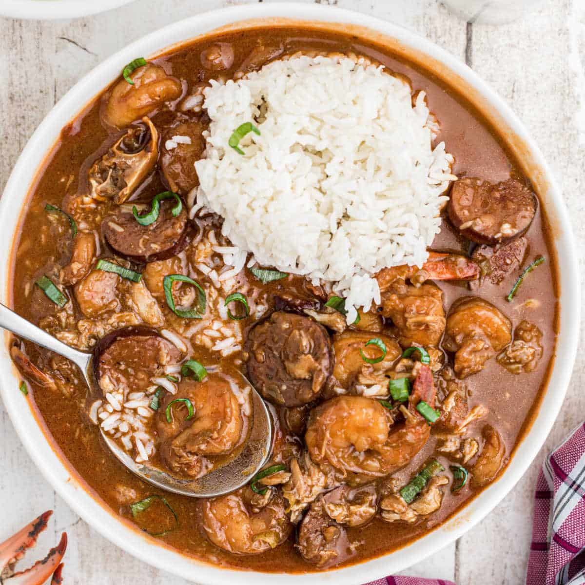

# Louisiana Seafood Gumbo

*Louisiana's coastal gumbo: shrimp, crab, oysters and andouille in a dark roux base with the trinity (onion, celery, green pepper), okra and filé. The Gulf Coast Cajun-Creole classic; the gumbo for Easter, Christmas Eve, family feasts.*

**Serves:** 8

**Prep Time:** 40 minutes

**Cook Time:** 1.5 hours

## Overview
Louisiana seafood gumbo is the coastal counterpart to chicken-andouille gumbo: same dark roux foundation, same trinity, but the protein is Gulf seafood: peeled shrimp, lump crab meat, and oysters (in their liquor), with often a touch of andouille for smokiness. Okra (sliced fresh, or cooked separately) adds the canonical thickening alongside filé. Served over rice with hot sauce and chopped spring onion. The "gumbo for special occasions" in Cajun-Creole Louisiana.

## Ingredients

### Roux
- 200 ml vegetable oil
- 200 g plain flour

### Trinity
- 2 large onions (chopped)
- 6 sticks celery (chopped)
- 2 large green bell peppers (chopped)
- 12 garlic cloves (crushed)

### Seafood
- 800 g raw peeled shrimp (with tails on or off)
- 500 g lump crab meat (picked through for shell)
- 250 g shucked oysters with their liquor
- 200 g andouille sausage (sliced; optional)

### Vegetables
- 400 g okra (sliced; fresh or frozen)
- 1 tin (400 g) chopped tomatoes
- 1 tablespoon tomato paste

### Liquid and seasoning
- 2 litres hot seafood or chicken stock
- 2 bay leaves
- 1 tablespoon dried thyme
- 1 tablespoon paprika
- 1 tablespoon Cajun seasoning
- 1 teaspoon cayenne
- 2 teaspoons fine sea salt
- 1 teaspoon ground black pepper
- 1 tablespoon Worcestershire sauce
- 1 ½ tablespoons filé powder (added at end)
- Juice of 1 lemon

### To finish
- 1 bunch spring onions
- 1 small bunch fresh parsley
- Tabasco

### To serve
- Steamed long-grain rice
- French bread
- Pickled okra

## Method

### Stage 1 - Make dark roux
1. Heat oil; whisk in flour over medium-low.
2. Cook 25-40 min till deep mahogany.

### Stage 2 - Add trinity
1. Add onion, celery, bell pepper.
2. Cook 8 min.
3. Add garlic; 30 sec.

### Stage 3 - Add okra and tomato
1. Add sliced okra; cook 5 min.
2. Stir in tomato paste; cook 1 min.
3. Add chopped tomatoes.

### Stage 4 - Add stock
1. Whisk in hot stock.
2. Bring to simmer.

### Stage 5 - Add andouille and season
1. Add andouille (if using).
2. Add bay leaves, thyme, paprika, Cajun seasoning, cayenne, salt, pepper, Worcestershire.
3. Simmer 45 min.

### Stage 6 - Add seafood
1. Add shrimp; cook 4 min.
2. Add crab and oysters with their liquor; cook 3 min more.
3. Don't overcook.

### Stage 7 - Finish
1. Add lemon juice.
2. Stir in filé powder off heat.
3. Don't boil after filé.

### Stage 8 - Serve
1. Rice in bowls; gumbo around.
2. Spring onion, parsley, hot sauce.

## Notes
- **Don't overcook seafood:** 4 min shrimp, 3 min crab/oysters.
- **Add filé off heat.**
- **Lemon juice brightens at end.**

## Variations
**With crab boil:** add Old Bay or Louisiana crab boil mix.
**Without okra:** use only filé for thickening.
**Spicier:** double cayenne.
**With smoked sausage:** swap andouille for kielbasa or similar.

## Serving
Over rice with hot sauce, French bread.

## Storage
- Keeps refrigerated 3 days; seafood doesn't keep as well as chicken.
- Freeze without seafood; add fresh seafood when reheating.
