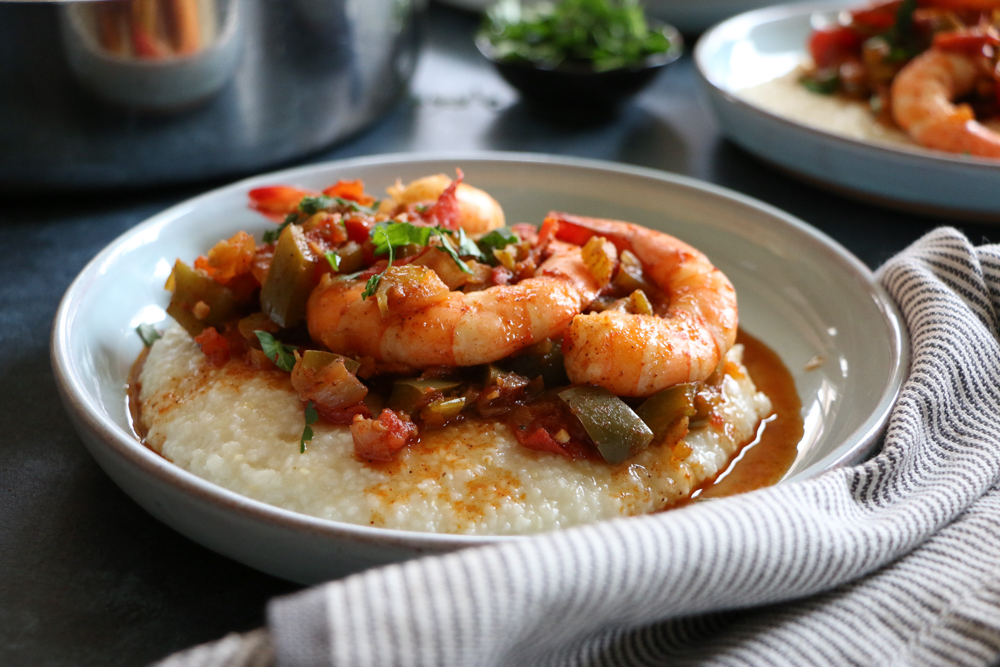

# Shrimp and Grits with Creole Sauce

*The Lowcountry classic with a New Orleans accent: stone-ground grits stirred soft with butter and cheese, topped with shrimp in a Creole tomato-and-pepper sauce that crackles with cayenne and the holy trinity.*

**Serves:** 4

**Prep Time:** 15 minutes

**Cook Time:** 45 minutes

## Overview
Shrimp and grits is a Carolina Lowcountry dish that travelled west through the Gulf Coast and picked up a New Orleans accent on the way. The Charleston version is restrained: shrimp poached in butter and stock over rich grits, finished with bacon and a squeeze of lemon. The Creole version, this one, is louder. The shrimp gets cooked in a proper Creole sauce: holy trinity sweated in oil, tomato and stock building a sauce, cayenne and paprika doing the heat, Worcestershire and hot sauce as the Louisiana background. The grits stay creamy and unflashy underneath, a calm anchor for the sauce on top.

The grits themselves are the second decision. Stone-ground grits (coarse, slow-cooking, 40 minutes) give the proper texture; quick or instant grits cook in five minutes but taste of cardboard. If you cannot find stone-ground grits, polenta is the closest substitute: same grain (corn), same cooking method, slightly different end texture but the dish still works.

A glass of cold lager or sweet iced tea on the side. Cornbread is unnecessary but welcome.

## Ingredients

### Grits
- 200 g stone-ground white or yellow grits (or polenta)
- 1 litre water (or 500 ml water + 500 ml whole milk for richer grits)
- 1 tsp fine salt
- 75 g unsalted butter
- 100 g sharp cheddar (grated; mild or medium also works)
- A grating of black pepper

### Creole sauce
- 600 g raw shrimp (peeled and deveined; tails on for presentation if you like)
- 3 tbsp neutral oil
- 1 large onion (finely chopped)
- 2 celery sticks (finely chopped)
- 1 green bell pepper (finely chopped)
- 1 red bell pepper (finely chopped)
- 4 garlic cloves (minced)
- 1 tin chopped tomatoes (400 g) or 4 fresh tomatoes (chopped)
- 1 tbsp tomato paste
- 200 ml shellfish stock or chicken stock
- 1 bay leaf
- 1 tsp sweet paprika
- 1 tsp dried thyme
- ½ tsp cayenne pepper (more for heat)
- ½ tsp ground white pepper
- ½ tsp ground black pepper
- 1 tsp Creole seasoning (Tony Chachere's, or the spice rub from [Blackened Redfish](blackened-redfish.md))
- 1 tsp salt
- 2 tsp Worcestershire sauce
- 2 tsp Louisiana hot sauce (Crystal or Tabasco)
- 1 tbsp lemon juice

### To finish
- 3 rashers smoked streaky bacon (cut into 5 mm strips, optional but classic)
- 3 spring onions (finely sliced; whites and greens separated)
- Small handful flat-leaf parsley (chopped)
- Lemon wedges, to serve

## Method

### Stage 1 - Start the grits
1. Bring the water (and milk, if using) to a boil in a heavy saucepan. Add the salt.
1. Pour the grits in slowly while whisking continuously, to prevent lumps. Bring back to a gentle simmer.
1. Reduce the heat to its lowest setting. Cover with a tight lid.
1. Cook 35-40 minutes, stirring every 5 minutes and scraping the bottom and corners of the pan. The grits should pass through soupy → thick porridge → soft and creamy with a slight bite. If they get too thick before the time is up, splash in a little hot water and keep going.

### Stage 2 - Cook the bacon (if using)
1. While the grits cook, place the bacon strips in a cold dry frying pan. Set on medium heat. Cook 6-7 minutes, stirring, until the bacon is crisp and the fat has rendered.
1. Lift the bacon onto kitchen paper with a slotted spoon. Keep the fat in the pan; you will use 1 tbsp of it in the next stage.

### Stage 3 - Build the Creole sauce
1. Heat 3 tbsp oil (or 2 tbsp oil + 1 tbsp bacon fat) in a wide heavy pan over medium heat.
1. Add the chopped onion, celery, green pepper and red pepper. Cook 8-10 minutes, until soft and just starting to turn gold at the edges.
1. Stir in the garlic, the whites of the spring onions, paprika, thyme, cayenne, white pepper, black pepper, Creole seasoning and salt. Cook 1 minute.
1. Add the tomato paste; stir 1 minute. Add the chopped tomatoes and break them up with a wooden spoon. Cook 5 minutes, until the tomato has reduced to a thick sauce.
1. Pour in the stock, Worcestershire sauce and hot sauce. Add the bay leaf.
1. Simmer 12-15 minutes, uncovered, stirring occasionally. The sauce should reduce to a thick gravy that coats a spoon. Taste and adjust salt, cayenne and hot sauce.

### Stage 4 - Finish the grits
1. With 5 minutes to go on the sauce, stir the butter and cheese into the grits off the heat. The grits should now look glossy, smooth and almost silky. Grate over a few twists of black pepper. Cover and keep warm.

### Stage 5 - Cook the shrimp
1. Stir the raw shrimp into the simmering Creole sauce. Cover and cook 4-5 minutes, until the shrimp are just opaque and pink.
1. Off the heat. Stir in the lemon juice. Taste once more.

### Stage 6 - Serve
1. Spoon a generous mound of grits into the centre of each shallow bowl.
1. Ladle the Creole sauce and shrimp over the top.
1. Scatter with the crisp bacon, spring onion greens and parsley.
1. Tuck a lemon wedge on the side and serve immediately, with extra hot sauce on the table.

## Notes
- **Stone-ground grits are worth the 40 minutes.** Quick grits taste of starch and nothing else. If 40 minutes is too long, polenta is a better substitute than instant grits.
- **The Creole sauce reduces to a coating gravy.** Watery sauce makes a watery dish. Reduce until it clings to the back of a spoon before adding the shrimp.
- **Add the shrimp last.** Over-cooked shrimp is the easiest mistake to make. Four to five minutes in hot sauce is plenty.
- **Bacon is optional but classic.** A Charleston purist would protest; a NOLA cook would include it without thinking. Take a side.
- **Cheddar in the grits.** White cheddar or a mild yellow are both fine. Smoked cheddar pushes the dish toward the South Carolina version; Parmesan is wrong. Cheese is the difference between Charleston-style grits (cheesy) and the older South Carolina version (no cheese, just butter); the Creole version follows the cheesy convention.

## Variations
- **No bacon:** the grits still work without it; a Lowcountry tradition that does not use bacon is "cheese grits" with grated sharp cheddar only.
- **With andouille:** swap the bacon for 100 g diced andouille sausage, browned in the pan before the trinity. Pushes the dish further into Cajun territory.
- **With crab:** fold 100 g lump crabmeat into the sauce in the final minute alongside the shrimp. A New Orleans upgrade.

## Serving
A single bowl is a meal. Cornbread or a simple green salad on the side; nothing else needed. The grits will continue to thicken as they sit, so serve as soon as everything is in place.

## Storage
- Grits keep 2 days refrigerated and reheat well with a splash of milk to loosen.
- Creole sauce with shrimp keeps 2 days; reheat gently and just bring back to temperature so the shrimp don't toughen.
- The whole dish, assembled, does not store well; the grits and sauce merge into a single texture overnight. Store the components separately and combine on the plate.
