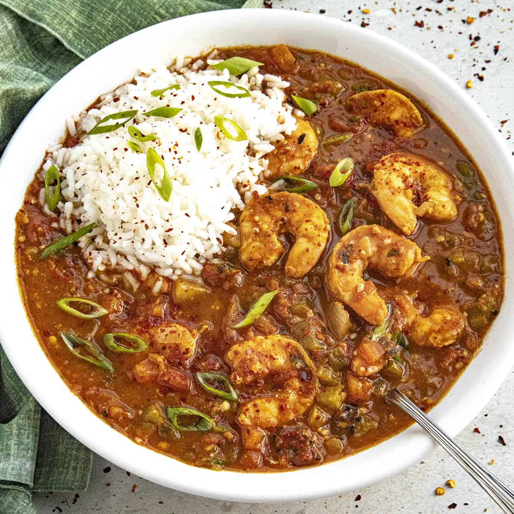

# Shrimp Étouffée

*Gulf shrimp smothered in a dark roux gravy with the holy trinity, cayenne and a long simmer. The Creole/Cajun crossover dish that proves a roux can carry seafood as well as it carries meat.*

**Serves:** 4

**Prep Time:** 20 minutes

**Cook Time:** 50 minutes

## Overview
Étouffée (literally "smothered" in French) is the Louisiana dish where shellfish meets dark roux. Crawfish is the traditional Cajun version; shrimp is the Creole-leaning variant, common across both traditions and the more accessible of the two outside Louisiana. The technique is a slow patient build: cook a roux of equal flour and oil to a deep peanut-butter brown, sweat the holy trinity (onion, celery, green pepper) into the roux, add stock and tomato to make a gravy, simmer to mature the flavour, then add raw shrimp in the final five minutes so they cook just to opaque in the heat of the sauce. The roux is the trick. Étouffée wants a darker roux than gumbo: the colour of a milk-chocolate Hershey bar, not the deeper coffee-brown of a gumbo. Lighter and the dish tastes raw; darker and it goes bitter. Eat over plain steamed rice with Louisiana hot sauce and sliced green spring onion, a cold beer or sweet iced tea alongside.

## Ingredients

### Roux
- 75 g neutral oil (or rendered bacon fat, for traditional richness)
- 75 g plain flour

### Smother
- 1 large onion (finely chopped, about 200 g)
- 2 celery sticks (finely chopped)
- 1 green bell pepper (finely chopped)
- 4 garlic cloves (minced)
- 2 tomatoes (chopped, or 200 g tinned chopped tomatoes)
- 1 tbsp tomato paste
- 600 ml shellfish stock (or chicken stock; ideally made from the shrimp shells)
- 1 bay leaf
- 1 tsp sweet paprika
- 1 tsp dried thyme
- ½ tsp cayenne pepper (more to taste)
- ½ tsp ground white pepper
- ½ tsp ground black pepper
- 1 tsp salt (or to taste)
- 2 tsp Worcestershire sauce
- 1 tsp Louisiana hot sauce (Crystal or Tabasco)

### Shrimp and finish
- 600 g raw shrimp (peeled and deveined; reserve shells for stock if making)
- 2 spring onions (finely sliced; whites and greens separated)
- Small handful flat-leaf parsley (chopped)
- Cooked plain rice, to serve
- Lemon wedges, to serve

### Shellfish stock (if making from shrimp shells)
- Shells from the 600 g shrimp
- 1 small onion (halved)
- 2 garlic cloves (smashed)
- 1 bay leaf
- 700 ml cold water

## Method

### Stage 1 - Make the stock (optional but recommended)
1. Combine the shrimp shells, onion, garlic, bay leaf and water in a saucepan. Bring to a gentle boil, then reduce to a low simmer.
1. Simmer 20 minutes. Skim any foam from the surface.
1. Strain through a fine sieve into a jug. Discard the solids. You should have about 600 ml.

### Stage 2 - Make the roux
1. Heat the oil in a heavy enamelled or cast-iron pan over medium heat.
1. Whisk in the flour all at once. Reduce the heat to medium-low.
1. Stir continuously with a wooden spoon, scraping the bottom of the pan and the corners, for 15-20 minutes. The roux will pass through pale gold, blond, peanut butter, and finally arrive at a deep milk-chocolate brown. Do not walk away; a burnt roux is bitter and the whole dish has to be restarted.
1. As soon as the colour is right, take the pan off the heat to stop the cooking.

### Stage 3 - Smother
1. Add the chopped onion, celery and green pepper to the hot roux. Return to medium heat. The vegetables will sizzle hard and the steam will smell unmistakable: this is the smell of Louisiana cooking. Stir constantly.
1. Cook 7-8 minutes, until the vegetables are soft and translucent.
1. Add the garlic, paprika, thyme, cayenne, white and black pepper, salt and the whites of the spring onions. Stir 1 minute.
1. Stir in the tomato paste, then the chopped tomatoes. Cook 2 minutes, until the tomato starts to break down.

### Stage 4 - Build the gravy
1. Pour in the warm shellfish stock in three additions, whisking smooth between each. The mixture will thicken as the roux meets the liquid.
1. Add the bay leaf, Worcestershire sauce and hot sauce. Bring to a gentle simmer.
1. Lower the heat and simmer 20 minutes, uncovered, stirring occasionally. The gravy should reduce to a consistency that coats the back of a spoon and leaves a clean line when you drag a finger through it. Taste; adjust salt, cayenne, and hot sauce.

### Stage 5 - Add the shrimp and finish
1. Stir the raw shrimp into the simmering gravy. The temperature will drop briefly.
1. Cover and cook 4-5 minutes, until the shrimp are just opaque and pink. Do not over-cook; chewy shrimp is the étouffée sin.
1. Off the heat. Stir in the spring onion greens and parsley.

## Stage 6 - Serve
1. Spoon over plain steamed rice in shallow bowls, allowing 4-5 large shrimp and a generous ladle of gravy per portion.
1. Serve with lemon wedges and a bottle of Louisiana hot sauce on the table.

## Notes
- **The roux is the dish.** A pale roux gives a thin, raw-tasting étouffée; a too-dark roux is bitter. Milk chocolate is the target. Twenty minutes is the time, give or take five.
- **Stock from shrimp shells is the upgrade.** Plain water makes an acceptable étouffée; chicken stock makes a good one; shellfish stock made from the shrimp shells you just peeled makes a great one. Twenty minutes of extra work, dramatic difference.
- **Hold the shrimp until the last five minutes.** Long-cooked shrimp goes rubbery and chalky. The five-minute finish in the hot gravy is enough.
- **Worcestershire and hot sauce both go in.** Either alone is fine; together they build the proper Louisiana background note.

## Variations
- **Crawfish étouffée:** see the [Cajun version](../cajun/crawfish-etouffee.md). Use 600 g cooked crawfish tails instead of raw shrimp; add at the same point, but only warm through (1-2 minutes) since the tails are pre-cooked.
- **Mixed seafood étouffée:** half shrimp, half crab claw meat (lump or backfin), folded in at the end.
- **Étouffée over hush puppies:** instead of plain rice, spoon the étouffée over crisp [hush puppies](../american/side-dishes/hush-puppies.md) for a Southern crossover.

## Serving
Étouffée is a one-bowl meal. Plain rice is the only side it needs. A slice of cornbread on the side is welcome but not necessary. Beer or sweet iced tea; nothing fancy.

## Storage
- Improves overnight. Keeps 3 days refrigerated; remove the shrimp before reheating and stir back in for the last minute to avoid rubbery seafood on the second day.
- Freezes well 1 month. The shrimp suffer slightly on thaw; étouffée gravy frozen alone (without the shrimp) keeps better and lets you finish with fresh shrimp on serving day.
