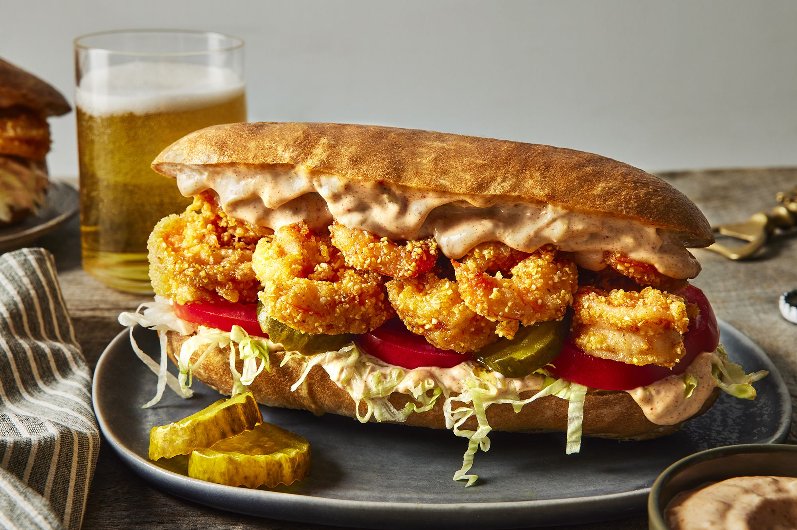

# Shrimp Po'boy

*New Orleans' great fried-shrimp sandwich: cornmeal-crusted Gulf shrimp on crisp French bread with shredded lettuce, tomato, pickles and remoulade. Eat with both hands, plate optional.*

**Serves:** 4

**Prep Time:** 20 minutes

**Cook Time:** 12 minutes

## Overview
A po'boy (originally poor boy, the name born of a 1929 streetcar strike) is the New Orleans submarine sandwich. The bread matters as much as the filling: airy, crisp-crusted French loaves baked locally to a recipe that does not travel well, split lengthways, lightly toasted and "dressed" with shredded iceberg lettuce, sliced tomato, dill pickles and creole remoulade. The filling is the variable: fried oyster, fried shrimp, soft-shell crab, hot roast beef with debris gravy, or in lean times just fried potato.

This recipe covers the shrimp version, the most-ordered po'boy on most menus. The shrimp are dipped in seasoned buttermilk, dredged in a half-cornmeal-half-flour mix for the characteristic crackle, and fried hot and fast. The remoulade is creole-style (mustard-driven, no mayonnaise dominance) and bracingly punchy.

## Ingredients

### Remoulade
- 100 g good mayonnaise
- 2 tbsp creole or coarse-grain mustard
- 1 tbsp dill pickle (very finely chopped)
- 1 tsp capers (finely chopped)
- 1 tsp horseradish (or to taste)
- 1 small garlic clove (minced)
- 1 tbsp finely chopped fresh parsley
- 1 tsp paprika
- 1 tsp Louisiana hot sauce (Crystal or Tabasco)
- Squeeze of lemon
- Pinch of salt

### Shrimp and dredge
- 600 g raw shrimp (peeled, deveined, tails removed)
- 200 ml buttermilk
- 1 tbsp Louisiana hot sauce
- 100 g plain flour
- 100 g fine yellow cornmeal
- 1 tsp paprika
- 1 tsp garlic powder
- 1 tsp onion powder
- ½ tsp cayenne (more for heat)
- 1 tsp salt
- ½ tsp black pepper
- Neutral oil for frying (about 1 litre)

### To assemble
- 1 long French baguette (or 4 short submarine rolls)
- 1 small head iceberg lettuce (shredded)
- 2 tomatoes (sliced)
- 12 dill pickle chips
- Lemon wedges, to serve

## Method

### Stage 1 - Make the remoulade
1. Whisk all the remoulade ingredients in a bowl. Taste and adjust the lemon, hot sauce and salt. The flavour should be sharp, mustardy and faintly heat-warm. Refrigerate to mellow while you do everything else.

### Stage 2 - Soak and dredge the shrimp
1. Combine the buttermilk and hot sauce in a bowl. Add the shrimp and toss to coat. Leave 10 minutes.
1. Combine the flour, cornmeal, paprika, garlic and onion powders, cayenne, salt and pepper in a wide shallow bowl.
1. Lift shrimp out of the buttermilk one at a time, letting excess drip, and dredge in the seasoned cornmeal flour, pressing the coating on firmly. Lay on a wire rack as you go. Do not crowd.

### Stage 3 - Fry
1. Heat the oil in a deep pan to 180°C (350°F).
1. Fry the shrimp in 3-4 batches, 90 seconds to 2 minutes per batch, until the coating is deep gold and the shrimp inside is just opaque.
1. Lift onto kitchen paper. Sprinkle immediately with a fine pinch of salt. Keep warm in a low oven if needed; do not stack while warm or the coating softens.

### Stage 4 - Assemble
1. Cut the baguette into 4 lengths and slit each lengthways without cutting through. Briefly warm in a 180°C oven for 3 minutes to crisp the crust.
1. Spread remoulade generously on both cut sides.
1. Lay sliced tomato, shredded iceberg and three pickle chips on the bottom half.
1. Pile the hot fried shrimp on top. Press the top gently.
1. Cut the sandwich on the diagonal, serve with a lemon wedge and the remaining hot sauce on the table.

## Notes
- **The bread is the dish.** A French baguette from a good bakery (crisp shell, light interior) is the right shape. A supermarket sub roll is too dense and the sandwich becomes a chore. Worth seeking out.
- **Cornmeal in the dredge is the New Orleans tell.** Plain flour alone gives a flat, slightly chewy coating; cornmeal gives the crackle the city expects.
- **Hot, fast, drained.** Shrimp at 180°C in batches small enough not to drop the oil temperature. Drain on a rack, not paper (steam softens the coating).
- **"Dressed" means lettuce, tomato, pickle and remoulade.** "Undressed" means just the protein on bread. Always ask "dressed?" when ordering one in NOLA.

## Variations
- **Oyster po'boy:** swap raw shucked oysters for the shrimp, dredge and fry the same way. The classic Lent po'boy.
- **Soft-shell crab po'boy:** one whole soft-shell crab per sandwich, dredged and fried, legs sticking out.
- **Roast beef po'boy:** slow-braised beef shredded into its own gravy ("debris"), piled into the bread without remoulade. Soggy on purpose.

## Storage
- Best the moment it is built. The hot shrimp soften the cold lettuce and crisp the bread; ten minutes later the geometry has gone.
- Fry the shrimp ahead by no more than 20 minutes; hold uncovered on a wire rack in a low oven (90°C). Do not stack.
- Remoulade keeps 5 days refrigerated and improves overnight.
