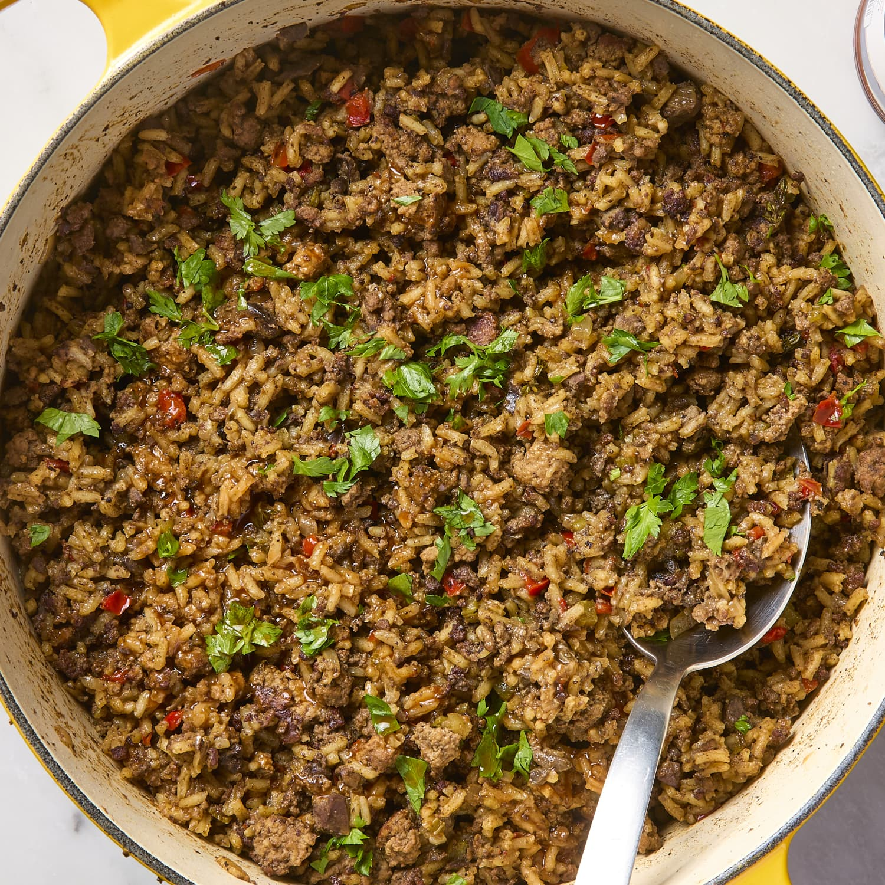

# Louisiana Dirty Rice

*Louisiana's Cajun rice dish: long-grain rice cooked with browned ground pork and beef, the trinity, garlic, Cajun spices and chicken stock till the rice turns "dirty" with little brown flecks of meat throughout. The Cajun home cook standard; the rice that accompanies gumbo, étouffée, fried chicken.*

**Serves:** 6-8

**Prep Time:** 20 minutes

**Cook Time:** 35 minutes

## Overview
Louisiana dirty rice is a Cajun rice dish that gets its name from the "dirty" speckled appearance the rice takes on when cooked with browned meat: long-grain rice toasted briefly in oil, then cooked with a 50/50 mix of ground pork and ground beef (the offal-free home-style version; the classic Cajun version uses chopped chicken livers and gizzards but most modern home cooks use ground meat), the trinity (onion, celery, green pepper), garlic, Cajun seasoning, bay, thyme, hot sauce, and chicken stock. The meat browns and breaks up into the rice as it cooks, giving the dish its characteristic colour and savoury depth. Three details: brown the meat thoroughly for proper colour, trinity, finished with spring onion and parsley.

## Ingredients

- 400 g long-grain white rice
- 250 g ground pork
- 250 g ground beef (80/20)
- 1 large onion (chopped)
- 4 sticks celery (chopped)
- 1 green bell pepper (chopped)
- 10 garlic cloves (crushed)
- 4 tablespoons vegetable oil
- 800 ml hot chicken stock
- 2 bay leaves
- 1 tablespoon dried thyme
- 1 tablespoon paprika
- 1 tablespoon smoked paprika
- 1 tablespoon Cajun seasoning
- 1 teaspoon cayenne
- 1 ½ teaspoons fine sea salt
- 1 teaspoon ground black pepper
- 2 tablespoons Worcestershire sauce
- 1 tablespoon hot sauce

### To finish
- 1 bunch spring onions (sliced)
- 1 small bunch fresh parsley (chopped)

## Method

### Stage 1 - Brown meat
1. Heat oil in a wide heavy pot over medium-high heat.
2. Add ground pork and beef.
3. Brown 8-10 min, breaking up with a wooden spoon, till deeply browned (the dark fond at the bottom of the pot is what makes the rice "dirty"; don't rush this step).

### Stage 2 - Add trinity
1. Add onion, celery, green pepper.
2. Cook 8 min till soft.
3. Add garlic; cook 30 sec.

### Stage 3 - Add rice
1. Add uncooked rice; stir to coat 2 min so each grain is glossed with the meat fat.

### Stage 4 - Add seasoning and stock
1. Add bay leaves, thyme, paprika, smoked paprika, Cajun seasoning, cayenne, salt, pepper, Worcestershire, hot sauce.
2. Pour in hot stock.
3. Stir briefly to combine; scrape any browned bits from the pot bottom.

### Stage 5 - Cook covered
1. Bring to simmer.
2. Cover tightly; reduce to lowest heat.
3. Cook 18 min undisturbed.

### Stage 6 - Rest
1. Off heat; rest 10 min covered.

### Stage 7 - Finish
1. Fluff with fork.
2. Stir in spring onions and parsley.

## Notes
- **Brown the meat properly:** the deep fond on the pot bottom is what gives the rice its "dirty" colour and savoury backbone. Pale meat = pale rice.
- **Smoked paprika adds the missing depth:** without livers and gizzards, smoked paprika and the extra Worcestershire stand in for the deeper earthy notes the offal would have brought.
- **Toast rice briefly first.**
- **Don't stir during cook.**

## Variations
**With andouille:** swap the beef for 250 g sliced andouille for extra smoke.
**Vegetarian:** skip meat entirely; use 400 g chopped chestnut mushrooms (browned hard) and vegetable stock.
**Spicier:** double cayenne + extra hot sauce.
**Traditional with offal:** swap the pork and beef for 200 g chicken livers + 200 g chicken gizzards (both finely chopped) for the canonical old-school version.

## Serving
Alongside gumbo, étouffée, fried chicken.

## Storage
- Keeps refrigerated 4 days.
- Reheat with splash of water.
- Freezes 2 months.
