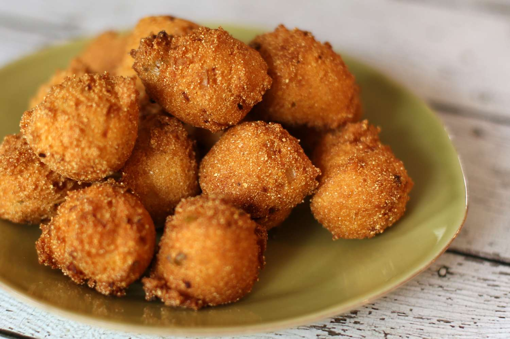

# Hush Puppies

*Louisiana's fried cornmeal balls: yellow cornmeal batter with onion, buttermilk and a touch of sugar, scooped and deep-fried till golden round balls with crispy outsides and soft savoury insides. The canonical fish-fry accompaniment; the side that appears alongside every Southern catfish meal.*

**Serves:** Makes 24 hush puppies

**Prep Time:** 15 minutes

**Cook Time:** 15 minutes

## Overview
Hush puppies are Louisiana's (and the wider American South's) canonical fried-fish accompaniment: a thick cornmeal batter (yellow cornmeal + flour + baking powder + sugar + chopped onion + buttermilk + egg + salt + cayenne) scooped with two spoons or a small ice cream scoop and deep-fried till golden brown round balls. The origin myth is that Civil War-era cooks fried these to throw to dogs to "hush the puppies" while preparing meals. Served piping hot alongside fried catfish (canonical), fried shrimp, fried chicken.

## Ingredients

- 250 g coarse yellow cornmeal
- 80 g plain flour
- 2 tablespoons caster sugar
- 1 tablespoon baking powder
- 1 ½ teaspoons fine sea salt
- 1 teaspoon cayenne
- 1 teaspoon paprika
- 1 medium onion (finely chopped or grated)
- 2 spring onions (sliced; optional)
- 1 large egg (beaten)
- 300 ml buttermilk
- 2 tablespoons melted butter

### Frying
- Vegetable oil for deep-frying (about 1 litre)

### To serve
- Fried catfish
- Cole slaw
- Tartar sauce
- Lemon wedges

## Method

### Stage 1 - Mix dry
1. Whisk cornmeal, flour, sugar, baking powder, salt, cayenne, paprika.
2. Stir in chopped onion (and spring onions if using).

### Stage 2 - Mix wet
1. Whisk egg, buttermilk, melted butter.

### Stage 3 - Combine
1. Pour wet into dry.
2. Stir to a thick scoopable batter.
3. Rest 5 min.

### Stage 4 - Heat oil
1. Heat oil to 180°C (360°F) in deep pan.

### Stage 5 - Fry
1. Drop heaped tablespoonfuls of batter into hot oil.
2. Fry 2-3 min till deep golden, turning if needed.
3. Drain on paper towels.

### Stage 6 - Salt and serve
1. Salt immediately while hot.

## Notes
- **Yellow cornmeal canonical.**
- **Chopped onion not powder:** texture matters.
- **180°C oil:** crucial.
- **Eat immediately.**

## Variations
**With jalapeño:** add chopped fresh jalapeño.
**With cheese:** add 100 g grated cheddar.
**With corn kernels:** add 100 g sweet corn.
**Sweeter:** double the sugar.

## Serving
Alongside fried catfish, shrimp, chicken. Friday fish fries.

## Storage
- Best immediately.
- Don't refrigerate; goes soggy.
- Batter keeps refrigerated 24 hours.
