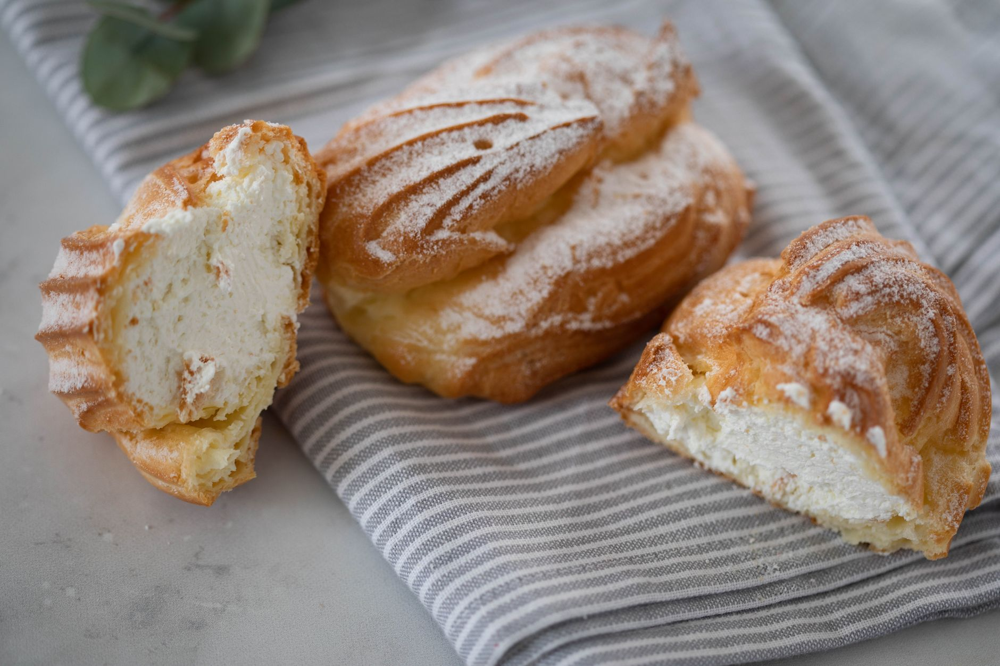

# Maque Choux

*Louisiana's Cajun corn sauté: fresh sweet corn cut off the cob, sautéed with butter, the trinity, tomato, Cajun spices and a touch of cream till the corn is tender and the trinity has melted into the corn. The Cajun summer side; the corn dish for every Cajun fish fry and crawfish boil.*

**Serves:** 6

**Prep Time:** 20 minutes

**Cook Time:** 25 minutes

## Overview
Maque choux is Louisiana's iconic Cajun summer corn dish (the name derives from a French-Creole fusion possibly meaning "smothered cabbage", though the dish itself uses corn): fresh sweet corn kernels cut off the cob (traditional; or frozen sweet corn in winter), sautéed with butter, the trinity (onion, celery, green pepper), garlic, chopped tomato, Cajun seasoning, a pinch of sugar, and finished with a touch of cream and chopped parsley and spring onion. The corn cooks down with the vegetables till it caramelises slightly and absorbs the trinity flavour.

## Ingredients

- 800 g fresh corn kernels (about 6 ears) or 800 g frozen sweet corn
- 80 g butter
- 1 large onion (chopped)
- 3 sticks celery (chopped)
- 1 green bell pepper (chopped)
- 8 garlic cloves (crushed)
- 4 medium tomatoes (chopped); or 1 tin (400 g) chopped
- 1 tablespoon paprika
- 1 tablespoon Cajun seasoning
- 1 teaspoon cayenne
- 1 teaspoon caster sugar
- 1 ½ teaspoons fine sea salt
- 1 teaspoon ground black pepper
- 1 tablespoon Worcestershire sauce
- 1 tablespoon hot sauce
- 100 ml double cream

### To finish
- 1 bunch spring onions (sliced)
- 1 small bunch fresh parsley (chopped)
- Juice of 1 lemon

## Method

### Stage 1 - Cut corn from cob
1. If using fresh: stand corn on end; slice down with sharp knife.
2. Scrape cob with the back of the knife to extract the "milk".

### Stage 2 - Sauté trinity
1. Melt butter in wide pan.
2. Add onion, celery, green pepper; cook 8 min.
3. Add garlic; cook 30 sec.

### Stage 3 - Add corn
1. Add corn kernels (and any "milk" from cobs).
2. Cook 10 min, stirring occasionally.

### Stage 4 - Add tomato and seasoning
1. Add chopped tomatoes.
2. Stir in paprika, Cajun seasoning, cayenne, sugar, salt, pepper, Worcestershire, hot sauce.
3. Cook 8 min.

### Stage 5 - Finish with cream
1. Stir in cream.
2. Cook 2 min more.

### Stage 6 - Brighten
1. Add lemon juice.
2. Scatter spring onions and parsley.

## Notes
- **Fresh corn ideal.**
- **Don't skip the "milk":** scrape cob.
- **Cream at the end.**

## Variations
- **With shrimp:** add 400 g raw peeled shrimp in last 4 min.
- **With andouille:** add diced cooked andouille.
- **Without cream:** more rustic.
- **Spicier:** double cayenne.

## Serving
- Alongside fried catfish, fried chicken, crawfish boil. Summer.

## Storage
- Keeps refrigerated 3 days.
- Reheat with splash of stock.
- Doesn't freeze well; cream can break.
