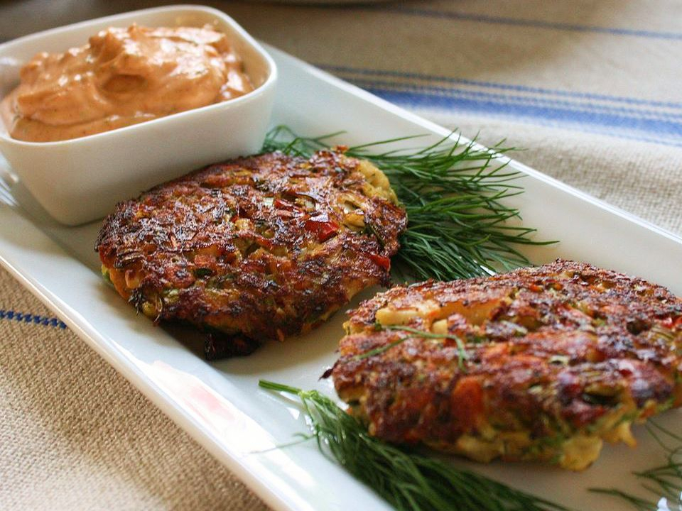

# Creole Crab Cakes

*Louisiana's Creole crab cakes: lump crab meat bound with a Creole-mustard mayonnaise, the trinity, Cajun spices and a minimum of breadcrumbs, formed into patties, pan-fried in butter till golden, served with remoulade. The Louisiana starter; the canonical crab cake of New Orleans, distinct from the Maryland version.*

**Serves:** 4 (8 small crab cakes)

**Prep Time:** 25 minutes

**Cook Time:** 15 minutes

## Overview
Creole crab cakes are the New Orleans version of the famous American crab cake (distinct from Maryland-style which uses Old Bay; Creole uses Cajun seasoning and Creole mustard): lump crab meat (jumbo lump for best texture) bound very lightly with a sauce of Creole mustard, mayonnaise, egg, lemon juice, the chopped trinity (onion, celery, green pepper), garlic, Cajun spices, parsley and just enough breadcrumbs to hold together (don't overbind; the crab should be the star). Formed into patties, refrigerated to firm up, then pan-fried in butter till golden on both sides. Served with remoulade sauce or tartar sauce, lemon wedges, and a small green salad.

## Ingredients

### Crab cakes
- 500 g lump crab meat (jumbo lump preferred; picked through for shell)
- 1 small onion (finely chopped)
- 2 sticks celery (finely chopped)
- ½ green bell pepper (finely chopped)
- 4 garlic cloves (crushed)
- 1 large egg (beaten)
- 4 tablespoons mayonnaise
- 2 tablespoons Creole mustard (or Dijon)
- Juice of ½ lemon
- 1 tablespoon Worcestershire sauce
- 1 tablespoon hot sauce
- 1 tablespoon Cajun seasoning
- 1 teaspoon paprika
- ½ teaspoon cayenne
- 1 small bunch fresh parsley (chopped)
- 1 small bunch spring onions (sliced)
- 80 g panko breadcrumbs

### Frying
- 4 tablespoons butter
- 2 tablespoons vegetable oil

### To serve
- Remoulade sauce (see remoulade recipe)
- Lemon wedges
- Mixed leaf salad
- French bread

## Method

### Stage 1 - Sauté trinity briefly
1. Heat 1 tablespoon butter in pan.
2. Cook chopped onion, celery, green pepper 5 min till just soft.
3. Add garlic; cook 30 sec.
4. Cool completely.

### Stage 2 - Make binder
1. Whisk egg, mayonnaise, Creole mustard, lemon juice, Worcestershire, hot sauce, Cajun seasoning, paprika, cayenne.
2. Stir in chopped parsley, spring onion.
3. Stir in cooled trinity.

### Stage 3 - Combine with crab
1. Gently fold the binder into the crab meat.
2. Add panko gradually, just enough to bind (don't over-bind).
3. The mixture should just hold; the crab should be the star.

### Stage 4 - Form patties
1. Form into 8 small patties (about 70g each) or 4 larger.
2. Refrigerate 30 min to firm up.

### Stage 5 - Pan-fry
1. Heat butter and oil in wide pan over medium-high heat.
2. Cook 4 min per side till deep golden.

### Stage 6 - Serve
1. With remoulade.
2. Lemon wedges.
3. Salad alongside.

## Notes
- **Minimum binder:** crab is the star.
- **Creole mustard signature.**
- **Refrigerate before frying:** holds together.
- **Pan-fry, don't deep-fry.**

## Variations
**With shrimp:** add chopped cooked shrimp.
**Baked (lighter):** brush with butter; bake at 220°C 18 min.
**Spicier:** double cayenne.
**With sweet corn:** add 100 g sweet corn.

## Serving
As starter with remoulade. On a bed of leaves with lemon.

## Storage
- Best fresh.
- Uncooked patties refrigerate 1 day.
- Cooked refrigerate 2 days; reheat in oven.
- Don't freeze cooked.
