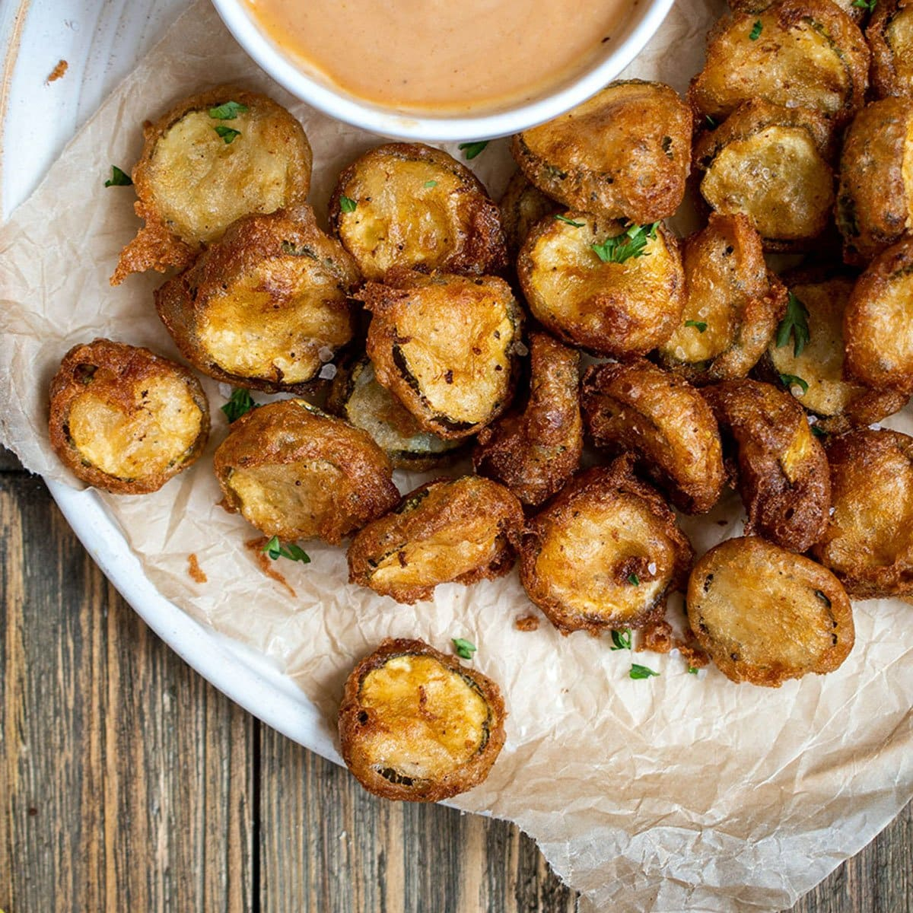

# Louisiana Fried Pickles

*Louisiana's tangy fried snack: dill pickle chips drained and patted dry, dredged in seasoned cornmeal batter, deep-fried till crispy golden outside while the pickle inside stays tangy-juicy. The Louisiana bar snack; the traditional accompaniment to cold beer and football.*

**Serves:** 4

**Prep Time:** 15 minutes

**Cook Time:** 10 minutes

## Overview
Louisiana fried pickles (also called fried pickle chips) are a Cajun-Southern bar snack and tailgate classic: dill pickle slices (sandwich-cut chips; not whole pickles) drained thoroughly and patted dry (the most critical step; wet pickles spatter and the coating slides off), dredged in buttermilk and a seasoned cornmeal-and-flour mixture, then deep-fried till the crust is deeply golden while the pickle inside stays tangy and slightly juicy. Served immediately with remoulade or ranch dressing. The dish allegedly originated in Mississippi but is traditional Louisiana bar food.

## Ingredients

- 500 g dill pickle slices (sandwich-cut chips)
- 250 ml buttermilk
- 1 tablespoon hot sauce
- 200 g coarse yellow cornmeal
- 100 g plain flour
- 1 tablespoon paprika
- 1 tablespoon Cajun seasoning
- 1 teaspoon cayenne
- 1 teaspoon garlic powder
- 1 teaspoon onion powder
- 1 teaspoon fine sea salt
- 1 teaspoon ground black pepper
- Vegetable oil for deep-frying (about 800 ml)

### To serve
- Remoulade sauce or ranch dressing
- Hot sauce
- Cold beer

## Method

### Stage 1 - Drain and pat dry
1. Drain pickles in a colander.
2. Spread on paper towels.
3. Pat thoroughly dry.
4. Critical step; wet pickles ruin the dish.

### Stage 2 - Buttermilk dip
1. Whisk buttermilk with hot sauce.
2. Toss pickle chips in mixture.

### Stage 3 - Mix dredge
1. Whisk cornmeal, flour, paprika, Cajun seasoning, cayenne, garlic and onion powder, salt, pepper.

### Stage 4 - Coat
1. Lift pickles from buttermilk (let excess drip).
2. Toss in cornmeal mixture; press to coat.

### Stage 5 - Heat oil
1. Heat oil to 180°C (360°F) in deep pan.

### Stage 6 - Fry
1. Fry pickles in batches 2-3 min till deep golden.
2. Don't overcrowd.
3. Drain on paper towels.

### Stage 7 - Salt and serve immediately
1. Sprinkle with extra Cajun seasoning while hot.
2. With remoulade or ranch.

## Notes
- **Pat pickles dry:** critical.
- **Cornmeal traditional:** crispy texture.
- **Eat immediately:** lose crispness.

## Variations
**Spear pickles:** use whole long spears; longer fry time.
**With panko:** less traditional.
**Spicier:** double cayenne.
**Baked (less crispy):** at 220°C with oil spray, 18 min.

## Serving
At bars, tailgates, gatherings. Cold beer.

## Storage
- Best immediately.
- Don't store cooked.
- Coated raw refrigerate 1 hour; fry just before serving.
