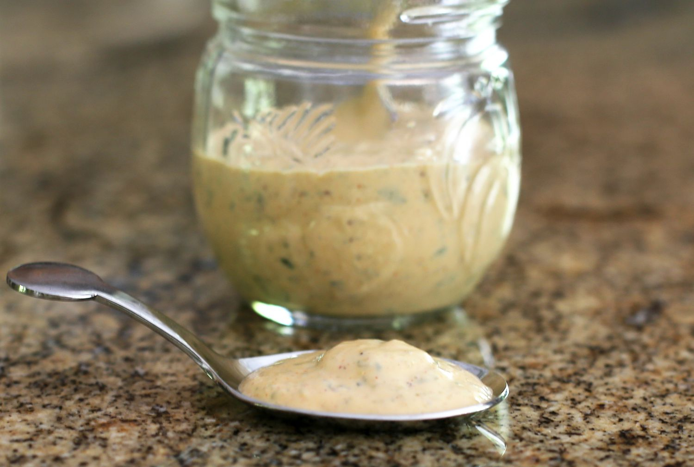

# Louisiana Remoulade Sauce

*Louisiana's red remoulade: a creamy spicy sauce of mayonnaise, Creole mustard, ketchup, horseradish, paprika, Worcestershire, garlic and lemon, blended into a thick orange-red dipping sauce. The canonical dip for shrimp, crab cakes, fried catfish, and po-boys.*

**Serves:** Makes 400 ml

**Prep Time:** 10 minutes

**Cook Time:** None (chill 1 hour)

## Overview
Louisiana remoulade is the canonical Creole-Louisiana dipping sauce, distinct from the French original (which is mayonnaise-based without ketchup) and the Maryland version (which uses Old Bay): mayonnaise as the base, Creole mustard, ketchup (or paprika for colour), prepared horseradish, Worcestershire sauce, hot sauce, garlic, chopped capers, finely chopped spring onion, parsley, lemon juice, paprika, Cajun seasoning, cayenne. The traditional New Orleans "red" remoulade uses ketchup for the canonical orange-red colour; the "white" remoulade skips the ketchup (more like the French). Used as a dip for boiled shrimp (classic), crab cakes, fried catfish, fried oysters, po-boys, hush puppies. Three details: Creole mustard signature, horseradish for bite, chill 1 hour for flavours to meld.

## Ingredients

- 300 ml mayonnaise
- 3 tablespoons ketchup
- 3 tablespoons Creole mustard (or Dijon + 1 tsp wholegrain)
- 1 tablespoon prepared horseradish
- 1 tablespoon Worcestershire sauce
- 1 tablespoon hot sauce
- Juice of 1 lemon
- 4 garlic cloves (crushed)
- 2 tablespoons capers (chopped)
- 1 small bunch spring onions (finely sliced)
- 1 small bunch fresh parsley (chopped)
- 1 tablespoon paprika
- 1 tablespoon Cajun seasoning
- 1 teaspoon cayenne
- 1 teaspoon caster sugar (balances)
- 1 teaspoon fine sea salt
- ½ teaspoon ground black pepper

## Method

### Stage 1 - Combine
1. In a bowl, whisk mayonnaise, ketchup, Creole mustard, horseradish, Worcestershire, hot sauce, lemon juice.
2. Add crushed garlic, chopped capers, spring onions, parsley.
3. Stir in paprika, Cajun seasoning, cayenne, sugar, salt, pepper.

### Stage 2 - Chill
1. Chill 1 hour minimum to meld flavours.

### Stage 3 - Use
1. As dip for boiled shrimp.
2. On crab cakes.
3. With fried catfish.
4. On po-boys.
5. With fried oysters.

## Notes
- **Creole mustard signature:** important.
- **Horseradish for bite.**
- **Chill 1 hour:** flavours meld.

## Variations
**White remoulade:** skip ketchup; gives French-style.
**Spicier:** double cayenne and hot sauce.
**Smokier:** add smoked paprika.
**With pickle:** add chopped dill pickle.

## Serving
On every Louisiana seafood platter.

## Storage
- Keeps refrigerated 1 week.
- Don't freeze.
- Better after 24 hours.
