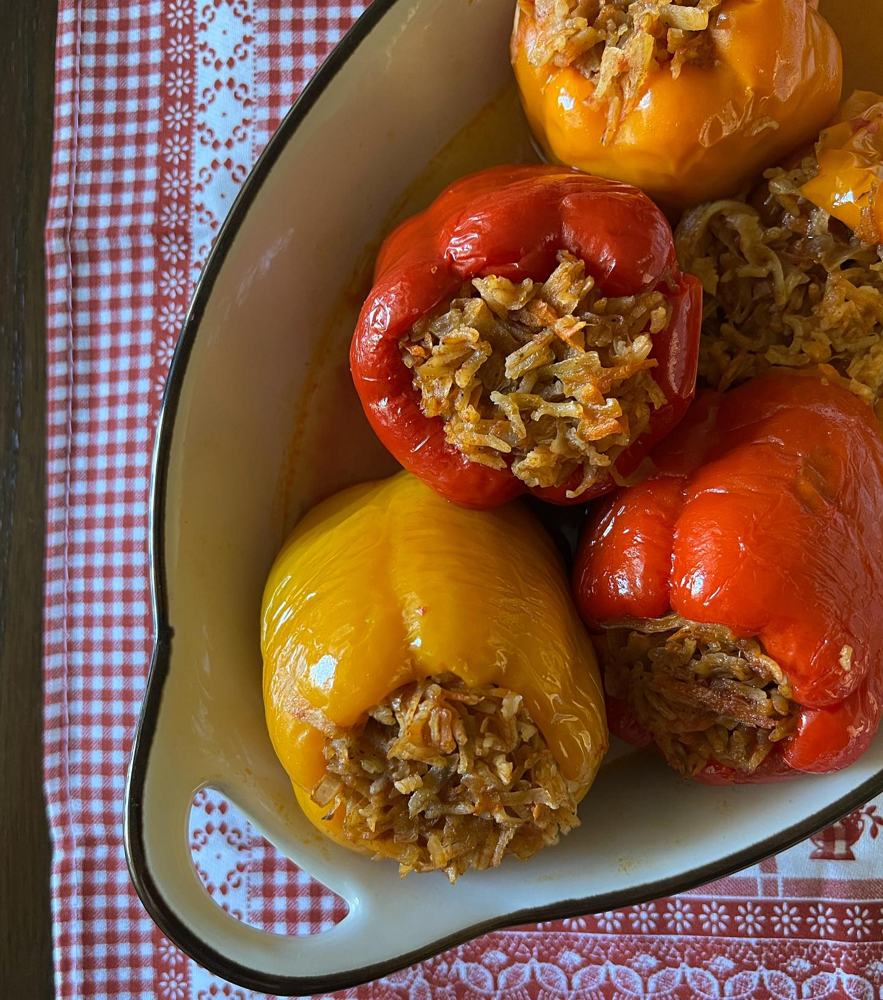

# Ajvar-Stuffed Peppers (Polneti Piperki)

*North Macedonia's stuffed pepper classic: red bell peppers filled with a rice-and-minced-meat-and-ajvar mixture, baked in tomato sauce till the peppers are tender and the filling is golden on top. The Macedonian Sunday-lunch stuffed vegetable; the family-meal favourite.*

**Serves:** 6

**Prep Time:** 30 minutes

**Cook Time:** 1 hour

## Overview
Polneti piperki (stuffed peppers) appear across the Balkans, but the Macedonian version distinguishes itself by adding ajvar (the Macedonian red-pepper-and-aubergine relish) to the filling, giving it a smoky-sweet depth. The construction: large red bell peppers are hollowed; filled with a mixture of minced pork-and-beef, cooked rice, sweated onion and garlic, paprika, dried mint, parsley, ajvar; stood upright in a deep dish; surrounded with tomato sauce; baked 1 hour till peppers are tender and tops golden. Served with sour cream and crusty bread.

## Ingredients

### Filling
- 6 large red bell peppers (tops removed, seeds out)
- 500 g minced pork (or 50/50 pork and beef)
- 150 g cooked long-grain rice
- 1 large onion (diced)
- 4 garlic cloves (chopped)
- 3 tablespoons ajvar (red pepper relish; see notes)
- 1 tablespoon sweet paprika
- 1 tablespoon dried mint
- 4 tablespoons chopped fresh parsley
- 1 large egg (binder)
- 1 teaspoon salt
- 1 teaspoon pepper

### Sauce
- 400 g tinned chopped tomatoes
- 2 tablespoons tomato paste
- 1 tablespoon sweet paprika
- 400 ml chicken stock
- 1 teaspoon caster sugar
- Salt and pepper

### To serve
- Sour cream
- Crusty bread

## Method
1. Sweat onion 6 minutes; add garlic; cook 1 minute. Cool.
2. Combine with minced meat, cooked rice, ajvar, paprika, mint, parsley, egg, salt, pepper.
3. Stuff peppers ¾ full (filling expands).
4. Make sauce: combine tomatoes, paste, paprika, stock, sugar, salt; pour into a deep baking dish.
5. Stand stuffed peppers upright in sauce.
6. Cover with foil; bake at 180°C for 45 minutes.
7. Uncover; bake 15 minutes more till tops are golden.
8. Serve hot with sour cream and bread.

## Notes
- **Ajvar in the filling:** the Macedonian distinguishing element.
- **Don't overfill:** the filling expands.
- **Stand upright in sauce:** the peppers cook evenly.

## Variations
- **Vegetarian:** swap meat for cooked lentils + mushroom + walnut.
- **With cheese:** stir 80 g grated Kashkaval into the filling.
- **Spicy:** add 1 chopped chilli.
- **Mini stuffed peppers:** small sweet peppers (per portion).

## Serving
- At Macedonian family Sunday lunch · with sour cream · at home with red wine.

## Storage
Refrigerates 4 days; flavour improves. Freezes 2 months.
