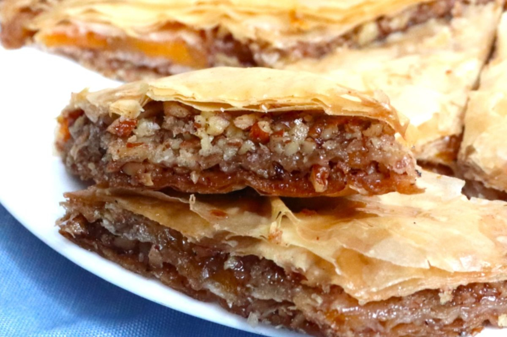

# Macedonian Baklava

*North Macedonia's syrupy nut pastry: layered phyllo pastry with crushed walnuts and cinnamon, baked till deeply golden, then drenched in cool lemon-honey syrup. The Macedonian Ottoman-legacy dessert; sold at every Macedonian bakery; eaten at every wedding.*

**Serves:** 16 pieces

**Prep Time:** 30 minutes

**Cook Time:** 45 minutes

## Overview
Baklava appears across Macedonia, Greece, Turkey, Bosnia and Albania, each country claims subtle variations. The Macedonian version uses walnuts (rather than the pistachio-heavy Turkish version), cinnamon-spiced filling, and a syrup with lemon and a touch of honey. The construction: 18-20 sheets of phyllo pastry are layered with melted butter; a filling of finely chopped walnuts mixed with caster sugar and cinnamon is layered between every 5-6 phyllo sheets; the whole thing is scored into diamond pieces before baking; baked till deeply golden; immediately drenched in cool lemon-and-honey syrup.

## Ingredients

### Filling
- 500 g walnuts (finely chopped)
- 100 g caster sugar
- 2 tablespoons ground cinnamon
- 1 teaspoon ground cloves (optional)

### Layers
- 500 g phyllo (filo) pastry
- 250 g unsalted butter (melted)

### Syrup
- 500 g caster sugar
- 350 ml water
- 4 tablespoons honey
- 2 tablespoons lemon juice
- 1 strip lemon peel
- 1 cinnamon stick

## Method
1. Make syrup: combine all syrup ingredients; bring to boil; simmer 10 minutes. Cool COMPLETELY.
2. Combine filling ingredients.
3. Preheat oven to 180°C.
4. Brush a 30×20 cm baking tray with melted butter.
5. Place a sheet of phyllo; brush with butter. Repeat for 6 sheets.
6. Sprinkle 1/3 of the nut mixture evenly.
7. Layer 4-5 more buttered phyllo sheets.
8. Sprinkle another 1/3 of the nuts.
9. Layer 4-5 more sheets; sprinkle the last 1/3.
10. Top with 6-7 more buttered phyllo sheets.
11. Brush top generously with butter.
12. With a sharp knife, score into diamond pieces (cut down through ALL layers).
13. Bake 40-45 minutes till deeply golden.
14. Immediately pour the cool syrup evenly over the hot baklava.
15. Rest 4 hours (or overnight) for the syrup to soak in.
16. Cut along scored lines.

## Notes
- **Cool syrup over hot baklava:** non-negotiable. Reverse gives soggy.
- **Score deeply BEFORE baking:** cuts must reach the bottom.
- **Rest 4 hours minimum:** syrup soaks slowly.

## Variations
**With pistachios:** Turkish-influenced.
**With almonds:** Greek variant.
**Without cinnamon:** more nut-forward.
**Mini baklava rolls:** rolled phyllo cigars for individual portions.
**With orange-blossom water in syrup:** Levantine variant.

## Serving
At a Macedonian wedding · at every Macedonian bakery counter · with strong coffee · at Eid (in Muslim Macedonian communities) · at home for special occasions.

## Storage
Keeps in a sealed tin 1 week at room temperature. Don't refrigerate (the phyllo softens). Freezes 1 month.
