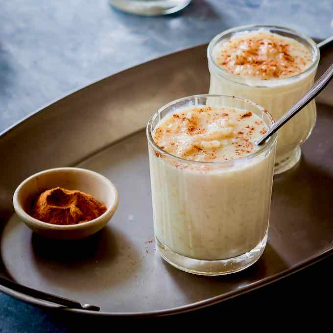

# Sutlijaš (Macedonian Rice Pudding)

*North Macedonia's creamy rice pudding: short-grain rice slowly cooked in whole milk with sugar, vanilla and a pinch of cinnamon till thick and creamy. Served warm or chilled, dusted with cinnamon. The canonical Macedonian comfort dessert.*

**Serves:** 6

**Prep Time:** 5 minutes

**Cook Time:** 45 minutes

## Overview
Sutlijaš (from Turkish "sütlaç") is North Macedonia's classic rice pudding - a slow-cooked creamy dessert eaten warm or chilled. The construction: short-grain rice is briefly toasted in butter, then simmered in whole milk for 35-40 minutes with sugar, vanilla, a strip of lemon peel and a cinnamon stick till the rice is tender and the milk is thick and creamy. Served in small bowls dusted with cinnamon. Three details: SHORT-GRAIN RICE (the canonical creamy texture), SLOW SIMMER (don't boil hard; the milk burns), and DUST WITH CINNAMON (the canonical finish).

## Ingredients
- 200 g short-grain rice (or risotto rice)
- 1.2 litres whole milk
- 30 g butter
- 200 g caster sugar
- 1 teaspoon vanilla extract
- 1 strip lemon peel
- 1 cinnamon stick
- A pinch of fine sea salt
- 2 large egg yolks (optional, for extra richness)
- Ground cinnamon (for dusting)

## Method
1. Toast rice in butter 1 minute.
2. Add milk, sugar, lemon peel, cinnamon stick, salt.
3. Bring to a gentle simmer; stir constantly for the first 5 minutes.
4. Reduce heat to LOW; simmer 35-40 minutes stirring frequently, till the rice is tender and the mixture is thick and creamy.
5. Remove from heat; remove lemon peel and cinnamon stick.
6. Optional: temper egg yolks with a ladle of hot pudding; stir back into pan; warm 2 minutes without boiling.
7. Stir in vanilla.
8. Pour into small bowls.
9. Dust with cinnamon; chill or serve warm.

## Notes
- **Don't boil:** the milk burns and sticks.
- **Stir frequently:** prevents sticking.
- **Thicker as it cools:** factor in.

## Variations
**With cardamom:** add 4 crushed pods.
**With raisins:** stir in 60 g at the end.
**With rose water:** add 1 teaspoon at the end - Levantine variant.
**Chocolate sutlijaš:** stir in 60 g dark chocolate at the end.
**Caramelised top (brûlée):** sprinkle sugar; torch.

## Serving
At a Macedonian family Sunday dessert · at a Macedonian wedding · with strong coffee · at home as a comfort dessert.

## Storage
Refrigerates 4 days. Don't freeze.
