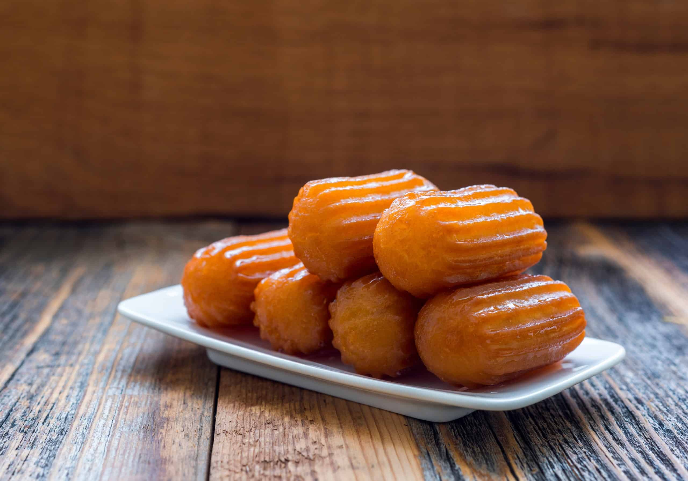

# Tulumba (Syrup-Soaked Fried Dough)

*North Macedonia's beloved fried dessert: short ridged fingers of choux-style dough deep-fried till golden, then soaked in cool lemon-flavoured sugar syrup. Crisp outside, syrup-soaked inside. The Macedonian-Turkish dessert sold from carts at every festival.*

**Serves:** Makes 24

**Prep Time:** 20 minutes

**Cook Time:** 25 minutes

## Overview
Tulumba (also known as "tulumbe" in Bosnia; "tulumbas" in Albanian, "lokma" in Turkish) is an Ottoman-origin Balkan dessert beloved across North Macedonia. The construction: a thick choux-style batter (water + butter + flour + eggs) is piped through a star-tipped nozzle into hot oil, cut into 4-5 cm lengths; the ridged fingers fry till deeply golden; immediately submerged in a cool lemon-flavoured sugar syrup; the temperature differential makes the syrup soak deep into the crisp dough.

## Ingredients

### Syrup
- 400 g caster sugar
- 350 ml water
- 1 tablespoon lemon juice
- 1 cinnamon stick (optional)
- 1 strip lemon peel

### Dough
- 250 ml water
- 100 g butter
- 1 tablespoon caster sugar
- A pinch salt
- 1 teaspoon vanilla
- 200 g plain flour
- 3 large eggs
- 1 tablespoon white vinegar

### For frying
- 1 litre vegetable oil

## Method
1. Make syrup: combine sugar, water, lemon juice, cinnamon, lemon peel. Boil 5 minutes. Cool completely.
2. Make dough: bring water, butter, sugar, salt, vanilla to boil. Add flour all at once; stir vigorously till smooth dough forms.
3. Cool 5 minutes; beat in eggs one at a time; add vinegar.
4. Transfer to piping bag with star nozzle.
5. Heat oil to 170°C.
6. Pipe 4-5 cm lengths into hot oil, cutting with scissors.
7. Fry 4-5 minutes till deeply golden.
8. Immediately transfer hot fritters into cold syrup; soak 1 minute.
9. Lift out; place on a serving plate.

## Notes
- **Hot fritter, cool syrup:** the temperature differential is the secret.
- **Star nozzle gives ridges:** essential for soak surface.
- **Don't oversoak:** 1 minute in syrup is enough.

## Variations
- **With chocolate drizzle:** modern variant.
- **With chopped pistachios on top:** Ottoman touch.
- **Mini tulumba:** smaller pieces for canapés.

## Serving
- At a Macedonian festival · at a Macedonian wedding · with strong coffee · at home as a sweet snack.

## Storage
Best eaten fresh; refrigerate 2 days (texture softens).
