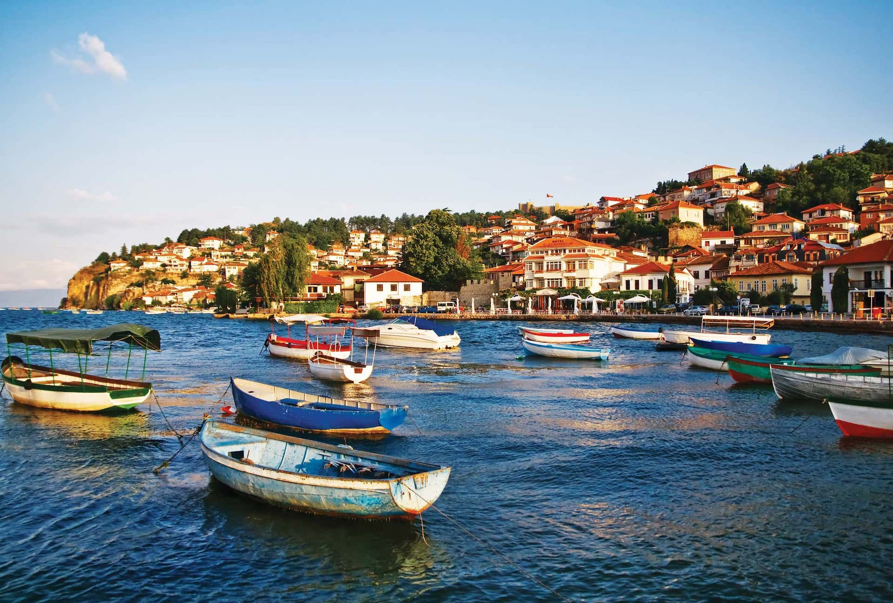

# Macedonian Cuisine

North Macedonia's cuisine sits at the meeting point of Balkan, Mediterranean and Ottoman traditions. The national dish - tavče gravče - is a long-baked white-bean stew with paprika and onion. Grilled meats (kebapi, pljeskavica) shape the meaty side; ajvar (the slow-cooked red-pepper relish), shopska salad (the canonical Balkan salad), and kashkaval cheese run the daily table. Pastrmajlija (the flat oval bread topped with cured meat) is the Macedonian pizza. Sweet finishes lean Turkish: tulumba (syrup-soaked fried dough), baklava, sutlijaš (rice pudding). Macedonian wine (Vranec red, Smederevka white), rakija, and Skopsko beer round out the drink list.
