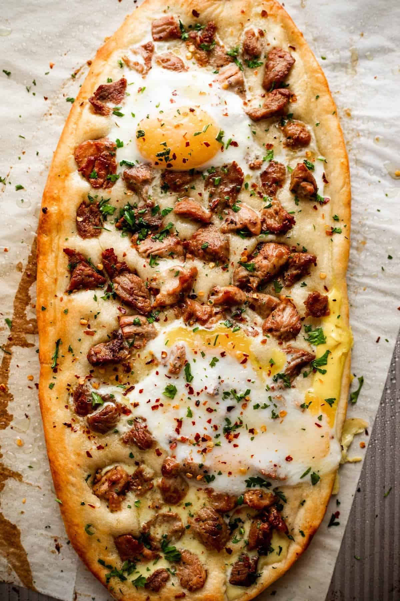

# Pastrmajlija (Macedonian Meat Flatbread)

*North Macedonia's iconic meat flatbread: an oval boat-shaped yeasted dough topped with cubed cured pork or lamb, baked till the bread is golden and the meat is crisp on top. The Macedonian "pizza"; the dish for celebrations and matchday meals; a Pastrmajlija Festival held annually in Štip.*

**Serves:** 4 (one large flatbread each)

**Prep Time:** 30 minutes (plus 1 hour rising)

**Cook Time:** 18 minutes

## Overview
Pastrmajlija (from "pastrma" - Macedonian cured meat) is the Macedonian flatbread classic - an oval boat-shaped pizza topped with cubed cured pork, lamb or beef. The construction: yeasted dough is divided, rolled into oval boat shapes (about 25 × 15 cm), the edges raised slightly; cubed cured meat is scattered over with a splash of oil and a sprinkle of paprika; sometimes an egg is cracked in the centre at the last minute. Baked at very high heat till the bread is deeply golden and the meat is crisped. Served with chopped raw onion, pickled chillies, and a wedge of lemon.

## Ingredients

### Dough
- 500 g strong bread flour
- 10 g instant yeast
- 1 teaspoon fine sea salt
- 280 ml warm water
- 2 tablespoons olive oil

### Topping
- 400 g cubed cured pork (or pancetta, smoked pork shoulder; in 1 cm cubes)
- 2 tablespoons olive oil
- 2 tablespoons sweet paprika
- 1 teaspoon hot paprika (optional)
- 4 cloves garlic (chopped)
- 1 teaspoon fine sea salt
- 4 eggs (optional, one per flatbread)

### To serve
- Pickled chillies
- Chopped raw onion
- Lemon wedges
- A glass of Macedonian red wine

## Method
1. Make dough: combine flour, yeast, salt; add warm water and oil; knead 8 minutes till smooth. Rise 1 hour.
2. Divide into 4 portions. Roll each into an oval boat shape, about 25 cm long, with slightly raised edges.
3. Toss cubed meat with olive oil, garlic, paprikas, salt.
4. Scatter meat over each bread.
5. Bake at 240°C / 220°C fan for 12-15 minutes till bread is golden and meat is crisp.
6. Optional: crack an egg into the middle of each in the last 3 minutes.
7. Serve immediately with pickled chillies, raw onion, lemon.

## Notes
- **Use cured meat:** smoked or cured; fresh meat releases too much liquid.
- **Very high heat:** the canonical Macedonian temperature.
- **Eat with hands:** tear and dip.

## Variations
**Pastrmajlija sa jajca:** with eggs (described above).
**Pastrmajlija od piletina:** with chicken instead of pork.
**Mini pastrmajlija:** smaller portions for sharing.
**Vegetarian:** swap meat for grilled vegetables.

## Serving
At the Štip Pastrmajlija Festival (annually) · at Macedonian gostilna · as Macedonian matchday food · at a Macedonian wedding · at home with red wine.

## Storage
Best fresh; reheat in 200°C oven 5 minutes.
