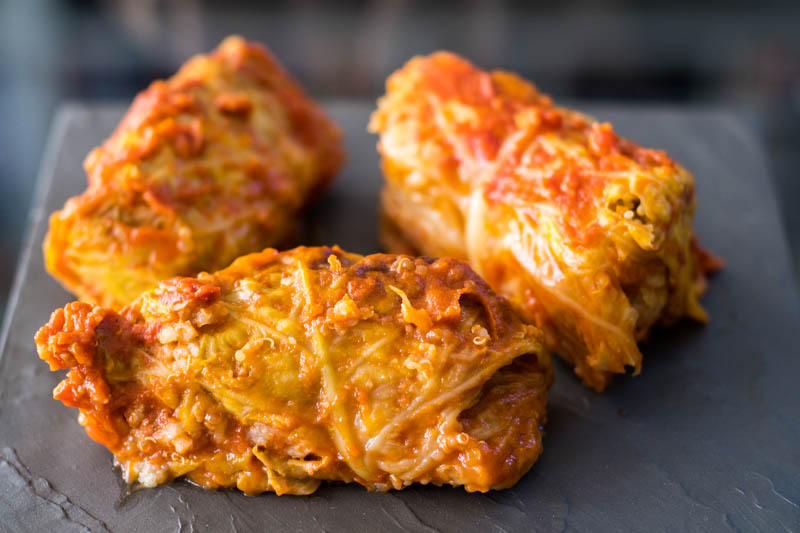

# Sarma (Macedonian Cabbage Rolls)

*North Macedonia's beloved cabbage roll: sour cabbage leaves wrapped around a filling of minced pork, rice, onion, paprika and herbs, layered with smoked meat in a deep pot, simmered for 2 hours till tender. The canonical Balkan winter dish; eaten at Christmas and family celebrations.*

**Serves:** 8

**Prep Time:** 45 minutes

**Cook Time:** 2 hours

## Overview
Sarma is a Balkan-wide tradition, but the Macedonian version distinguishes itself: sour cabbage (preserved whole heads of fermented cabbage) is the canonical wrapper (rather than fresh cabbage or grape leaves); the filling combines minced pork (or pork-and-beef) with rice, sweated onion, sweet paprika, salt, pepper, and dried mint; the rolls are layered in a deep pot with pieces of smoked dried pork or sausage between layers; the pot is filled with stock and simmered slowly for 2 hours. Served with sour cream and crusty bread. Three details: SOUR CABBAGE LEAVES (the canonical Macedonian wrapper; available from Balkan grocers), SMOKED MEAT LAYERED BETWEEN (the depth element), and SLOW SIMMER 2 HOURS minimum.

## Ingredients

### Filling
- 1 large sour cabbage (whole head; available at Balkan/Slavic grocers) OR 2 large fresh cabbages parboiled
- 800 g minced pork (or 50/50 pork and beef)
- 150 g long-grain rice (uncooked)
- 1 large onion (finely diced)
- 4 garlic cloves (chopped)
- 2 tablespoons sweet paprika
- 1 tablespoon dried mint
- 2 tablespoons olive oil
- 1 large egg (binder)
- 2 teaspoons salt
- 1 teaspoon black pepper
- 4 tablespoons chopped fresh parsley

### Layer
- 300 g smoked dried pork (or smoked sausage; sliced or cubed)
- 2 bay leaves
- 1 litre beef stock

### To serve
- Sour cream
- Crusty bread
- Pickled chillies

## Method
1. Sweat onion in olive oil 6 minutes; add garlic and paprika; cook 1 minute. Cool.
2. Combine cooled onion mix with minced pork, rice, dried mint, egg, salt, pepper, parsley.
3. Separate cabbage leaves; trim thick stems.
4. Place a heaped tablespoon of filling on each leaf; fold sides in; roll tight.
5. Layer rolls in a deep pot (seam-side-down), packed tightly, alternating with smoked meat pieces and bay leaves.
6. Pour over beef stock to just cover.
7. Place a heavy plate on top to weigh the rolls down.
8. Bring to a simmer; cover; reduce to LOW.
9. Simmer 2 hours till the leaves are tender and the filling cooked through.
10. Serve hot with sour cream and bread.

## Notes
- **Sour cabbage is canonical:** the fermentation adds the right tang. Fresh parboiled cabbage works as substitute.
- **Pack tight:** rolls should not float.
- **Weight on top:** keeps the rolls submerged.

## Variations
**With sauerkraut between layers:** the German-Hungarian crossover.
**Vegetarian sarma:** rice + mushroom + walnut filling.
**With dill:** add fresh dill to the filling.
**Mini sarma:** smaller rolls for canapés.

## Serving
At Macedonian Christmas (Bozhik) · at a family birthday · at a Macedonian wedding · at home as a winter Sunday lunch.

## Storage
Refrigerates 4 days; flavour improves overnight. Freezes 3 months.
