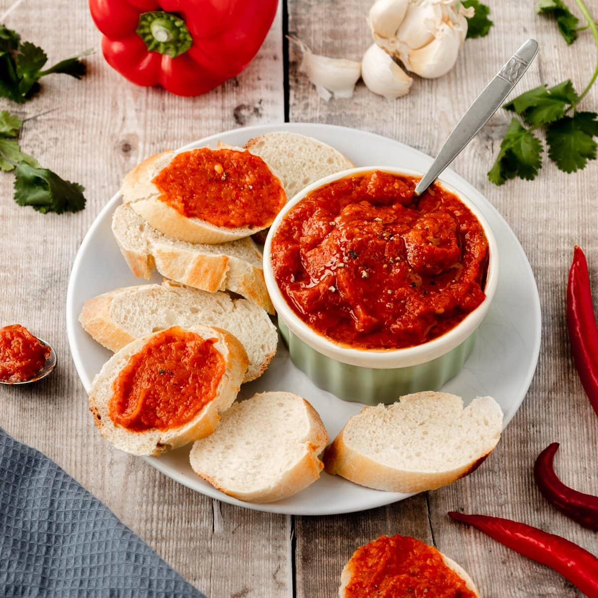

# Ajvar (Macedonian Red Pepper Relish)

*North Macedonia's iconic red pepper relish: roasted red bell peppers and aubergines blended with garlic, sunflower oil, vinegar and chilli, slow-cooked till thick and deeply red. Eaten on bread, with grilled meat, alongside cheese. The canonical Balkan condiment.*

**Serves:** Makes 1 kg

**Prep Time:** 30 minutes

**Cook Time:** 1.5 hours

## Overview
Ajvar (pronounced "EYE-var") is the Balkan condiment that defines Macedonian cooking - a thick, dark red, smoky relish made from roasted red bell peppers and aubergines. The construction: large red bell peppers (Macedonian capia or American red bells) are roasted whole till the skins blacken; aubergines are roasted alongside; both are peeled while warm; the flesh is finely chopped or blended; slow-cooked in sunflower oil with garlic, vinegar, salt and a touch of chilli till thick (90 minutes minimum). Sealed in jars for winter use. Eaten daily across Macedonia: on bread, with grilled meat, alongside cheese, in stuffed peppers.

## Ingredients
- 2 kg red bell peppers (or Macedonian capia peppers)
- 500 g aubergines
- 200 ml sunflower oil
- 8 garlic cloves (chopped)
- 4 tablespoons white wine vinegar
- 1 tablespoon caster sugar
- 2 teaspoons fine sea salt
- 1 teaspoon hot paprika or chilli flakes
- 1 small bunch fresh parsley (optional)

## Method
1. Roast peppers and aubergines at 220°C for 30-40 minutes till skins are blackened and flesh is soft.
2. Place hot peppers in a covered bowl 15 minutes (steaming makes peeling easier).
3. Peel peppers; remove stems and seeds.
4. Peel aubergines; scrape out flesh.
5. Pulse pepper and aubergine flesh in a food processor to a coarse purée (not smooth).
6. Heat sunflower oil in a heavy pan over medium heat.
7. Add garlic; cook 1 minute.
8. Add pepper-aubergine purée; reduce heat to LOW.
9. Cook 90 minutes, stirring frequently, till very thick and the oil rises to the surface.
10. Stir in vinegar, sugar, salt, hot paprika.
11. Pack into sterilised jars; cover with a thin layer of oil to seal.

## Notes
- **Roast peppers till blackened:** the smoke is essential.
- **Slow reduction:** 90 minutes minimum; the texture comes from time.
- **Seal with oil:** for long storage.

## Variations
**Hot ajvar (Ljuti ajvar):** triple the chilli.
**Without aubergine (Lyutenitsa-style):** Bulgarian/Serbian variant; all peppers, no aubergine.
**With walnuts:** add 100 g ground walnuts at the end.
**Smoked ajvar:** add ½ teaspoon liquid smoke.

## Serving
On bread (canonical Macedonian breakfast/snack) · with grilled meat (ćevapi, pljeskavica) · alongside cheese · in stuffed peppers · as a sandwich spread.

## Storage
Sealed jars 6 months in a cool place. Once opened, refrigerate; consume 1 month.
