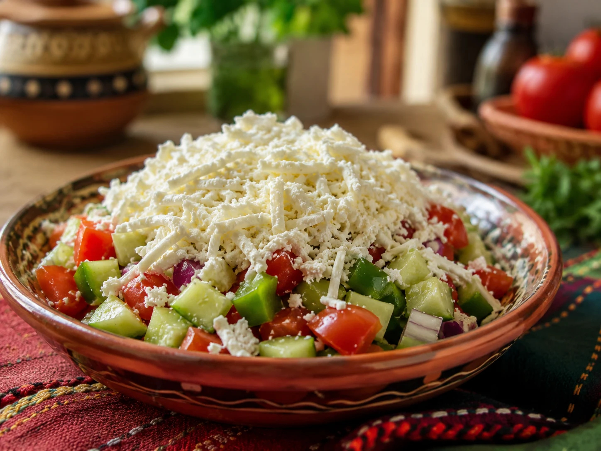

# Shopska Salad (Macedonian Style)

*North Macedonia's traditional salad: diced cucumber, tomato, red bell pepper, raw onion, parsley, all topped with a snowy mound of grated white sheep's cheese (Kashkaval or sirenje feta). The Balkan flag colours in salad form; refreshing, herbal, juicy. Found at every Macedonian table.*

**Serves:** 4

**Prep Time:** 15 minutes

## Overview
Shopska salad is technically Bulgarian by origin (named after the Shopi people of the Sofia region), but the Macedonian version is essentially identical and is the traditional daily salad in both countries. The construction: tomato, cucumber, red pepper, onion are all diced to roughly 1 cm dice; tossed with chopped parsley, sunflower oil, vinegar, salt; topped with a generous grated mound of white salty cheese (sirenje, the Balkan brined-white-cheese; substitute Greek feta) which contrasts with the colourful vegetable base.

## Ingredients
- 4 large ripe tomatoes (diced 1 cm)
- 1 large cucumber (peeled, diced 1 cm)
- 1 large red bell pepper (diced 1 cm)
- 1 small red onion (finely diced)
- 1 small bunch fresh parsley (chopped)
- 6 tablespoons sunflower oil (or olive oil)
- 2 tablespoons red wine vinegar
- 1 teaspoon fine sea salt
- 1 teaspoon black pepper
- 200 g sirenje (Balkan brined white cheese) OR Greek feta (coarsely grated)
- A few pitted black olives (for garnish)
- A pinch of dried oregano (Macedonian touch)

## Method
1. In a large bowl, combine diced tomato, cucumber, pepper, onion.
2. Add chopped parsley.
3. Dress with oil, vinegar, salt, pepper, oregano. Toss gently.
4. Transfer to a serving bowl.
5. Top with a thick mound of coarsely grated cheese.
6. Garnish with olives.
7. Serve immediately.

## Notes
- **Don't pre-mix the cheese:** the visual is the snowy mound on top.
- **Coarsely grate, don't crumble:** the texture is part of the dish.
- **Eat fresh:** within 30 minutes of assembly.

## Variations
- **With egg:** add 4 chopped hard-boiled eggs.
- **With olives mixed in:** Greek-Macedonian variant.
- **With Kashkaval (yellow cheese):** Macedonian variant with grated yellow cheese alongside white.
- **Spicy:** add chopped fresh chilli.

## Serving
- At every Macedonian table (traditional) · alongside grilled meat · with ajvar and bread · at a Macedonian wedding · at home as the daily summer salad.

## Storage
Best eaten fresh; the dressed vegetables soften within an hour.
