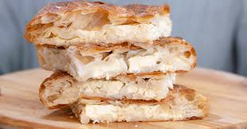

# Macedonian Burek

*North Macedonia's iconic spiral phyllo pie: thin phyllo sheets layered with a filling of cheese, spinach, minced meat or pumpkin, rolled into a long log, then coiled into a spiral and baked till deeply golden. The canonical Balkan breakfast; sold at every Macedonian burekdžija (burek shop) from dawn.*

**Serves:** 8

**Prep Time:** 30 minutes

**Cook Time:** 45 minutes

## Overview
Burek (also spelled börek across the Turkish/Balkan world) is a beloved phyllo pie tradition spanning the Balkans. The Macedonian version distinguishes itself by the spiral form: phyllo sheets are laid out, brushed with butter, filled with the chosen filling (cheese being most popular - sirenje/feta + ricotta + egg; spinach is the second favourite; minced meat the third), rolled into a long log, then coiled into a flat spiral in a round baking tray; baked at high heat till deeply golden. Eaten warm for breakfast with yogurt drink.

## Ingredients

### Phyllo and butter
- 500 g phyllo pastry
- 200 g butter (melted)

### Cheese filling (most popular)
- 400 g feta or sirenje (crumbled)
- 200 g ricotta or cottage cheese
- 3 large eggs (beaten)
- 100 ml plain yogurt
- 1 teaspoon black pepper
- Optional: 100 g grated Kashkaval

### Alternative spinach filling
- 500 g spinach (wilted, drained, chopped)
- 200 g feta (crumbled)
- 2 large eggs
- 1 teaspoon nutmeg

### To finish
- 1 beaten egg + 2 tablespoons yogurt (for glaze)
- A handful of sesame seeds

### To serve
- Plain yogurt or ayran (yogurt drink)
- Pickled chillies

## Method
1. Mix filling ingredients.
2. Lay a phyllo sheet on the counter; brush with melted butter.
3. Place 2-3 tablespoons of filling along one long edge.
4. Roll tightly into a long thin log.
5. Repeat with all phyllo sheets.
6. In a round baking dish (28 cm), starting from the centre, coil the first log into a tight spiral.
7. Continue with the next log, joining the end to the previous; continue coiling outward.
8. Brush the top with egg-yogurt glaze.
9. Sprinkle sesame seeds.
10. Bake at 200°C / 180°C fan for 40-45 minutes till deeply golden.
11. Cool 10 minutes; cut into wedges.
12. Serve warm with yogurt.

## Notes
- **Spiral shape canonical for Macedonia:** flat layered "burek" is also valid (Bosnian style).
- **Generous butter:** the canonical crisp.
- **Eat warm:** the cheese softens; the pastry crisp is at peak.

## Variations
**Pumpkin burek (Tikvenik):** roasted pumpkin + sugar + cinnamon - sweet variant.
**Spinach (Zeljanica):** as above.
**Meat (Burek sa mesom):** minced lamb or beef + onion + spice.
**Mixed cheese:** combine feta, ricotta, Kashkaval.
**Vegan burek:** skip dairy; mushroom + walnut + leek filling.

## Serving
At every Macedonian breakfast (burekdžija canonical setting) · with ayran (yogurt drink) · at a Macedonian bus station · at home as a Sunday brunch.

## Storage
Best eaten warm same day. Refrigerates 2 days; reheat at 180°C for 8 minutes. Freezes (raw) 2 months.
