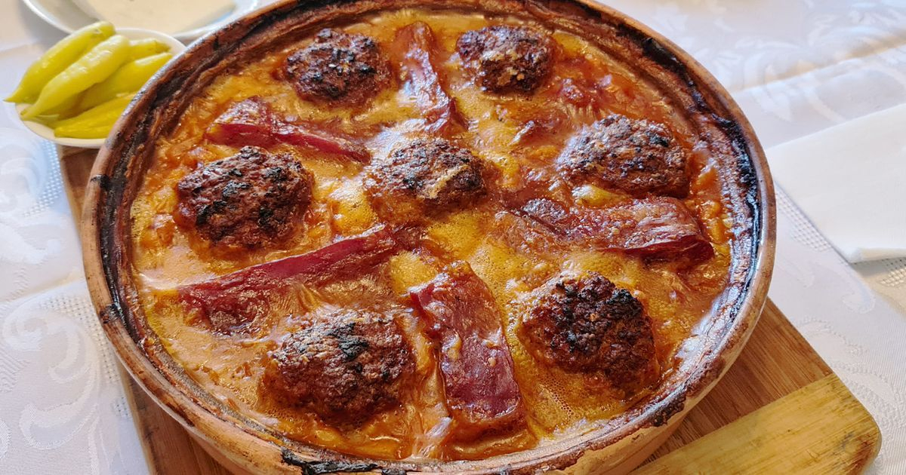

# Tavče Gravče (Macedonian Baked Beans)

*North Macedonia's national dish: dried white beans slow-baked in a clay pot (tavče) with onion, paprika, dried mint, and chilli till the top crusts deeply golden. The Macedonian comfort food; eaten at every family Sunday lunch.*

**Serves:** 6

**Prep Time:** 20 minutes (plus overnight bean soak)

**Cook Time:** 2 hours 30 minutes

## Overview
Tavče gravče (literally "beans in a pan") is North Macedonia's national dish - a humble, deeply flavoured baked bean stew with strong Sephardic and Ottoman roots. The construction: dried white beans (tetovec or similar large white beans) are soaked overnight, simmered till just tender, then transferred to a glazed clay pot (the traditional "tavče"; a ceramic baking dish works) with sweated onions, sweet and hot paprika, dried mint, garlic and a splash of stock; baked uncovered at moderate heat for 90 minutes till the top crusts deeply golden-red.

## Ingredients
- 500 g dried tetovec or large white beans (soaked overnight)
- 3 bay leaves
- 2 large onions (sliced thin)
- 6 garlic cloves (chopped)
- 4 tablespoons olive oil
- 2 tablespoons sweet paprika
- 1 tablespoon hot paprika (or chilli flakes)
- 2 tablespoons dried mint
- 1 tablespoon plain flour
- 800 ml vegetable stock
- 1 dried red chilli (whole; for stew)
- 2 teaspoons fine sea salt
- 1 teaspoon coarsely cracked black pepper
- 2 fresh tomatoes (chopped) OR 200 g tinned tomatoes
- 1 small bunch fresh parsley (chopped, for garnish)

## Method
1. Drain soaked beans; boil in fresh water 45 minutes with 1 bay leaf till just tender. Drain (reserve cooking liquid).
2. Heat olive oil in a heavy pan; sweat onions 10 minutes till golden.
3. Add garlic; cook 1 minute. Add paprikas and flour; stir 1 minute.
4. Add chopped tomatoes; cook 5 minutes.
5. Transfer to a clay pot or ovenproof dish: layer beans, onion mixture, remaining bay leaves, dried mint, chilli, salt, pepper.
6. Pour over stock and 200 ml reserved bean liquid; the liquid should just cover the beans.
7. Preheat oven to 200°C / 180°C fan. Bake uncovered 75-90 minutes till the top is deeply golden and the liquid mostly absorbed.
8. Scatter parsley over; serve hot with bread and a salad.

## Notes
- **Don't skip the dried mint:** the Macedonian signature.
- **Bake uncovered:** the crust is the traditional look.
- **Eat hot from the dish:** straight from the clay pot is the traditional service.

## Variations
**With sausage:** add cured Macedonian klobasica or kielbasa on top in the last 30 minutes.
**With pork:** add cubed smoked pork at stage 5.
**Vegetarian:** as written.
**With egg:** crack eggs over the top in the last 10 minutes.

## Serving
At a Macedonian Sunday family lunch · with rakija as starter · in any Macedonian gostilna · at a Macedonian wedding feast · at home as the traditional Balkan comfort food.

## Storage
Refrigerates 4 days; flavour improves overnight. Freezes 3 months.
