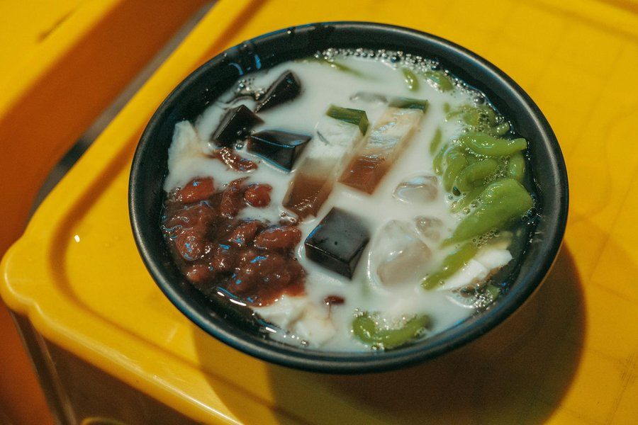

# Cendol

*Malaysia's shaved-ice dessert: worm-shaped green pandan jellies in a pool of coconut milk and dark palm sugar syrup. The Penang night-market obsession.*

**Serves:** 4

**Prep Time:** 25 minutes (plus 30 minutes chilling)

**Cook Time:** 20 minutes

## Overview
A three-part dessert: bright green pandan-flavoured rice flour jellies, a glossy gula melaka syrup, and a generous pour of salted coconut milk, all heaped over shaved or finely crushed ice. The contrast is the point, the sweet coconut and the smoky molasses-like syrup, the cold ice and the chewy jellies. Often served with a spoonful of sweetened red kidney beans for body.

## Ingredients

### Pandan Jellies
- 80 grams rice flour
- 20 grams tapioca flour
- 400 ml water
- 1 teaspoon pandan paste (or 4 fresh pandan leaves, blended with 100 ml water and strained)
- ¼ teaspoon fine sea salt

### Gula Melaka Syrup
- 150 grams gula melaka (palm sugar), roughly chopped, or soft dark brown sugar
- 100 ml water
- 1 pandan leaf, knotted (optional)

### Coconut Milk
- 400 ml can coconut milk
- ¼ teaspoon fine sea salt

### To Serve
- 600 grams crushed (or finely shaved ice)
- 200 grams cooked sweetened red kidney beans, drained (optional, see Notes)

## Method

### Stage 1 - Make the Pandan Jellies
1. Place the rice flour, tapioca flour, water, pandan paste (or strained pandan juice) and salt in a medium saucepan.
2. Whisk until smooth, with no lumps clinging to the base.
3. Set over medium heat and cook, stirring constantly with a wooden spoon, for 5 to 7 minutes. The mixture will thicken in the last minute and turn glossy and stretchy.
4. As soon as it pulls away cleanly from the side of the pan, remove from the heat.

### Stage 2 - Shape the Jellies
1. Fill a large bowl with iced water.
2. Set a colander with 5 mm holes (or a potato ricer with a coarse plate) over the iced water.
3. Working quickly while the mixture is hot, scoop the dough into the colander and press it through with a silicone spatula so short strands drop into the iced water.
4. Leave the jellies in the cold water for 5 minutes to firm up, then drain and refrigerate until needed.

### Stage 3 - Make the Gula Melaka Syrup
1. Place the chopped gula melaka, water and pandan leaf (if using) in a small saucepan.
2. Bring to a simmer over medium heat and cook for 6 to 8 minutes, stirring occasionally, until the sugar has fully dissolved and the syrup coats the back of a spoon.
3. Strain into a small jug and leave to cool to room temperature.

### Stage 4 - Salt the Coconut Milk
1. Pour the coconut milk into a small saucepan and add the salt.
2. Warm over low heat for 1 to 2 minutes, just enough to take the chill off and dissolve the salt. Do not boil.
3. Pour into a jug and chill for at least 30 minutes.

### Stage 5 - Assemble
1. For each portion, place a generous heap of crushed ice in a bowl or tall glass.
2. Spoon over a tablespoon or two of the kidney beans, if using.
3. Add a heaped spoonful of pandan jellies.
4. Pour over 60 ml of coconut milk and finish with 2 to 3 tablespoons of gula melaka syrup.
5. Serve immediately, with a long spoon for stirring everything together at the table.

## Notes
- **Pandan:** Fresh pandan leaves give the truest flavour and colour. Blend 4 leaves with 100 ml water in a blender for 1 minute, then strain through a fine sieve. Pandan paste or extract from a bottle is a perfectly acceptable substitute and produces a brighter green.
- **Gula melaka:** This dark palm sugar is the defining flavour of cendol, smoky and almost coffee-like. Look for solid blocks in Asian grocers labelled gula melaka, gula jawa or palm sugar. Soft dark brown sugar is the closest pantry substitute, though it lacks the same depth.
- **Cendol mould:** A wide-holed colander with 5 mm holes is the practical home approach. Traditional stalls press the dough through a brass disc with circular holes. A potato ricer with the coarsest plate works too.
- **Red beans:** Tinned sweetened red kidney beans are sold at Asian grocers (often labelled for shaved ice). To make from scratch, simmer 80 grams of dried red kidney beans until tender then sweeten with 3 tablespoons of sugar.

## Variations
**Cendol durian:** Top each bowl with a heaped spoonful of fresh durian flesh for the most indulgent version.
**Cendol pulut:** Add 2 tablespoons of warm cooked glutinous rice to the base of each bowl for a more substantial pudding.

## Serving
Serve with: Long spoons or thick straws; stir vigorously at the table to mix the syrup, coconut and ice
Garnish with: An extra drizzle of gula melaka syrup on top of the coconut milk for a marbled finish

## Storage
- Pandan jellies keep 2 days refrigerated submerged in cold water; drain before using
- Gula melaka syrup keeps 2 weeks refrigerated in a sealed jar
- Salted coconut milk keeps 2 days refrigerated; assemble bowls only when ready to eat
