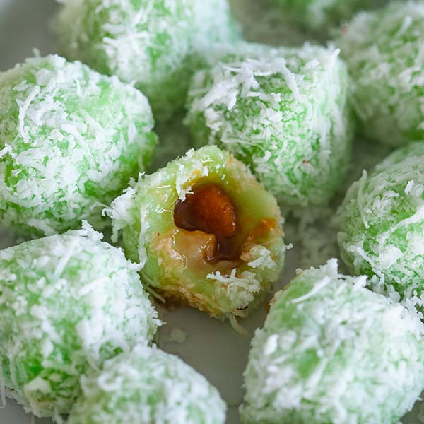

# Onde-Onde

*Malaysia's tea-time sweet: green pandan glutinous rice balls hiding a molten gula melaka centre, rolled in salted grated coconut.*

**Serves:** 4 (makes about 18 balls)

**Prep Time:** 25 minutes

**Cook Time:** 10 minutes

## Overview
A two-flour glutinous rice dough is coloured with pandan, wrapped around chips of gula melaka, then dropped into boiling water until the balls float to the surface. Each one is rolled while still warm in a generous drift of salt-seasoned grated coconut. Three textures in one bite, springy dough, sweet liquid centre, soft coconut crust.

## Ingredients

### Dough
- 200 grams glutinous rice flour
- 1 tablespoon rice flour
- 2 teaspoons pandan paste, or 100 ml strained fresh pandan juice (see Notes)
- 150 ml warm water (slightly less if using pandan juice)
- ¼ teaspoon fine sea salt

### Filling
- 80 grams gula melaka (palm sugar), finely chopped into small chips, or soft dark brown sugar

### Coconut Coating
- 120 grams grated coconut (or 90 grams desiccated coconut moistened with 3 tablespoons hot water)
- ¼ teaspoon fine sea salt
- 1 pandan leaf, torn (optional, for steaming)

## Method

### Stage 1 - Prepare the Coconut Coating
1. Place the grated coconut in a heatproof bowl and toss with the salt. If using moistened desiccated coconut, mix in the water at this stage.
2. Sit the bowl over a saucepan of simmering water (with the pandan leaf tucked in the water if using) and steam for 5 minutes.
3. Remove and spread on a plate to cool.

### Stage 2 - Make the Dough
1. Combine the glutinous rice flour, rice flour and salt in a mixing bowl.
2. Stir in the pandan paste (or pandan juice) and most of the warm water.
3. Knead by hand for 2 to 3 minutes until you have a smooth, soft dough that holds together but is not sticky. Add a splash more water or a dusting of flour to adjust.
4. Cover with a damp tea towel and rest for 5 minutes.

### Stage 3 - Shape the Balls
1. Pinch off pieces of dough about the size of a small walnut, around 18 grams each. You should get about 18 balls.
2. Flatten each piece between your palms into a thick disc about 4 cm across.
3. Place ¼ teaspoon of chopped gula melaka in the centre, gather the edges up over the filling, and pinch to seal completely.
4. Roll between your palms into a smooth ball. Set aside on a tray dusted lightly with rice flour. Cover with a damp cloth so they don't dry out.

### Stage 4 - Cook the Balls
1. Bring a wide saucepan of water to a rolling boil.
2. Drop in the balls in batches of 6 to 8 so they don't crowd.
3. They will sink at first; cook for 1 minute after they float to the surface, around 3 to 4 minutes total.
4. Lift out with a slotted spoon and let them drip dry for a few seconds.

### Stage 5 - Coat & Serve
1. Working while the balls are still warm and tacky, roll each one in the steamed grated coconut, pressing gently so the coconut clings all over.
2. Arrange on a plate or banana leaf and serve within an hour, while the centres are still molten.

## Notes
- **Pandan juice:** For fresh pandan juice, blend 6 pandan leaves with 100 ml water for 1 minute and strain through a fine sieve. The colour is more muted than paste but the flavour is true. Pandan paste from a bottle is a perfectly acceptable substitute.
- **Gula melaka:** The smoky palm sugar is what makes onde-onde sing. Look for it in solid blocks at Asian grocers (sometimes labelled gula jawa). Chip it small enough to fit into the dough but big enough to hold its shape; if it dissolves into the dough you lose the burst. Soft dark brown sugar is a workable substitute.
- **Sealing the filling:** The most common failure point. If the seam is not fully pinched closed, the sugar leaks into the cooking water. Press firmly and check each ball for cracks before boiling.
- **Coconut:** Frozen grated coconut from Asian grocers gives the best texture. If using desiccated, the steam and water rehydration is essential, otherwise the coating tastes dry and sandy.

## Variations
**Klepon ketan hitam:** Replace half the glutinous rice flour with black glutinous rice flour for a deeper, nuttier dough (Indonesian style).
**Sweet potato onde-onde:** Substitute 80 grams of the glutinous rice flour with 100 grams of cooked mashed orange sweet potato. The dough is softer and slightly sweeter.

## Serving
Serve with: A small cup of strong black coffee or kopi-o, the bitterness balances the palm sugar
Garnish with: A few extra strands of grated coconut on top of each ball

## Storage
- Best eaten within 4 hours of cooking, while the centres are still liquid
- Keeps 1 day at room temperature in a sealed container; the dough firms up but the flavour holds
- Do not refrigerate, the dough turns hard and grainy; gently steam to revive
