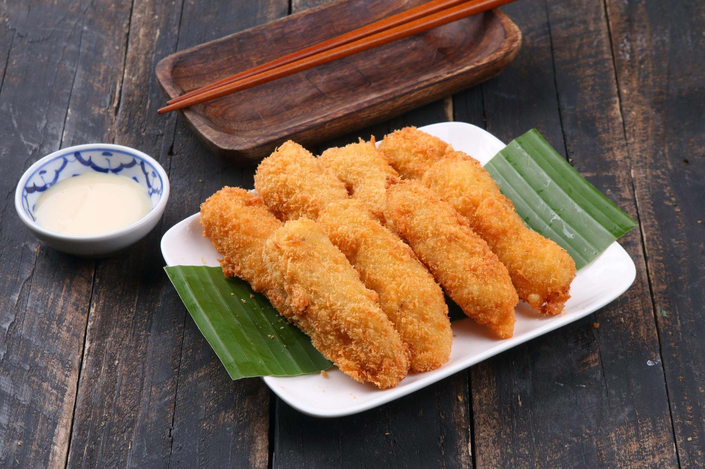

# Pisang Goreng

*Pisang goreng (literally "fried bananas") is the after-school, after-work, after-everything snack of Malaysia. Found at roadside stalls perfumed with hot oil and ripening fruit, the best versions wear a shatteringly crisp golden batter over a soft, almost caramelised banana centre. Each region has its preferred banana, in Malaysia it is often pisang raja or pisang awak.*

**Serves:** 4
**Prep Time:** 10 minutes
**Cook Time:** 15 minutes

## Overview
Ripe bananas are sliced lengthways, dipped in a rice-flour batter spiked with a little turmeric, then deep-fried until the batter sets into a crisp, lacy shell. The trick is in the batter, a mix of rice flour and plain flour for crackle, with a touch of bicarbonate for lightness and rice cereal or panko for extra crunch. Served piping hot, sometimes with a dust of sugar or a drizzle of gula melaka syrup.

## Ingredients

### Batter
- 100 grams rice flour
- 50 grams plain (all-purpose) flour
- 2 tablespoons cornflour
- 1 tablespoon caster sugar
- ½ teaspoon ground turmeric
- ¼ teaspoon fine sea salt
- ¼ teaspoon bicarbonate of soda
- 180 ml ice-cold sparkling water
- 30 grams panko breadcrumbs or crushed rice cereal (optional, for extra crunch)

### Bananas
- 6 ripe but firm small bananas (pisang raja, pisang awak, or finger bananas)
- 1 tablespoon plain flour (for dusting)

### To Fry
- 1 litre vegetable oil

### To Serve
- 2 tablespoons icing sugar (optional)
- 4 tablespoons gula melaka syrup (optional, see Notes)

## Method

### Stage 1 - Mix the Batter
1. Whisk the rice flour, plain flour, cornflour, sugar, turmeric, salt and bicarbonate of soda together in a mixing bowl.
2. Pour in the cold sparkling water and whisk until the batter is smooth and the consistency of pouring cream. Add a splash more water if it looks too thick.
3. Stir in the panko or crushed rice cereal, if using.
4. Rest the batter for 5 minutes while the bicarb activates.

### Stage 2 - Prepare the Bananas
1. Peel the bananas.
2. Slice each one lengthways into 2 long halves, or, for fatter bananas, into 3 long planks.
3. Pat dry on paper towel and dust very lightly with the plain flour. This helps the batter cling.

### Stage 3 - Heat the Oil
1. Pour the vegetable oil into a deep, heavy saucepan or wok to a depth of 6 to 7 cm.
2. Set over medium-high heat and bring to 175°C (350°F). A small piece of bread should turn golden in 30 seconds.

### Stage 4 - Fry
1. Working in batches of 3 to 4 pieces, dip each banana half into the batter, lift out and let the excess drip off, then lower carefully into the oil.
2. Fry for 3 to 4 minutes, turning halfway, until the batter is deep golden and crisp and the banana has softened.
3. Lift out with a slotted spoon and drain on a wire rack set over a tray. Avoid paper towel directly, the steam will soften the crust.
4. Skim any loose batter scraps from the oil between batches so they don't burn and taint the flavour.

### Stage 5 - Serve
1. Pile the fritters onto a serving plate while still hot.
2. Dust with icing sugar or drizzle with warm gula melaka syrup just before serving.

## Notes
- **Banana choice:** You want bananas that are ripe enough to be sweet but still firm enough to hold their shape in the oil. Standard supermarket Cavendish bananas work but go fast, slightly underripe is safer than overripe.
- **Sparkling water:** The bubbles in ice-cold sparkling water create a lighter, crisper batter. Use it within 10 minutes of mixing for the best lift.
- **Oil temperature:** If the oil is too cool the batter will absorb it and turn greasy; too hot and the batter darkens before the banana softens. A thermometer is worth its weight here.
- **Gula melaka syrup:** Simmer 80 grams of chopped gula melaka with 60 ml water until dissolved into a glossy syrup. Soft dark brown sugar is a workable substitute if you cannot find palm sugar.

## Variations
**Cheese pisang goreng:** A modern Malaysian fast-food twist, top hot fritters with grated cheddar and a drizzle of condensed milk.
**Banana fritter sandwich:** Slip a hot fritter between slices of soft white bread with kaya (coconut jam) for a kampung breakfast.

## Serving
Serve with: A scoop of vanilla or coconut ice cream for a fuller dessert, or a small cup of thick black coffee
Garnish with: A dusting of icing sugar, a drizzle of gula melaka syrup, or a scatter of toasted sesame seeds

## Storage
- Best eaten within 10 minutes of frying, the batter loses its crispness fast
- Leftover fritters can be revived in a 180°C oven for 5 minutes; they will not be quite as crisp
- Batter does not store well, mix only what you need
