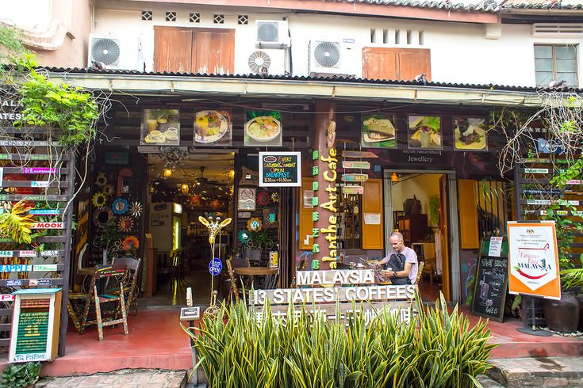

# Malaysian Cuisine

A multicultural cuisine where Malay, Chinese (especially Hokkien), Tamil Indian and Peranakan (Nyonya) traditions sit on the same table, shaped by hawker culture and street food. Flavours come from coconut milk, lemongrass, galangal, kaffir lime leaf, belacan (shrimp paste), pandan, tamarind and the sweet darkness of kecap manis. Defining techniques include the freshly pounded rempah spice paste, fast wok stir-fries for noodle dishes, slow-simmered coconut curries and the layered assembly of nasi lemak and laksa.
