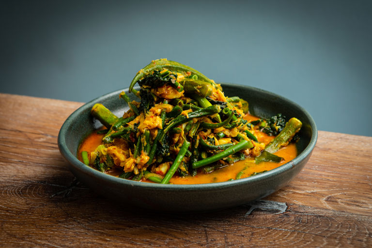

# Sayur Masak Lemak

*Malaysian vegetables in coconut milk: a yellow-tinged, turmeric-bright broth with squash, beans, and a fragrant rempah base. "Masak lemak" means "cooked rich", and the dish is exactly that, mild and creamy without being heavy. Eat with rice, every day across Malaysia.*

**Serves:** 4

**Prep Time:** 15 minutes

**Cook Time:** 25 minutes

## Overview
Malaysia's everyday vegetables in coconut milk: a yellow-tinged, turmeric-bright broth with squash, beans, aubergine and tofu around a fragrant rempah base. Masak lemak means cooked rich, and the dish is exactly that, mild and creamy without being heavy. The kind of weeknight dinner that lands on every Malaysian table with rice. The fresh rempah is the foundation of the dish; a blended paste of shallots, garlic, ginger, fresh turmeric, lemongrass and dried red chillies fried in oil till the oil splits out and the kitchen smells aromatic. Ground turmeric works at half quantity in a pinch, but the fresh root gives a brighter colour and cleaner flavour. The coconut milk technique is the rule home cooks miss; a steady simmer never a rolling boil, because coconut milk splits at high heat and the broth goes oily and broken. Pumpkin or squash leads the vegetables in (it takes the longest), followed by the quicker things. Salt, sugar and a squeeze of lime off the heat to balance. Served hot with rice.

## Ingredients

### Spice paste (rempah)
- 6 shallots
- 4 garlic cloves
- 3 cm fresh ginger
- 3 cm fresh turmeric (or 1 teaspoon ground)
- 2 stalks lemongrass (white parts only, sliced)
- 2 dried red chillies (soaked in hot water 10 min, deseeded)

### Stew
- 3 tablespoons vegetable oil
- 4 kaffir lime leaves
- 1 stalk lemongrass (bashed)
- 400 ml coconut milk
- 400 ml water (or vegetable stock)
- 500 g pumpkin (or butternut squash, peeled and cubed)
- 200 g long beans (or green beans, in 5 cm lengths)
- 1 aubergine (small, cubed)
- 200 g firm tofu (cubed)
- 1 teaspoon salt
- 2 teaspoons sugar
- ½ lime (juice)

## Method

### Stage 1 - Paste
1. Blend all the spice-paste ingredients with a splash of water to a smooth paste.

### Stage 2 - Fry
1. Heat the oil in a heavy pan over medium heat.
1. Cook the paste 5-6 minutes, stirring, until darker, oily and aromatic.

### Stage 3 - Liquid
1. Add the lime leaves and lemongrass; stir 30 seconds.
1. Pour in the coconut milk and water; bring to a steady simmer.

### Stage 4 - Vegetables
1. Add the pumpkin; cook 10 minutes until starting to soften.
1. Add the beans, aubergine and tofu; simmer 8 minutes more until everything is tender.
1. Stir in the salt and sugar.

### Stage 5 - Finish
1. Off the heat, stir in the lime juice.
1. Taste; adjust salt and sugar.
1. Serve hot with rice.

## Notes
- **Fresh turmeric:** Fresh root gives a brighter, more floral flavour than ground. If using ground, halve to ½ teaspoon, it can taste musty in larger amounts.
- **Don't boil the coconut milk hard:** It can split. Steady simmer; never a rolling boil.
- **Vegetable choice:** Sweet potato, snake gourd, choko, kabocha all work, anything that holds shape in coconut sauce.

## Storage
- Keeps 3 days refrigerated; flavour deepens.
- Freezes 2 months but the aubergine softens.
