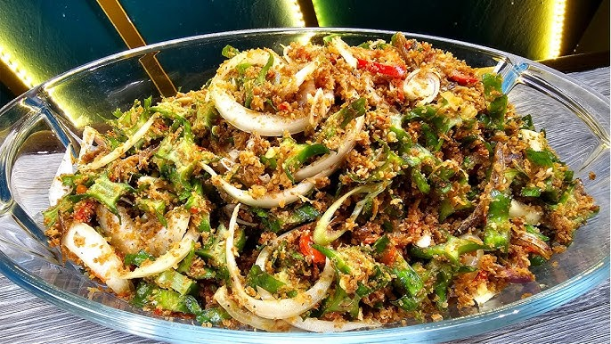

# Kerabu Kacang Botol

*A Malay raw salad: winged beans dressed with toasted coconut, chilli, lime and fish sauce. Eaten next to grilled fish at a kampung table.*

**Serves:** 4 (as a side)

**Prep Time:** 20 minutes

**Cook Time:** 8 minutes

## Overview
Winged beans are sliced thin and tossed with kerisik (toasted grated coconut pounded to a fragrant paste), fresh herbs, dried shrimp and a sharp chilli-lime dressing. The kerisik is the heart of the dish, it gives the salad its smoky-sweet backbone and binds the dressing to the vegetables. Bright, crunchy, savoury and just lightly fiery.

## Ingredients

### Salad
- 200 grams winged beans (kacang botol)
- 1 Asian red shallot (small, very thinly sliced)
- 2 kaffir lime leaves (centre rib removed, very finely shredded)
- 10 mint leaves (torn)
- 8 Vietnamese mint (laksa) leaves (optional, torn)

### Kerisik (Toasted Coconut)
- 60 grams fresh (or frozen grated coconut), defrosted (or 50 grams desiccated coconut moistened with 2 tablespoons water)

### Dressing
- 2 tablespoons dried shrimp
- 2 fresh red bird's eye chillies (finely chopped)
- 1 fresh red chilli (large, finely chopped)
- 2 tablespoons fresh lime juice
- 1 ½ tablespoons fish sauce
- 1 teaspoon palm sugar (gula melaka, grated) or soft brown sugar
- 1 garlic clove (grated)

### To Finish
- 1 tablespoon fried shallots (optional)
- Lime wedges

## Method

### Stage 1 - Make the Kerisik
1. Heat a dry frying pan over medium-low heat.
2. Add the grated coconut and toast, stirring constantly, for 6 to 8 minutes until evenly golden brown and fragrant. Watch closely in the last 2 minutes, it scorches fast.
3. Tip the toasted coconut into a mortar and pound for 2 minutes, until it releases its oil and clumps into a coarse, slightly tacky paste. Set aside.

### Stage 2 - Prepare the Beans
1. Wash and trim the winged beans, removing the stem ends.
2. Slice them on a sharp angle into very thin rings, about 2 mm thick, so the fluted edges stay visible.
3. Bring a small saucepan of salted water to the boil.
4. Drop the sliced beans in for 30 seconds, then drain and plunge into iced water to lock in the colour. Drain again and pat dry.

### Stage 3 - Mix the Dressing
1. Soak the dried shrimp in hot water for 5 minutes, drain and chop finely.
2. In a small bowl, stir together the chopped shrimp, both chillies, lime juice, fish sauce, palm sugar and grated garlic.
3. Whisk until the palm sugar has dissolved. Taste and adjust to a balance of salty, sour, sweet and hot.

### Stage 4 - Assemble
1. Place the drained beans in a large mixing bowl with the shallot, kaffir lime leaves, mint and Vietnamese mint (if using).
2. Add the kerisik and toss with your hands so the coconut clings to the beans.
3. Pour over the dressing and toss again until everything is glossy and well coated.
4. Tip onto a serving platter, scatter with fried shallots, and serve with lime wedges.

## Notes
- **Kerisik:** Toasting the coconut and then pounding it is what separates kerabu from a basic salad. The pounding releases oil and turns the coconut into a near-paste, the texture you want. Desiccated coconut is a workable shortcut if fresh is unavailable.
- **Winged beans:** Look for kacang botol at Southeast Asian grocers or Filipino shops (where they are called sigarilyas). If unavailable, swap in long beans or thin French beans, sliced equally thin, you will lose the decorative fluted edge but the dish still works.
- **Vietnamese mint:** Also called daun kesum or laksa leaf. It is a defining herb for kerabu and worth seeking out; if you can't find it, double the regular mint and add a few coriander leaves.
- **Palm sugar:** Gula melaka has a deeper, smokier sweetness than brown sugar. Grate it finely so it dissolves into the dressing.

## Variations
**Kerabu mangga:** Replace the beans with 2 firm green (unripe) mangoes, julienned. The salad becomes sharper and fruitier.
**Kerabu taugeh:** Use blanched bean sprouts in place of winged beans for a softer, crunchier salad popular in Penang.

## Serving
Serve with: Grilled fish, ikan bakar, satay, or as part of a wider Malaysian spread with rice and sambal
Garnish with: A handful of crisp fried shallots and a wedge of lime

## Storage
- Best eaten within 2 hours of dressing, the beans soften quickly
- Undressed components (kerisik, sliced beans, dressing) keep separately for 1 day in the fridge
- Kerisik on its own keeps 1 week in a sealed jar at room temperature
