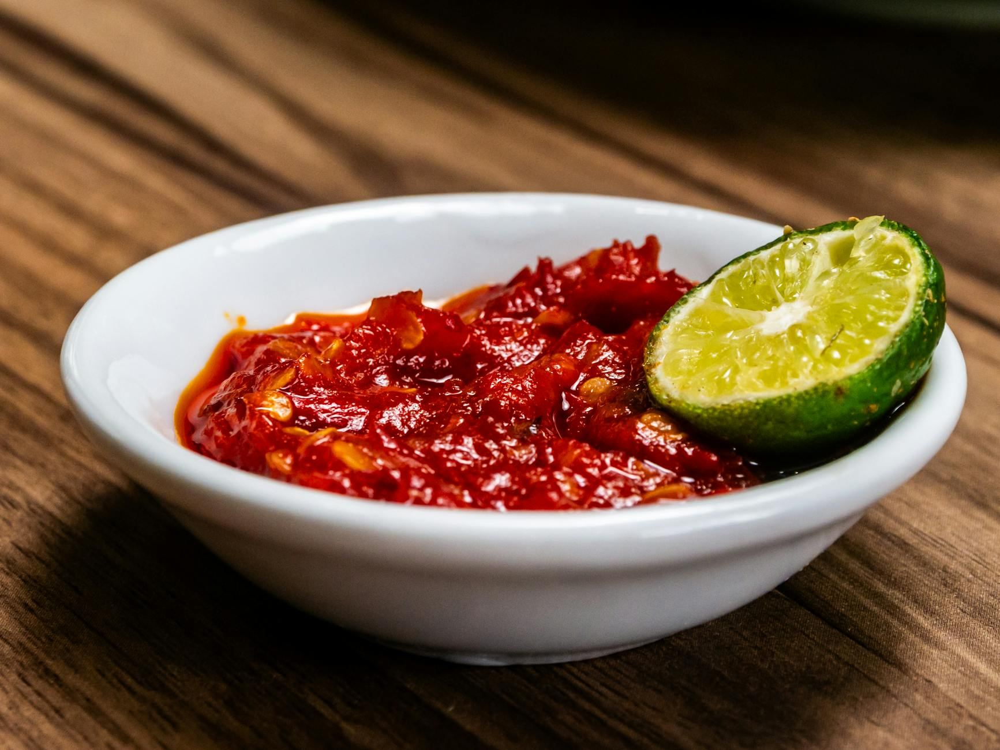

# Sambal Belacan

*Malaysia's everyday chilli condiment: a raw pounded paste of fresh red chillies and toasted shrimp paste finished with a sharp squeeze of lime.*

**Serves:** 6 (as a condiment)
**Prep Time:** 10 minutes
**Cook Time:** 3 minutes

## Overview
A bright, punchy raw sambal built around belacan, the fermented Malaysian shrimp paste. The belacan is toasted first to mellow its rawness and bring out its savoury depth, then pounded with fresh red chillies, a little shallot and lime juice. The texture should stay coarse, not smooth, so each spoonful carries flecks of chilli skin and seed. Unlike cooked sambals such as sambal tumis, this one is finished in minutes and meant to be eaten the day it is made.

## Ingredients

### Sambal
- 1 tablespoon belacan (Malaysian shrimp paste)
- 6 fresh red bird's eye chillies (stems removed)
- 2 large fresh red chillies (deseeded if you prefer less heat)
- 1 small Asian red shallot (roughly chopped)
- ½ teaspoon caster sugar
- ¼ teaspoon sea salt

### To Finish
- 1 ½ tablespoons fresh lime juice (from 1 large lime or 2 calamansi)
- 1 small red chilli (sliced into rings, to garnish)

## Method

### Stage 1 - Toast the Belacan
1. Wrap the belacan in a small square of foil and flatten it into a thin disc about 5 mm thick.
2. Heat a dry frying pan over medium heat for 1 minute.
3. Place the foil parcel in the pan and toast for 1 minute on each side, until the belacan smells deeply savoury and slightly smoky.
4. Unwrap and tip the toasted belacan into a mortar.

### Stage 2 - Pound the Sambal
1. Add the bird's eye chillies, large red chillies and shallot to the mortar.
2. Pound with the pestle for 2 to 3 minutes, working in a steady circular motion, until you have a coarse, flecked paste. Stop before it turns to a smooth puree.
3. Pound in the sugar and salt.

### Stage 3 - Finish & Serve
1. Stir in the lime juice with a small spoon.
2. Taste and adjust with a pinch more salt or sugar if needed.
3. Tip into a small serving bowl and scatter the sliced red chilli over the top.

## Notes
- **Belacan:** Sold in firm blocks at Asian grocers, usually in the dried-goods aisle near the dried anchovies. Toasting is non-negotiable, it transforms the paste from raw and ammoniac to rich and umami. The foil keeps the smell contained.
- **Mortar vs blender:** A granite mortar gives the right coarse texture. A small food processor works but pulse in short bursts so you don't end up with a smooth puree.
- **Lime vs calamansi:** Calamansi is traditional and gives a more fragrant, mandarin-like sourness. Regular lime is a fine swap.
- **Heat level:** Bird's eye chillies provide the kick; the larger chillies add colour and body. Reduce the bird's eye chillies if you are heat-shy.

## Variations
**Sambal belacan with mango:** Stir in 2 tablespoons of finely diced unripe green mango at the end for a tangy, crunchy version often served with grilled fish.
**Sambal belacan with kaffir lime:** Pound 2 shredded kaffir lime leaves into the chillies for an aromatic citrus lift.

## Serving
Serve with: Nasi lemak, grilled fish, fried chicken, plain rice, or as a dip for raw cucumber and long beans
Garnish with: A few extra rings of fresh red chilli and a wedge of lime on the side

## Storage
- Best eaten the day it is made, while the chillies are still bright
- Keeps 2 days refrigerated in a sealed jar; the lime will dull the colour but the flavour holds
- Does not freeze well, the texture turns watery on thawing
