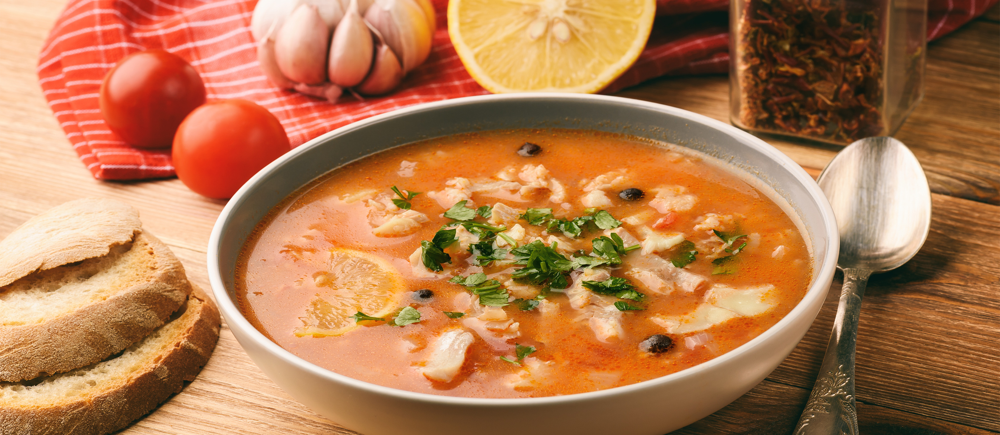

# Aljotta (Maltese Garlic Fish Soup)

*Malta's everyday fishermen's soup: a light tomato-garlic-rice broth with white fish and a generous handful of fresh herbs (mint, marjoram, parsley). The Lent and Friday-fasting soup; the dish that uses the day's smaller catch. Light, garlicky, distinctly Maltese.*

**Serves:** 4-6

**Prep Time:** 15 minutes

**Cook Time:** 35 minutes

## Overview
Aljotta (the name derives from "all'aglio", Italian for "with garlic") is one of Malta's oldest dishes, a fishermen's soup that uses smaller mixed-catch fish in a clear garlicky tomato broth thickened with a small amount of rice. The dish became the traditional Maltese Friday and Lenten meal (Catholic fasting days). The construction: a head of garlic is sweated in olive oil with onion and tomato; fish stock and water are added; small chunks of white fish (cod, hake, sea bream, scorpion fish, monkfish, whatever was caught) are poached briefly; rice is cooked into the broth for body; the soup is finished with a generous shower of fresh mint, marjoram, and parsley, plus a squeeze of lemon.

## Ingredients

### For 4-6 servings
- 4 tablespoons olive oil
- 1 head garlic (about 10 cloves; chopped)
- 1 large onion (finely diced)
- 4 large ripe tomatoes (peeled, chopped)
- 2 tablespoons tomato paste
- 1.5 litres fish stock (or 1 litre fish stock + 500 ml water)
- 100 g long-grain rice
- 600 g mixed white fish fillets (cod, hake, sea bream, monkfish, cubed)
- 1 small bunch fresh mint (chopped)
- 1 small bunch fresh marjoram (chopped) OR 1 teaspoon dried
- 1 small bunch fresh parsley (chopped)
- Juice of 1 lemon
- 1 teaspoon fine sea salt
- 1 teaspoon coarsely cracked black pepper
- 1 pinch chilli flakes (optional)

### To serve
- Crusty Maltese bread (ħobż tal-Malti)
- A wedge of lemon
- A drizzle of extra olive oil
- A glass of Maltese white wine

## Method

### Stage 1 - Aromatics
1. Heat olive oil in a large pot over medium heat.
2. Add chopped garlic and onion; sweat 8 minutes till soft and fragrant (don't brown).
3. Add tomato paste; cook 2 minutes.
4. Add chopped tomatoes; cook 5 minutes till they break down.

### Stage 2 - Broth
1. Pour in the fish stock; bring to a gentle simmer.
2. Add the rice.
3. Simmer 12-15 minutes till the rice is tender.

### Stage 3 - Fish
1. Add the cubed fish to the simmering broth.
2. Poach 3-4 minutes till the fish is just cooked through (don't overcook).
3. Season with salt, pepper, and chilli flakes (if using).

### Stage 4 - Finish
1. Stir in the chopped mint, marjoram, and parsley.
2. Squeeze the lemon juice over.
3. Drizzle a final tablespoon of olive oil.

### Stage 5 - Serve
1. Ladle into deep bowls.
2. Drizzle extra olive oil.
3. Serve with crusty Maltese bread for soaking and a lemon wedge.

## Notes
- **A whole head of garlic:** the traditional Maltese amount. Don't reduce.
- **Mint and marjoram:** the Maltese signature herbs. Don't substitute basil.
- **Don't overcook the fish:** 3-4 minutes maximum; longer and it falls apart and gets dry.
- **Day-fresh fish:** the dish was designed to use the day's catch.

## Variations
- **With prawns:** add 200 g raw prawns alongside the fish.
- **With clams or mussels:** the seafood-rich version.
- **Light vegetable aljotta:** for Lent, skip the fish; double the rice + add chickpeas.
- **With egg:** crack 4 eggs into the simmering broth in the last 3 minutes, poached-in-the-soup version.
- **Spicy aljotta:** add 2 chopped chillies + 1 teaspoon harissa.

## Serving
- At a Maltese Friday dinner (traditional Catholic fasting tradition) · during Lent (the traditional Lenten soup) · at a Maltese fishing-village restaurant · at home as a light weeknight supper · with crusty bread for soaking up the broth.

## Storage
- Refrigerates 2 days; the rice absorbs broth so add liquid when reheating.
- Don't freeze (the fish suffers).
- Best eaten same day.
