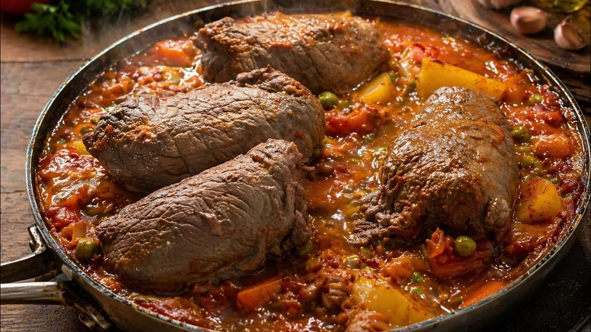

# Bragioli (Maltese Beef Olives)

*Malta's stuffed beef rolls: thin slices of beef wrapped around a savoury filling of minced pork, hard-boiled egg, parsley, garlic and breadcrumbs, tied with kitchen string, browned, then slow-braised in red wine and tomato sauce till fork-tender. The canonical Maltese Sunday-lunch beef dish; named for "ulivi" (olives) because of the rolled shape.*

**Serves:** 4-6

**Prep Time:** 30 minutes

**Cook Time:** 1.5 hours

## Overview
Bragioli (from the Italian "braciole" / Sicilian "involtini"; named "olives" because of the rolled shape, not because they contain olives) is Malta's classic stuffed-beef Sunday lunch. The construction: thin slices of top round beef are spread with a filling of minced pork, hard-boiled egg, breadcrumbs, parsley, garlic, Parmesan and beaten egg, rolled tight, tied with string, browned in olive oil, then slow-braised in a tomato-and-red-wine sauce with bay and onion for 90 minutes till the beef is fork-tender and the sauce is thick. Served sliced into pinwheel rounds over pasta, or with mashed potato and peas as the secondo.

## Ingredients

### Beef rolls (4 large or 8 small)
- 4 thin slices top round beef (about 200 g each; beaten to 3 mm thick)
- Fine sea salt and black pepper

### Filling
- 300 g minced pork
- 2 hard-boiled eggs (chopped)
- 100 g fresh breadcrumbs
- 60 g grated Parmesan
- 4 garlic cloves (finely chopped)
- 4 tablespoons chopped fresh parsley
- 1 small egg (beaten, for binding)
- 1 teaspoon fine sea salt
- 1 teaspoon coarsely ground black pepper

### Braising sauce
- 4 tablespoons olive oil
- 2 onions (chopped)
- 6 garlic cloves (chopped)
- 2 tablespoons tomato paste
- 400 g tinned chopped tomatoes
- 250 ml dry red wine
- 500 ml beef stock
- 2 bay leaves
- 1 small bunch fresh thyme
- 1 teaspoon ground cinnamon (optional Maltese touch)

### To serve
- 500 g cooked spaghetti or boiled potatoes
- 200 g peas (steamed)
- Grated Parmesan

## Method

### Stage 1 - Make the filling
1. Combine minced pork, chopped eggs, breadcrumbs, Parmesan, garlic, parsley, egg, salt, pepper.
2. Mix thoroughly.

### Stage 2 - Roll
1. Lay each beef slice flat; season.
2. Spread a portion of filling along one short edge.
3. Roll tightly into a cigar shape.
4. Tie with kitchen string in 2-3 places.

### Stage 3 - Brown
1. Heat olive oil in a Dutch oven over medium-high heat.
2. Brown the rolls all over (6-8 minutes).
3. Set aside.

### Stage 4 - Braising sauce
1. In the same pot, sweat onions and garlic 8 minutes.
2. Add tomato paste; cook 1 minute.
3. Add chopped tomatoes; cook 5 minutes.
4. Pour in red wine; reduce 5 minutes.
5. Add beef stock, bay, thyme, cinnamon (if using).

### Stage 5 - Braise
1. Return rolls to the sauce; bring to a simmer.
2. Cover; reduce heat to LOW.
3. Braise 90 minutes till the rolls are fork-tender.

### Stage 6 - Serve
1. Lift out rolls; remove strings.
2. Slice each into 4-5 pinwheel rounds.
3. Serve over cooked spaghetti tossed with the braising sauce, OR with mashed potato and peas alongside.
4. Top with grated Parmesan.

## Notes
- **Beat the beef thin:** 3 mm. Thicker rolls don't braise evenly.
- **Tie with string:** the canonical Maltese technique.
- **Slow braise 90 minutes:** the meat must be fork-tender.

## Variations
**Pork bragioli:** swap beef for pork shoulder slices.
**With prosciutto in the filling:** add a slice of prosciutto inside.
**With raisins (Sicilian-Maltese):** add 30 g sultanas to the filling.
**Mini bragioli:** smaller rolls; canapé portions.
**With provolone in the filling:** the cheesier variant.

## Serving
At a Maltese Sunday family lunch · at a Maltese wedding luncheon · at a Maltese village festa · at home as a special weekend supper · alongside Maltese red wine.

## Storage
- Refrigerates 3 days; the flavour improves overnight.
- Freezes 3 months in the sauce.
- Reheat gently in a low oven.
