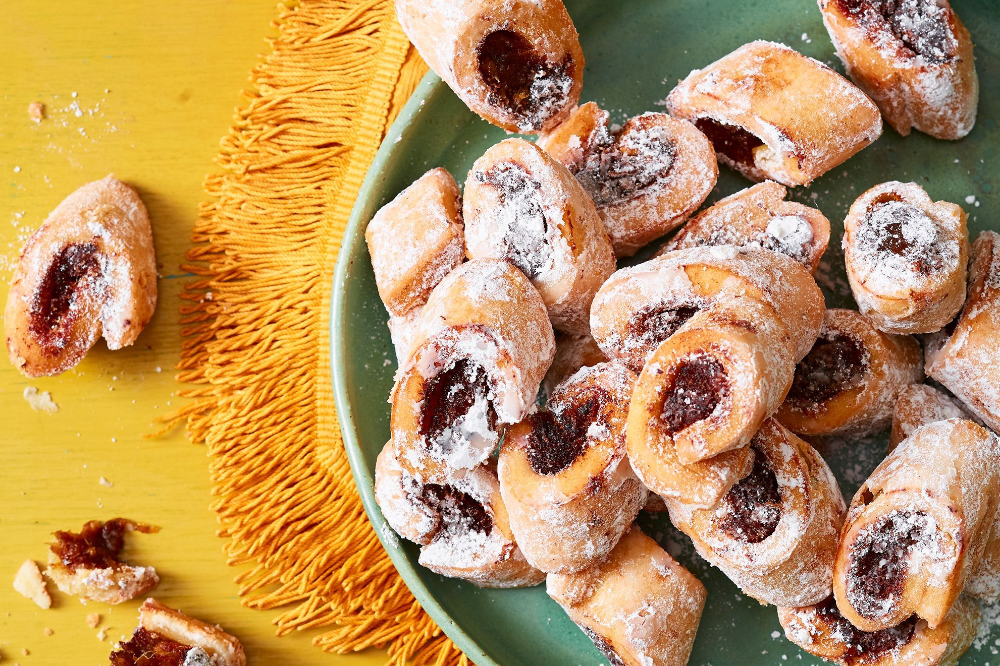

# Imqaret (Maltese Date Pastries)

*Malta's traditional date pastries: a thick filling of pureed dates, citrus zest, aniseed and a slug of anisette, encased in shortcrust pastry strips, deep-fried till golden, dusted with icing sugar. The street-food dessert sold from carts at every Maltese village festa and outside churches on feast days.*

**Serves:** Makes 12-16

**Prep Time:** 30 minutes (plus 1 hour pastry chill)

**Cook Time:** 15 minutes

## Overview
Imqaret (singular "mqaret"; the name comes from the Arabic root for "diamond-shaped") are Malta's traditional date pastries - a remnant of the islands' Arab heritage adapted into a Catholic-festa street food. The construction: dates are puréed with anisette (or brandy), orange and lemon zest, cinnamon, cloves, and a touch of olive oil to make a thick paste; a sturdy shortcrust pastry (sometimes made with semolina for added crunch) is rolled into a long thin rectangle; the date paste is piped down the centre of the pastry; the pastry is folded over and sealed; the long log is cut into diamond shapes; deep-fried in olive oil till deeply golden; dusted generously with icing sugar. Sold hot at every Maltese village festa, sold cold from bakery counters; eaten with coffee or as a sweet snack. Three details: ANISEED OR ANISETTE in the date paste (the Maltese signature), DEEP-FRY (the canonical Maltese method; baking is possible but less traditional), and DIAMOND CUT (the iconic Maltese imqaret shape).

## Ingredients

### Pastry
- 300 g plain flour
- 100 g semolina (optional; for extra crunch)
- 150 g butter (cubed cold)
- 30 g caster sugar
- 1 teaspoon ground cinnamon
- A pinch of fine sea salt
- 1 large egg
- 4 tablespoons cold water

### Date filling
- 400 g pitted dates (Medjool or similar)
- 80 ml anisette (or brandy)
- Zest of 1 orange
- Zest of 1 lemon
- 1 teaspoon ground cinnamon
- ½ teaspoon ground cloves
- 1 tablespoon olive oil
- 1 tablespoon fennel seeds (lightly crushed; optional)

### To finish
- 1 litre vegetable oil (for deep frying)
- Icing sugar for dusting

## Method

### Stage 1 - Pastry
1. Mix flour, semolina (if using), sugar, salt, cinnamon.
2. Rub in butter till like breadcrumbs.
3. Add egg and water; bring together into smooth dough.
4. Wrap; chill 1 hour.

### Stage 2 - Date filling
1. Place pitted dates in a food processor.
2. Add anisette, zests, cinnamon, cloves, olive oil, fennel seeds.
3. Pulse to a thick smooth paste.
4. Adjust with a teaspoon of water if too stiff.

### Stage 3 - Assemble
1. Roll pastry on a floured surface into a long rectangle (about 60 × 12 cm), 4 mm thick.
2. Cut lengthways into 2 strips (30 cm × 12 cm each).
3. Pipe (or spoon) a thick rope of date filling down the centre of each strip.
4. Fold one long edge over the date; brush with water; fold the other edge over to seal.
5. Press gently to seal.

### Stage 4 - Cut into diamonds
1. With a sharp knife, cut each log into diamond shapes - angled cuts every 5-6 cm.
2. Each piece should be a parallelogram about 5 cm across.

### Stage 5 - Deep fry
1. Heat vegetable oil to 170°C.
2. Fry imqaret in batches 3-4 minutes till deeply golden.
3. Lift out; drain on kitchen paper.

### Stage 6 - Finish
1. Dust generously with icing sugar while still warm.
2. Serve warm or at room temperature.

## Notes
- **Anisette or brandy is the Maltese signature.**
- **Diamond cut is iconic.**
- **Eat warm:** best straight from the fryer.

## Variations
**Baked imqaret:** bake at 200°C for 18-20 minutes - easier, less traditional.
**With walnuts:** add 80 g chopped walnuts to the date paste.
**With honey drizzle:** drizzle warm honey after frying.
**Mini imqaret:** smaller diamonds (3 cm) for canapé portions.

## Serving
At a Maltese village festa (the canonical setting) · sold from street carts outside churches · at a Maltese coffee shop · at home as a sweet snack · with strong Maltese coffee.

## Storage
- Best eaten warm; texture is best within 4 hours.
- Refrigerates 5 days (texture softens).
- Reheat at 160°C for 8 minutes to refresh.
- Freezes 1 month.
