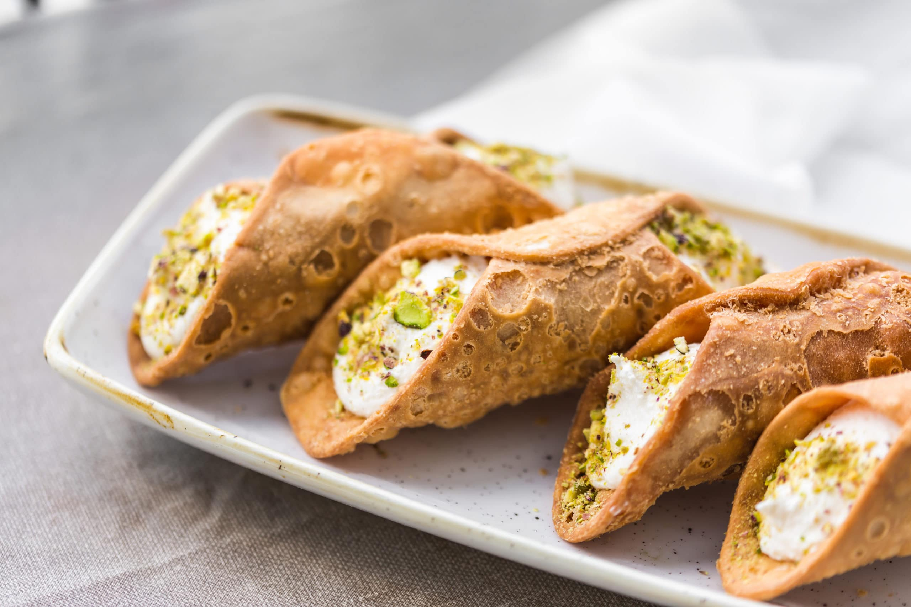

# Maltese Kannoli

*Malta's beloved fried-pastry-with-ricotta-filling: crisp deep-fried pastry shells filled with sweetened ricotta studded with chocolate chips, candied peel and a touch of cinnamon. The Maltese cousin of Sicilian cannoli; the traditional Maltese festa dessert.*

**Serves:** Makes 12

**Prep Time:** 30 minutes (plus 1 hour dough chill)

**Cook Time:** 15 minutes

## Overview
Maltese kannoli are Malta's adaptation of the Sicilian cannoli, differing in subtle but real ways: the shells are slightly thicker, the filling tends to be sweeter, the use of chocolate chips and candied peel inside the ricotta filling is universal (whereas Sicilian versions sometimes use only ricotta and pistachio), and the traditional Maltese kannoli is eaten at every village festa (the patron-saint feast days that punctuate the Maltese calendar). The construction: a flour-and-butter-and-Marsala dough is rolled thin, cut into ovals, wrapped around stainless-steel cannoli tubes, deep-fried till golden and crisp; once cooled, the shells are filled (with a piping bag) with sweetened ricotta mixed with grated dark chocolate, candied orange peel, and a touch of cinnamon. Dipped in chopped pistachios or icing sugar at the ends.

## Ingredients

### Shell dough
- 250 g plain flour
- 30 g caster sugar
- 1 tablespoon cocoa powder
- 1 teaspoon ground cinnamon
- A pinch of fine sea salt
- 30 g cold butter (cubed)
- 1 large egg (beaten)
- 4 tablespoons Marsala wine (or sweet sherry)
- 1 tablespoon white wine vinegar

### Filling
- 500 g good ricotta (drained overnight in a sieve; sheep's milk if possible)
- 150 g icing sugar (sifted)
- 1 teaspoon vanilla extract
- 100 g dark chocolate (finely grated or chopped)
- 60 g candied orange peel (finely chopped)
- 1 teaspoon ground cinnamon

### To finish
- 100 g chopped pistachios (for dipping ends)
- Icing sugar for dusting
- 1 litre vegetable oil for deep frying

### Equipment
- 6 stainless-steel cannoli tubes (or wooden dowels; 1.5 cm diameter, 12-15 cm long)
- A piping bag with a large round nozzle

## Method

### Stage 1 - Make the dough
1. Combine flour, sugar, cocoa, cinnamon, and salt.
2. Rub in the butter till like breadcrumbs.
3. Mix beaten egg with Marsala and vinegar.
4. Combine into a smooth dough; knead 2 minutes.
5. Wrap; refrigerate 1 hour.

### Stage 2 - Drain the ricotta
1. Place ricotta in a fine sieve over a bowl.
2. Refrigerate at least 1 hour (or overnight).
3. Discard the drained whey.

### Stage 3 - Make the filling
1. Combine drained ricotta with icing sugar, vanilla, cinnamon.
2. Whisk till smooth and creamy.
3. Stir in grated chocolate and candied peel.
4. Refrigerate till ready to use.

### Stage 4 - Shape the shells
1. Roll the dough to 2 mm thick.
2. Cut into oval shapes about 10 × 8 cm.
3. Wrap each oval around a greased cannoli tube, overlapping the long edges.
4. Press the overlap to seal (brush with a little beaten egg if needed).

### Stage 5 - Deep fry
1. Heat oil to 180°C.
2. Fry the tube-wrapped shells in batches 2-3 minutes till golden and crisp.
3. Lift out with a slotted spoon; drain on kitchen paper.
4. While still hot but cool enough to handle, carefully slide the shells off the tubes.
5. Cool completely.

### Stage 6 - Fill and finish
1. Transfer ricotta filling to a piping bag.
2. Pipe into both ends of each shell.
3. Dip the exposed filling ends into chopped pistachios.
4. Dust with icing sugar.

### Stage 7 - Serve
1. Serve immediately (within 30 minutes of filling).
2. Pair with strong Maltese coffee.

## Notes
- **Fill just before serving:** the shells go soggy within an hour.
- **Drain ricotta well:** wet ricotta makes runny filling.
- **Sheep's milk ricotta if possible:** the traditional Mediterranean choice.

## Variations
- **Without chocolate chips:** the simpler Sicilian-Maltese hybrid.
- **With pistachio cream filling:** swap ricotta for pistachio cream.
- **With chopped candied citron:** add chopped citron alongside the orange peel.
- **Mini kannoli:** smaller tubes (8 cm) for canapé-sized portions.
- **Chocolate-dipped shells:** dip cooled shell ends in melted chocolate before filling.

## Serving
- At a Maltese village festa (the traditional setting) · at a Maltese wedding dessert table · at a Maltese family celebration · at a Maltese bakery counter · at a Maltese coffee shop · at home with espresso.

## Storage
- Filled kannoli should be eaten within an hour.
- Unfilled shells keep in a sealed tin 5 days.
- Ricotta filling refrigerates 2 days.
- Don't freeze.
