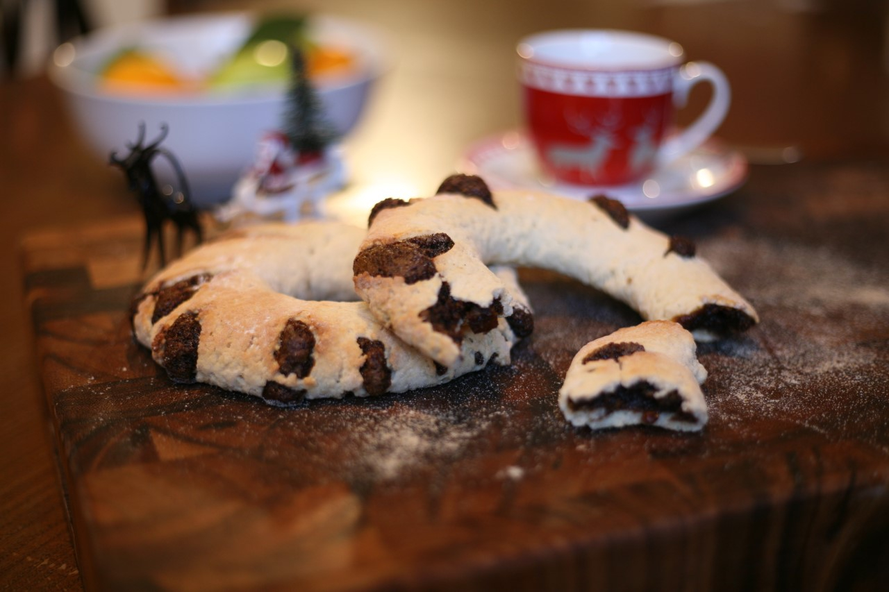

# Qagħaq tal-Għasel (Maltese Honey Rings)

*Malta's iconic Christmas honey ring: a ring of shortcrust pastry filled with a thick honey-and-treacle-and-spice paste, baked till deeply golden, the filling visible through diagonal slashes in the top. Sliced thin for tea. The traditional Maltese Christmas pastry; sold at every Maltese bakery during Advent.*

**Serves:** Makes 1 ring (serves 12-16)

**Prep Time:** 45 minutes (plus 1 hour pastry chill)

**Cook Time:** 45 minutes

## Overview
Qagħaq tal-għasel ("rings of honey") are Malta's most iconic Christmas pastry, a thick honey-treacle-spice paste encased in shortcrust pastry, formed into a ring (the traditional shape), with the top scored diagonally so the dark filling shows through. The filling is a complex spiced mixture of honey, treacle, semolina, orange and lemon zest, cinnamon, cloves, cocoa, and almonds, slowly cooked till thick and dark. The pastry is rolled, wrapped around the cooled filling rope, shaped into a ring, scored with a sharp knife, and baked till deep gold. Sliced thin (like fruit cake) for tea. Every Maltese bakery sells qagħaq tal-għasel from late November through January.

## Ingredients

### Pastry
- 500 g plain flour
- 250 g butter (cold cubed)
- 100 g caster sugar
- 1 teaspoon ground cinnamon
- A pinch of fine sea salt
- 1 large egg
- 4 tablespoons cold water
- 1 egg yolk (for glaze)

### Filling
- 400 g runny honey
- 200 g black treacle
- 200 g semolina
- 80 g chopped almonds
- 80 g raisins
- 60 g cocoa powder
- 2 tablespoons orange zest
- 2 tablespoons lemon zest
- 1 tablespoon ground cinnamon
- 1 teaspoon ground cloves
- ½ teaspoon ground nutmeg
- 4 tablespoons aniseed (Maltese touch)
- 100 ml water

## Method

### Stage 1 - Pastry
1. Mix flour, sugar, cinnamon, salt.
2. Rub in butter till like breadcrumbs.
3. Add egg and water; bring together.
4. Wrap; chill 1 hour.

### Stage 2 - Filling (do first to cool)
1. In a heavy saucepan, combine honey, treacle, water.
2. Heat gently to a simmer.
3. Stir in semolina, almonds, raisins, cocoa, zests, all spices, aniseed.
4. Stir constantly over LOW heat for 15-20 minutes till very thick and pulling away from the sides of the pan.
5. Cool completely.

### Stage 3 - Shape
1. Preheat oven to 180°C / 160°C fan / 350°F.
2. Roll the pastry into a long rectangle (about 60 cm × 12 cm), 5 mm thick.
3. Roll the cooled filling into a long rope (about 50 cm × 4 cm).
4. Place the filling rope down the centre of the pastry.
5. Fold the pastry over the filling; pinch to seal underneath.
6. Form the long log into a ring on a lined baking tray, sealing the two ends together.

### Stage 4 - Score and glaze
1. With a sharp knife, score the top diagonally every 2 cm (cuts about 5 mm deep, the filling should be visible through the slashes).
2. Brush the top with beaten egg yolk.

### Stage 5 - Bake
1. Bake 40-45 minutes till deep golden.
2. Cool on a wire rack.

### Stage 6 - Slice and serve
1. Slice thin (5 mm slices, like fruit cake).
2. Serve with tea or coffee.

## Notes
- **Cool the filling fully before assembling:** hot filling melts the pastry.
- **Score deeply:** the dark filling should show through.
- **Slice thin:** the filling is dense and very sweet.

## Variations
- **Smaller rings:** make 4-6 smaller individual rings, perfect for gifts.
- **With orange flower water:** add 1 tablespoon orange flower water to the filling.
- **With pine nuts:** swap almonds for pine nuts.
- **Vegan version:** vegan butter, skip the egg.
- **With sesame seeds:** sprinkle sesame seeds on top before baking.

## Serving
- At every Maltese Christmas (the traditional setting; sold from late November through January at every Maltese bakery) · at a Maltese Christmas Eve dinner · sliced thin with tea or coffee on Christmas afternoon · as a Maltese New Year gift · at home throughout the festive season.

## Storage
- Keeps in a sealed tin 3 weeks (improves over the first week).
- Freezes 3 months.
- The flavour deepens after a few days.
