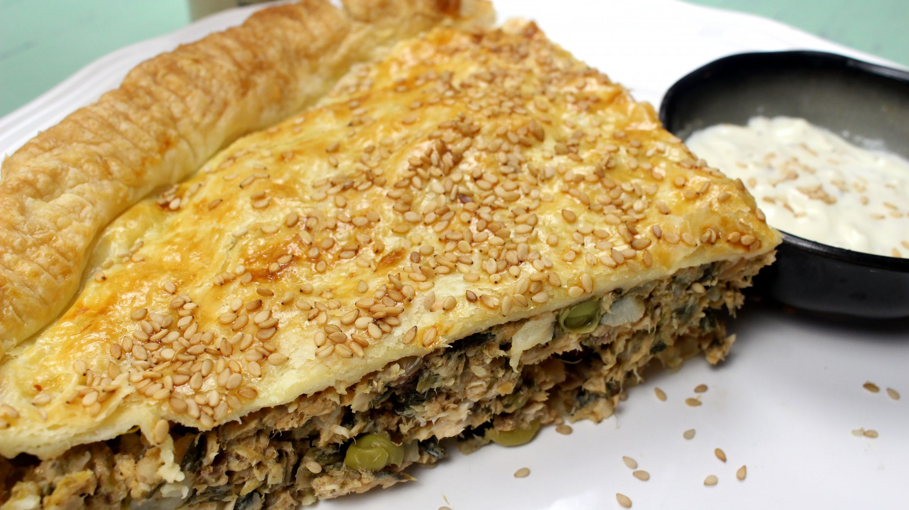

# Torta tal-Lampuki (Maltese Dorado Fish Pie)

*Malta's late-summer specialty: fillets of lampuki (mahi-mahi / dorado, caught off Maltese shores from August to November) sandwiched between layers of shortcrust pastry with spinach, capers, olives, sultanas, tomato, and a pinch of mint. The traditional Maltese autumn pie; the dish every Maltese grandmother makes during lampuki season.*

**Serves:** 6

**Prep Time:** 30 minutes (plus 30 minutes pastry rest)

**Cook Time:** 45 minutes

## Overview
Torta tal-lampuki appears in Malta only during late summer and autumn, the lampuki (mahi-mahi / dorado / Coryphaena hippurus) is caught off Maltese shores from August through November using traditional palm-frond rafts that attract the fish. During this season, every Maltese bakery and home kitchen produces the traditional lampuki pie. The construction is a classic British-style pie filled with a uniquely Maltese filling: lampuki fillets (lightly floured and pan-fried first), layered with sautéed spinach, sultanas, capers, black olives, fresh tomato, chopped mint, and a touch of cauliflower for body. Two layers of shortcrust pastry encase the filling; baked till deeply golden.

## Ingredients

### Pastry
- 400 g plain flour
- 200 g cold butter (cubed)
- 1 teaspoon fine sea salt
- 1 egg yolk
- 80 ml ice-cold water

### Filling
- 600 g lampuki fillets (or mahi-mahi; substitute with any firm white fish if unavailable)
- 60 g plain flour (for dusting fish)
- 4 tablespoons olive oil
- 1 large onion (finely diced)
- 4 garlic cloves (chopped)
- 400 g spinach (washed, roughly chopped)
- 200 g cauliflower (broken into small florets, blanched 5 minutes)
- 4 large ripe tomatoes (peeled, chopped)
- 60 g sultanas
- 4 tablespoons capers (drained)
- 80 g black olives (pitted, halved)
- 1 small bunch fresh mint (chopped)
- 1 teaspoon ground cinnamon
- 2 tablespoons tomato paste
- 1 teaspoon fine sea salt
- 1 teaspoon coarsely cracked black pepper
- 1 beaten egg (for sealing and glazing)

## Method

### Stage 1 - Make the pastry
1. Rub the butter into the flour and salt till like breadcrumbs.
2. Mix egg yolk with cold water; add to flour; bring together gently.
3. Wrap; refrigerate 30 minutes.

### Stage 2 - Pan-fry the fish
1. Dust the lampuki fillets with flour, season with salt and pepper.
2. In a large pan, heat 2 tablespoons olive oil over medium-high.
3. Pan-fry the fillets 2 minutes per side till just golden.
4. Set aside.

### Stage 3 - Make the filling
1. In the same pan, heat remaining oil.
2. Sweat onion 5 minutes; add garlic, cook 1 minute.
3. Add tomato paste; cook 1 minute.
4. Add chopped tomatoes; cook 8 minutes till thickened.
5. Add cauliflower, spinach (wilted in batches), sultanas, capers, olives, mint, cinnamon.
6. Cook 5 minutes; season; cool slightly.

### Stage 4 - Assemble
1. Preheat oven to 200°C / 180°C fan / 400°F.
2. Roll two-thirds of the pastry; line a 25 cm pie dish.
3. Spoon half the vegetable filling.
4. Layer the pan-fried fish over.
5. Top with remaining vegetable filling.
6. Roll the remaining pastry; cover the pie.
7. Brush edges with egg; crimp to seal.
8. Cut 4 steam vents; brush top with egg.

### Stage 5 - Bake
1. Bake 35-40 minutes till deeply golden.
2. Cool 15 minutes before slicing.

### Stage 6 - Serve
1. Slice into wedges.
2. Serve warm with a green salad and a glass of Maltese white wine.

## Notes
- **Lampuki season is August-November:** outside that, use mahi-mahi or any firm white fish.
- **Pan-fry first:** prevents soggy bottom.
- **Sweet-savoury combination:** the sultanas + capers + olives + mint is the Maltese signature.
- **Cool slightly before slicing:** otherwise the filling runs.

## Variations
**Without cauliflower:** simpler version, just spinach base.
**With Maltese cheese (ġbejniet):** crumble 100 g fresh ġbejniet into the filling.
**With more sultanas:** sweeter, more Eastern-Mediterranean variant.
**Single-pie version:** make 6 individual pies in muffin tins.
**Pastry top only (lampuki cazzola):** no bottom crust; baked in a deep dish.

## Serving
During lampuki season (August-November): the traditional setting · at a Maltese family Sunday lunch · at a Maltese village festa · at a Maltese wedding · at home with a glass of Maltese white wine.

## Storage
- Refrigerates 3 days; reheat at 180°C for 12 minutes.
- Freezes (raw, formed but unbaked) 2 months; bake from frozen.
- Day-old cold lampuki pie is excellent next-day lunch.
