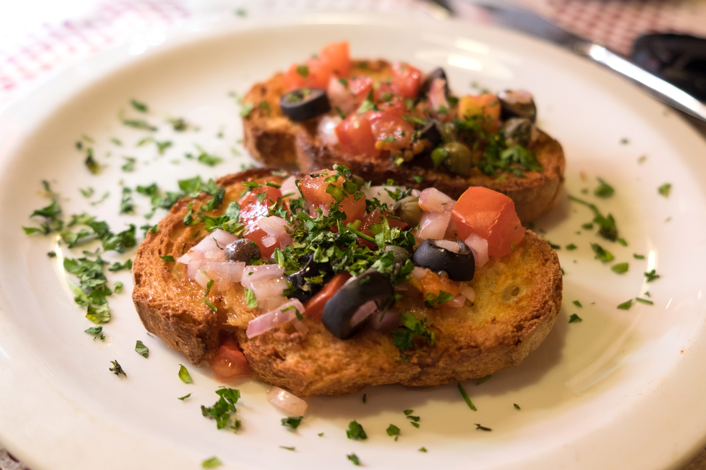

# Ħobż biż-Żejt (Maltese Ploughman's Bread)

*Malta's most beloved snack and breakfast: thick slices of crusty Maltese sourdough bread rubbed with ripe tomato, drizzled with olive oil, topped with tuna, capers, olives, onion, and ġbejniet cheese. The Maltese ploughman's lunch; the traditional Maltese beach picnic food.*

**Serves:** 4

**Prep Time:** 10 minutes

**Cook Time:** None

## Overview
Ħobż biż-żejt (literally "bread with oil") is Malta's most universally beloved everyday snack - the simplest possible expression of Maltese ingredients. The construction: thick slices of Maltese sourdough (ħobż tal-Malti, the traditional bread; a chewy crusty sourdough), rubbed vigorously with halved ripe tomato till the bread absorbs the juices and turns pink, drizzled generously with extra-virgin olive oil, then topped with tuna in oil, capers, black olives, sliced raw onion, and ġbejniet (Maltese fresh sheep's-milk cheese). A few mint leaves and fresh basil finish it. Eat with the hands at every Maltese beach picnic, every fishing village snack stop, and every Maltese village festa.

## Ingredients

### Per portion (serves 4)
- 4 thick slices Maltese sourdough bread (or any chewy crusty sourdough)
- 4 large ripe tomatoes (halved)
- 6-8 tablespoons extra-virgin olive oil
- 1 tin (160 g) tuna in olive oil (drained)
- 4 tablespoons capers
- 16 black Maltese olives (pitted, halved)
- 1 small red onion (sliced very thin)
- 200 g ġbejniet cheese (fresh sheep's-milk cheese; sliced)
- 1 small bunch fresh mint
- 1 small bunch fresh basil
- Fine sea salt and black pepper

## Method

### Stage 1 - Rub the tomato
1. Cut tomatoes in half.
2. Rub the cut sides vigorously into each slice of bread till the bread absorbs the juices and turns pink.
3. Discard the spent tomato skin or chop and use.

### Stage 2 - Drizzle olive oil
1. Drizzle each slice generously with olive oil (about 1-2 tablespoons per slice).
2. Season with sea salt and black pepper.

### Stage 3 - Top
1. Layer tuna, capers, olives, onion, and ġbejniet over the bread.
2. Scatter fresh mint and basil leaves.

### Stage 4 - Serve immediately
1. Eat with hands.
2. Pair with a glass of Maltese white wine or Cisk lager.

## Notes
- **Maltese ħobż tal-Malti:** the traditional bread. Any chewy sourdough substitutes.
- **Ripe tomatoes essential.**
- **Generous olive oil.**
- **Don't pre-make:** the bread softens fast.

## Variations
**With anchovies:** swap or add anchovies for the tuna.
**With tomato paste (kunserva):** spread the Maltese sun-dried tomato paste before adding fresh tomato.
**Vegetarian:** skip tuna; double the cheese and olives.
**Mini ħobż:** small slices for canapé portions.

## Serving
At a Maltese beach picnic · at a Maltese village festa · as a Maltese breakfast or lunch · at a fishing-village snack stop · at home as a quick supper.

## Storage
- Eat immediately.
- Pre-rubbed bread keeps 30 minutes.
- Don't store assembled.
