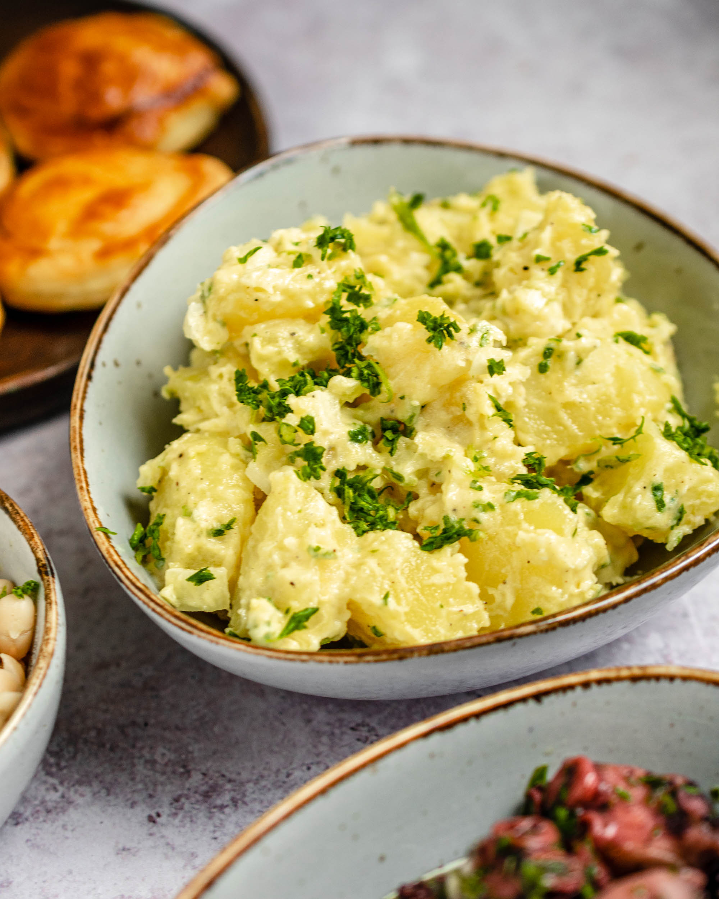

# Insalata tal-Patata (Maltese Potato Salad)

*Malta's sun-drenched potato salad: warm boiled potatoes tossed with sliced red onion, capers, black olives, chopped tomato, fresh mint, parsley, lemon juice and a generous slug of olive oil. The Mediterranean answer to mayo-based potato salad; the canonical Maltese summer side; bright, acidic, herbal.*

**Serves:** 6 (as a side)

**Prep Time:** 10 minutes

**Cook Time:** 20 minutes

## Overview
Maltese potato salad rejects the heavy mayonnaise-based Northern European version in favour of a bright Mediterranean dressing of olive oil, lemon, capers, herbs and tomato. The construction: waxy potatoes boiled in salted water till just tender, drained and tossed while still warm (so they absorb the dressing) with red onion, capers, black olives, chopped fresh tomato, fresh mint, fresh parsley, lemon juice and extra-virgin olive oil. Served at room temperature alongside grilled fish, stuffat tal-fenek, or any Maltese summer meal.

## Ingredients

### For 6 servings
- 1 kg waxy potatoes (Charlotte or new potatoes; boiled whole, skin on, cubed when cool)
- 1 small red onion (sliced very thin into half-moons)
- 4 tablespoons capers
- 100 g black Maltese olives (pitted, halved)
- 2 large ripe tomatoes (chopped)
- 1 small bunch fresh mint (chopped)
- 1 small bunch fresh parsley (chopped)
- 6 tablespoons extra-virgin olive oil
- 4 tablespoons fresh lemon juice
- 2 tablespoons white wine vinegar
- 1 teaspoon dried oregano
- 1 teaspoon fine sea salt
- 1 teaspoon coarsely cracked black pepper
- 4 hard-boiled eggs (quartered; optional garnish)

## Method

### Stage 1 - Boil the potatoes
1. Boil whole potatoes (skin on) in salted water for 18-22 minutes till knife-tender.
2. Drain.
3. Cool slightly; peel (if you want) and cube into 2 cm pieces.

### Stage 2 - Dress while warm
1. In a large bowl, combine warm potato cubes with red onion, capers, olives, and chopped tomato.
2. Whisk olive oil, lemon juice, vinegar, oregano, salt, pepper together.
3. Pour over and toss gently.

### Stage 3 - Add herbs and rest
1. Stir in chopped mint and parsley.
2. Let stand at room temperature 30 minutes for flavours to marry.

### Stage 4 - Serve
1. Transfer to a platter.
2. Optional: garnish with quartered hard-boiled eggs.
3. Serve at room temperature.

## Notes
- **Waxy potatoes:** Maris Piper or floury types break apart.
- **Toss while warm:** essential for absorption.
- **Eat at room temperature:** cold mutes the flavours.

## Variations
**With tuna:** add 1 tin tuna in olive oil - turns it into a niçoise-style main.
**With anchovies:** add 4 anchovy fillets.
**With ġbejniet:** crumble in 100 g fresh Maltese sheep's cheese.
**Spicy variant:** add a chopped fresh chilli or chilli flakes.

## Serving
At a Maltese summer lunch · alongside grilled fish · at a Maltese beach picnic · at a Maltese festa · at home as a quick summer side.

## Storage
- Refrigerates 3 days; bring to room temperature before serving.
- Don't freeze.
