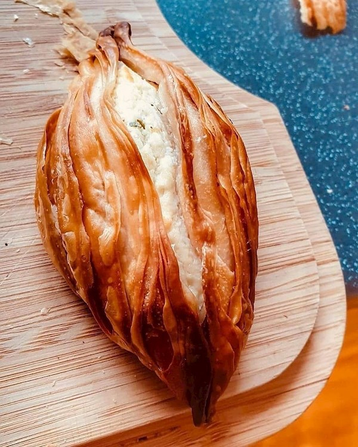

# Pastizzi (Maltese Phyllo Pastries)

*Malta's national pastry: small diamond-shaped phyllo pockets filled with ricotta cheese (pastizzi tal-irkotta) or curried mushy peas (pastizzi tal-piżelli), baked till the pastry is golden and crisp with shattering ridges. Sold at every Maltese pastizzeria from breakfast till midnight. The traditional Maltese street food.*

**Serves:** Makes 24

**Prep Time:** 45 minutes (plus 30 minutes pastry rest)

**Cook Time:** 25 minutes

## Overview
Pastizzi are Malta's most iconic street food, small flaky phyllo-pastry pockets that appear in every Maltese pastizzeria, every bus station, every village square shop, and every snack break. The traditional Maltese pastizzi come in two main filling types: pastizzi tal-irkotta (with seasoned ricotta, the more popular of the two, made with drained ricotta, beaten egg, salt, pepper, and chopped parsley) and pastizzi tal-piżelli (with curried mushy peas, green split peas slowly cooked with onion, curry powder, tomato paste). The pastry is a labour-intensive Maltese-specific dough (close to but different from phyllo or strudel dough) that's been stretched paper-thin, painted with lard or vegetable fat, layered, and shaped into the iconic diamond shape with a slight peak in the middle. Most home cooks use bought phyllo (filo) pastry as a substitute.

## Ingredients

### Pastry (using bought phyllo)
- 250 g phyllo (filo) pastry, defrosted
- 200 g butter (melted) OR 200 g lard (the traditional Maltese)

### Ricotta filling
- 500 g ricotta (drained overnight)
- 2 large eggs (beaten)
- 4 tablespoons chopped fresh parsley
- 1 teaspoon fine sea salt
- 1 teaspoon coarsely cracked black pepper
- 60 g grated Parmesan (optional)

### Pea filling (alternative)
- 300 g dried split green peas (cooked till soft, 45-60 minutes)
- 1 medium onion (diced; sweated in olive oil)
- 1 tablespoon curry powder
- 1 tablespoon tomato paste
- 1 teaspoon fine sea salt

## Method

### Stage 1 - Make the filling
1. **Ricotta:** combine drained ricotta with eggs, parsley, salt, pepper, Parmesan. Mix well.
2. **Pea:** mash cooked split peas; mix with sweated onion, curry powder, tomato paste, salt. Cool.

### Stage 2 - Prepare phyllo
1. Lay a phyllo sheet on the counter.
2. Brush generously with melted butter or lard.
3. Top with another sheet; brush again.
4. Layer 4 sheets total per stack; you'll need about 6 stacks (24 pastizzi).

### Stage 3 - Cut and fill
1. Cut each stack into 12-15 cm squares.
2. Place a heaped tablespoon of filling in the centre.
3. Bring the four corners up to meet in the middle.
4. Pinch the centre tightly to seal.
5. Form into a diamond/peaked shape (the traditional Maltese form).

### Stage 4 - Bake
1. Preheat oven to 200°C / 180°C fan / 400°F.
2. Place pastizzi on a parchment-lined tray.
3. Brush tops with extra butter/lard.
4. Bake 20-25 minutes till deeply golden.

### Stage 5 - Serve
1. Serve warm (the traditional experience).
2. Pair with strong Maltese coffee or Kinnie.

## Notes
- **Phyllo must be well-buttered:** the crisp comes from the fat between the layers.
- **Diamond shape with peaked centre:** traditional Maltese pastizzi.
- **Eat warm:** the cheese filling firms when cold.

## Variations
**Pastizzi tal-irkotta:** the ricotta traditional.
**Pastizzi tal-piżelli:** the curried pea traditional.
**Pastizzi tat-tonn:** with tuna and tomato.
**Pastizzi tal-laħam:** with minced beef and spices.
**Pastizzi taċ-ċikkulata:** with chocolate and ricotta, dessert variant.
**Mini pastizzi:** smaller squares for canapé portions.

## Serving
At every Maltese pastizzeria (the traditional setting) · at a Maltese bus station · at a Maltese coffee morning · at a Maltese village square shop · at any time of day in Malta · at home with strong coffee.

## Storage
- Best eaten warm.
- Refrigerates 2 days; reheat at 180°C for 8 minutes.
- Freezes (raw) 2 months; bake from frozen at 200°C for 30 minutes.
- Day-old pastizzi reheat to acceptable but never as good as fresh.
