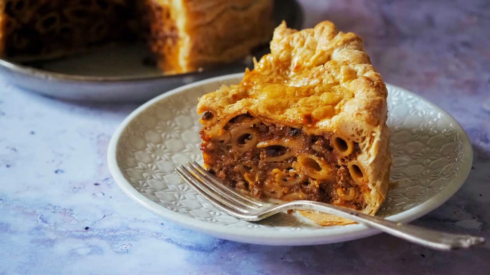

# Timpana (Maltese Macaroni Pie)

*Malta's most decadent pasta dish: macaroni pasta tossed with a rich Bolognese-style meat sauce, chopped hard-boiled egg and grated cheese, all sealed inside a thick puff-pastry crust and baked till the pastry is deeply golden. Sliced into thick wedges. Sunday-lunch theatre; the dish that defines the Maltese big-occasion meal.*

**Serves:** 8-10

**Prep Time:** 45 minutes

**Cook Time:** 1 hour

## Overview
Timpana is Malta's most elaborate and most special-occasion pasta dish, a baked pasta pie that takes its name from "timpano" (the Italian "timpanum", a drum-shaped baked pasta dish). The Maltese version is closer to a pie than a casserole: macaroni pasta is tossed with a slow-cooked Bolognese-style meat sauce (beef, pork, onion, garlic, tomato, red wine), chopped hard-boiled egg, peas, and grated cheese, then sealed inside a layer of puff pastry (the traditional Maltese version uses bought puff for ease, though some Maltese bakers make their own shortcrust). Baked at high heat till the pastry is deeply golden and the filling is hot. Sliced into thick wedges and served with a salad.

## Ingredients

### Meat sauce
- 3 tablespoons olive oil
- 1 large onion (chopped)
- 4 garlic cloves (chopped)
- 500 g minced beef
- 250 g minced pork
- 200 ml red wine
- 800 g tinned chopped tomatoes
- 4 tablespoons tomato paste
- 2 bay leaves
- 1 small bunch fresh thyme
- 1 teaspoon ground cinnamon
- 2 teaspoons fine sea salt
- 1 teaspoon black pepper

### Pasta
- 500 g macaroni (rigatoni works too)
- 4 hard-boiled eggs (chopped)
- 200 g frozen peas (defrosted)
- 200 g grated mature Cheddar OR pecorino
- 50 g grated Parmesan
- 2 large eggs (beaten)

### Pastry
- 500 g puff pastry (1 sheet bought, or homemade)
- 1 beaten egg (for glaze)

## Method

### Stage 1 - Meat sauce (90 minutes)
1. Sweat onion in olive oil 8 minutes.
2. Add garlic; cook 1 minute.
3. Add minced beef and pork; brown 10 minutes.
4. Add tomato paste; cook 2 minutes.
5. Pour in wine; reduce 5 minutes.
6. Add chopped tomatoes, bay, thyme, cinnamon, salt, pepper.
7. Simmer 60-90 minutes till thick.
8. Cool slightly.

### Stage 2 - Cook the pasta
1. Boil macaroni in salted water 2 minutes less than package directions (it'll cook more in the oven).
2. Drain.

### Stage 3 - Combine
1. In a large bowl, combine cooked pasta, cooled meat sauce, chopped hard-boiled eggs, peas, grated cheeses, and beaten eggs.
2. Mix thoroughly.

### Stage 4 - Assemble
1. Preheat oven to 200°C / 180°C fan / 400°F.
2. Line a deep pie dish (25 cm) or springform tin with puff pastry, letting it overhang.
3. Pack the pasta mixture in firmly.
4. Fold the overhanging pastry over the top, sealing in the centre (or top with a second layer of pastry).
5. Brush top with beaten egg.
6. Cut 4 steam vents.

### Stage 5 - Bake
1. Bake 45-60 minutes till deeply golden.
2. Cool 15 minutes before slicing.

### Stage 6 - Serve
1. Slice into thick wedges.
2. Serve warm with a green salad.

## Notes
- **Long meat sauce:** the depth of the sauce is critical.
- **Hard-boiled eggs chopped in:** Maltese signature.
- **Cool slightly before slicing:** otherwise the filling runs out.

## Variations
**Without pastry (timpana al forno):** baked uncovered as a casserole.
**With chicken livers in the sauce:** richer; more old-style Maltese.
**With béchamel layer:** add a thin layer of béchamel over the top before sealing, modern.
**Vegetarian timpana:** swap meat for mushrooms + lentils.
**Mini timpane:** in individual ramekins; party portions.

## Serving
At a Maltese Sunday family lunch (the traditional setting) · at a Maltese wedding luncheon · at a Maltese big-occasion meal · at home as a celebration dish · alongside Maltese red wine.

## Storage
- Refrigerates 3 days; reheat at 180°C for 20 minutes.
- Freezes 2 months (whole or sliced).
- Day-2 timpana cold for lunch is excellent.
