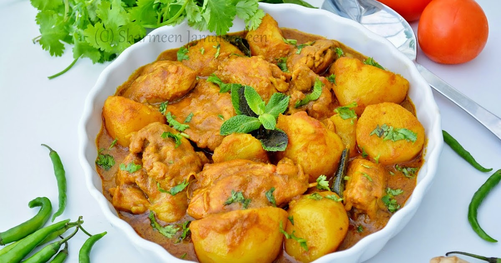

# Cari Poulet Hakka

*Sino-Mauritian chicken curry: Indian masala meets Hakka braising, with soy sauce, dried mushrooms, ginger and a slug of Shaoxing wine carrying the dish from curry-house to wok kitchen.*

**Serves:** 4

**Prep Time:** 25 minutes (plus 30 minutes for the mushrooms to rehydrate)

**Cook Time:** 50 minutes

## Overview
The Hakka community arrived in Mauritius in waves from the mid-1800s, mostly from Guangdong, and over a century settled into a Sino-Mauritian kitchen tradition that braided Chinese braising technique into the Creole-Indian curry vocabulary. Cari poulet hakka is one of the cleanest expressions of that braid. The base is a Mauritian curry: thyme, curry leaves, masala, slit green chillies, ginger and garlic, all blooming in oil before the tomato goes in. The finish is Cantonese: dark soy for colour, light soy for salt, oyster sauce for body, a splash of Shaoxing wine, and rehydrated dried shiitake whose soaking liquid becomes part of the braising water. The result tastes recognisably Mauritian (curry leaves give the dish away on the first sniff) but with a deeper, almost lacquered finish that pulls the plate towards the Pearl River. Served over steamed rice or, more authentically, Hakka flat noodles tossed with garlic oil. Heat is moderate; the dish leans aromatic and umami rather than fiery.

## Ingredients

### Mushrooms
- 25 g dried shiitake mushrooms
- 300 ml hot water (to soak)

### Curry base
- 900 g bone-in chicken thighs (skin on or off)
- 2 onions (medium, finely sliced)
- 3 spring onions (whites and greens separated, both finely sliced)
- 6 garlic cloves (minced)
- 25 g fresh ginger (julienned, plus 10 g grated)
- 2 sprigs fresh thyme
- 15 fresh curry leaves
- 2 green chillies (slit lengthways)
- 2 tomatoes (medium, about 200 g, finely chopped)
- 1 tbsp tomato paste
- 45 ml neutral oil
- 1 star anise
- 1 small piece cinnamon bark (3 cm)

### Masala and seasoning
- 1 tbsp Mauritian or mild Madras [curry powder](../../base-ingredients/curry-powder/bir-curry-powder.md)
- 1 tsp ground cumin
- 1 tsp ground coriander
- ½ tsp ground turmeric
- ½ tsp [Chinese five-spice powder](../../base-ingredients/spices/chinese-five-spice-powder.md)
- 2 tbsp dark soy sauce
- 2 tbsp light soy sauce
- 1 tbsp oyster sauce
- 30 ml Shaoxing wine (or dry sherry)
- 1 tsp sugar (white or palm)
- 1 tsp salt (or to taste)

### To finish
- Small handful fresh coriander (chopped)
- 1 tsp toasted sesame oil
- Steamed jasmine rice or Hakka-style flat noodles, to serve

## Method

### Stage 1 - Soak the mushrooms
1. Place the dried shiitake mushrooms in a heatproof bowl and pour over the 300 ml hot water. Cover with a plate and leave for 30 minutes, until pliable.
1. Lift the mushrooms out, squeeze gently over the bowl, and slice each cap into 5 mm strips. Discard any tough stems.
1. Strain the soaking liquid through a fine sieve to remove any grit and set aside. This becomes the braising water.

### Stage 2 - Brown the chicken
1. Pat the chicken thighs dry and season lightly with salt.
1. Heat the oil in a heavy pot or wok over medium-high heat.
1. Brown the chicken in batches, 3 minutes per side, until well coloured. Lift out and set aside on a plate.

### Stage 3 - Build the masala
1. Reduce the heat to medium. Add the onions to the same pot and cook 7-8 minutes, until soft and just turning gold at the edges.
1. Stir in the garlic, julienned and grated ginger, slit green chillies, thyme sprigs, curry leaves and the whites of the spring onions. Add the star anise and cinnamon. Cook one minute, until the leaves are crackling.
1. Combine the curry powder, cumin, coriander, turmeric and five-spice in a small bowl with 3 tbsp water to form a paste. Stir into the onions and cook 60-90 seconds, until the oil starts to separate at the edges.
1. Add the tomato paste and stir for another minute.

### Stage 4 - Add aromatics and braise
1. Tip in the chopped tomatoes. Stir, cover the pot and let the tomatoes break down for 5-6 minutes, stirring once.
1. Uncover and mash the tomatoes lightly with the back of a spoon until you have a thick base.
1. Stir in the sliced shiitake. Pour in the Shaoxing wine and let it bubble for 30 seconds.
1. Return the chicken to the pot, turning each piece through the masala until coated. Add the dark soy, light soy, oyster sauce, sugar and salt. Pour over the strained mushroom liquid.
1. Bring to a gentle boil, then reduce to a low simmer. Cover and cook 25 minutes, stirring once, until the chicken is tender and pulling from the bone.
1. Uncover for the final 5-7 minutes, lifting the lid and reducing the sauce until it clings to the back of a spoon and has a glossy, lacquered look. Taste for salt; adjust with a splash more light soy if needed.

### Stage 5 - Finish
1. Off the heat, drizzle over the sesame oil and scatter the spring-onion greens and fresh coriander.
1. Serve over jasmine rice or Hakka-style flat noodles. Chilli oil on the table.

## Notes
- **Star anise is non-negotiable:** it bridges the curry leaves and the soy, and the dish tastes confused without it. One whole pod is enough; more than that and the anise dominates.
- **Dark and light soy do different jobs:** dark gives colour and a faint sweetness; light gives salt. Use both. Substituting one for the other gives a flat result.
- **Mushroom liquid > water:** the strained shiitake liquid is the dish's secret depth. If you skip the mushrooms (don't), use chicken stock rather than plain water.
- **Hakka-style flat noodles** (also called mee tew or chow mein noodles) toss well with the sauce. If unavailable, use fresh Cantonese egg noodles. Plain rice is the more common Mauritian household serve.
- **Pork shoulder works** beautifully in place of chicken thighs; cut into 3 cm cubes, brown the same way, extend the braise to 1 hour 15 minutes.

## Storage
- Improves overnight. Keeps 3 days refrigerated in a sealed container.
- Reheats gently on the hob with a splash of water or mushroom liquid to loosen.
- Freezes well up to 2 months. The mushrooms keep their texture; the sauce reheats glossy.
