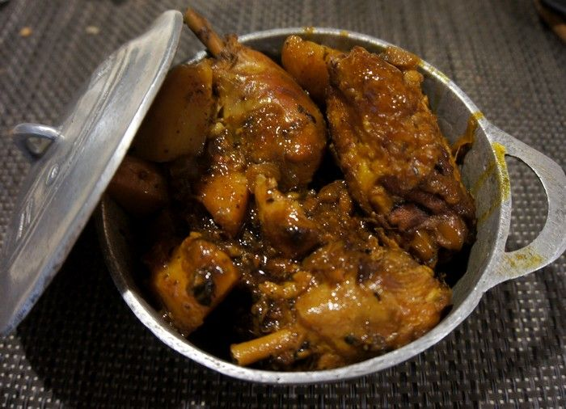

# Cari Poulet Et Pomme de Terre

*A Mauritian Sunday staple: chicken and potato simmered in a fragrant tomato curry built on home-pounded masala, fresh thyme and curry leaves.*

**Serves:** 4

**Prep Time:** 20 minutes

**Cook Time:** 45 minutes

## Overview
Mauritian cuisine is a layered conversation between Indian, African, Chinese and French traditions, and cari poulet is one of its clearest expressions. The Creole community took the Indian template of a wet curry and rebuilt it with local fresh herbs, particularly thyme and curry leaves grown in the yard, plus tomato, and a masala that is gentler and more aromatic than its mainland Indian cousins. Chicken on the bone is browned for fond, then potatoes are added and the whole pot is simmered in a curry-leaf and tomato gravy until the meat is falling off the bone and the potatoes are creamy on the outside but holding shape. The colour leans red-brown from paprika and turmeric rather than the bright yellow of a Punjabi-style curry. Heat is moderate, intended to complement rice and a chilli-based satini, not overwhelm them. For a home cook the difficulty is low to moderate; the only real demand is patience while the masala blooms in the oil at the start, which is what gives the dish its depth. Serve over plain steamed rice with a coriander satini and a spoon of green chilli pickle, the classic Mauritian Sunday plate.

## Ingredients

### Curry base
- 900 g bone-in chicken pieces (thighs and drumsticks, skin on or off)
- 500 g waxy potatoes (peeled, halved or quartered)
- 2 onions (medium, finely chopped)
- 4 tomatoes (medium, about 400 g, finely chopped)
- 1 tbsp tomato paste
- 6 garlic cloves (minced)
- 20 g fresh ginger (grated)
- 2 sprigs fresh thyme
- 15 fresh curry leaves
- 2 green chillies (slit lengthways)
- 45 ml neutral oil
- 300 ml water
- 1 tsp salt (or to taste)
- Small handful fresh coriander (chopped, to finish)

### Masala
- 2 tbsp Mauritian (or mild Madras curry powder)
- 1 tsp ground cumin
- 1 tsp ground coriander
- 1 tsp sweet paprika
- ½ tsp ground turmeric
- ¼ tsp ground cinnamon

## Method

### Stage 1 - Prepare and brown
1. Pat the chicken dry and season lightly with salt.
1. Heat the oil in a heavy pot over medium-high heat.
1. Brown the chicken in batches, 2-3 minutes per side, until golden. Lift out and set aside.

### Stage 2 - Build the masala
1. Lower the heat to medium. Add the onions to the same pot and cook 7-8 minutes until soft and just turning golden.
1. Stir in the garlic, ginger, slit green chillies, thyme sprigs and curry leaves. The curry leaves will crackle. Cook one minute.
1. Mix the masala spices together in a small bowl with 3 tbsp of water to form a paste. Stir into the onions and cook 60-90 seconds, until the oil starts to separate at the edges.
1. Add the tomato paste and stir for another minute.

### Stage 3 - Tomato and chicken
1. Add the chopped tomatoes and the salt. Stir, then cover the pot and let the tomatoes break down for 6-8 minutes, stirring once.
1. Uncover and mash the tomatoes lightly with the back of a spoon until you have a thick sauce.
1. Return the chicken pieces to the pot, turning each one through the masala until well coated.

### Stage 4 - Simmer and finish
1. Pour in the water. Bring to a gentle boil, then reduce to a low simmer.
1. Cover and cook 15 minutes, stirring once.
1. Add the potatoes, pressing them down into the sauce. Continue to simmer, covered, for another 20-25 minutes until the potatoes are tender and the chicken is falling off the bone.
1. Uncover for the last 5 minutes to thicken the gravy if needed. Taste for salt. Scatter coriander on top and serve over rice.

## Notes
- **Curry leaves are not optional:** their resinous, citrusy note is the backbone of Mauritian cari. Frozen curry leaves work; dried ones do not.
- **Bloom the masala properly:** the 60-90 seconds where the spice paste cooks in oil is the single most important step. Stop too early and the curry tastes raw.
- **Waxy potatoes hold up:** floury potatoes will dissolve into the gravy. Charlotte, Cyprus or any salad potato keeps its shape.
- **Heat is from the chillies:** the masala itself is mild. Slit chillies give perfume; chop them for real heat.

## Storage
- Tastes better the next day. Keeps 3 days refrigerated in a sealed container.
- Reheats gently on the hob with a splash of water to loosen.
- Freezes well up to 2 months. The potatoes soften further on thawing but remain pleasant.
