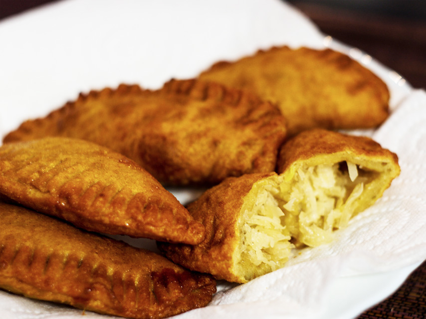

# Gâteau Patate

*Mauritius's sweet potato pastry: a soft turnover of crumbly rice-flour pastry filled with sweetened mashed purple sweet potato, coconut and a touch of cardamom and vanilla, deep-fried till the outside crisps and the filling stays soft. The Mauritian street sweet eaten with tea on the way home from work.*

**Serves:** Makes 12 turnovers

**Prep Time:** 45 minutes (plus 30 minutes resting)

**Cook Time:** 25 minutes

## Overview
Gâteau patate (literally "potato cake") is Mauritius's beloved sweet-potato turnover, sold at every street vendor and Indian sweetshop across the island for afternoon tea: a soft rice-flour pastry filled with mashed sweet potato sweetened with sugar, enriched with desiccated coconut, perfumed with cardamom, vanilla and a small splash of rum, folded into half-moons and deep-fried till the outside crisps and the filling stays soft and warm. The dish sits between the Indian samosa tradition and the Caribbean fried-sweet-fruit pastry; the Mauritian version takes from both and makes something distinctively its own. Two ingredient details matter. The sweet potato is canonically the purple-fleshed patate Maurice; the colour is dramatic and the flavour slightly less sweet than orange-fleshed (which substitutes happily for colour but not for pedigree). The pastry is rice-flour based, which gives the proper crumbly tender outside; a half-rice-half-wheat dough is the easier substitute, pure wheat-flour the most biscuit-like.

## Ingredients

### Filling
- 600 g sweet potato (purple-fleshed if available; or orange-fleshed; peeled and cubed)
- 100 g caster sugar (adjust by taste; sweet potatoes vary in sweetness)
- 80 g desiccated coconut (unsweetened)
- 30 g unsalted butter
- 1 tablespoon dark rum (or vanilla extract if avoiding alcohol)
- 1 teaspoon vanilla extract
- ½ teaspoon ground cardamom
- ¼ teaspoon ground nutmeg
- Pinch of fine sea salt

### Pastry
- 200 g rice flour
- 200 g plain flour
- 2 tablespoons caster sugar
- ½ teaspoon fine sea salt
- 60 g unsalted butter (cold; or use coconut oil for the fully vegan version)
- 180-200 ml warm water (the exact amount depends on flour absorbency)

### For frying
- Vegetable oil for deep-frying (about 1 litre)

### To finish
- Caster sugar for dusting (about 4 tablespoons)

## Method

### Stage 1 - Cook the sweet potato
1. Place the cubed sweet potato in a large saucepan; cover with cold water.
2. Bring to a boil; reduce to a simmer; cook 15-20 minutes till the sweet potato is properly tender (a knife slides through easily).
3. Drain thoroughly; tip back into the hot pan.
4. Let dry out over very low heat for 1-2 minutes (this evaporates excess moisture; important for the filling texture).
5. Mash with a potato masher till smooth.

### Stage 2 - Make the filling
1. To the warm mashed sweet potato, add the sugar, desiccated coconut, butter, rum, vanilla, cardamom, nutmeg and salt.
2. Mix thoroughly with a wooden spoon till smooth and combined.
3. Taste; adjust sugar if needed (the filling should be properly sweet but not cloying).
4. Let cool to room temperature; the filling firms up as it cools.

### Stage 3 - Make the pastry
1. Combine the rice flour, plain flour, sugar and salt in a wide bowl; whisk to distribute.
2. Add the cold cubed butter; rub in with your fingertips till the mixture looks like coarse breadcrumbs.
3. Add the warm water gradually, stirring with a wooden spoon, till the dough comes together. Start with 180 ml and add more as needed; the dough should be soft and pliable but not sticky.
4. Turn onto a lightly floured surface; knead briefly (1 minute) till smooth.
5. Wrap in cling film; rest 30 minutes at room temperature.

### Stage 4 - Roll and fill
1. Divide the dough into 12 equal pieces (about 35 g each).
2. Roll each piece into a ball; cover with a damp cloth to keep from drying out.
3. Take one ball; flatten with your palm into a rough circle.
4. Roll out on a lightly floured surface into a circle about 12 cm across and 2-3 mm thick.
5. Place 1 heaping tablespoon of the filling in the centre.
6. Fold the dough over to make a half-moon shape.
7. Press the edges together to seal; you can use a fork to crimp the edges (this also makes a nice decorative pattern).
8. Place on a tray lined with parchment.
9. Repeat with the remaining dough balls and filling.

### Stage 5 - Heat the oil
1. Pour vegetable oil into a deep heavy saucepan or wok to a depth of 7-8 cm.
2. Heat over medium-high heat till it reaches 170°C (340°F).
3. Test with a small piece of dough: it should rise to the surface and bubble immediately but not brown instantly.

### Stage 6 - Deep-fry
1. Lower 3-4 turnovers into the hot oil with a slotted spoon; don't overcrowd.
2. Fry for 4-5 minutes, turning gently once or twice, till the turnovers are deep golden-brown all over.
3. Lift out with the slotted spoon; drain on kitchen paper.
4. Repeat with the remaining turnovers.

### Stage 7 - Finish and serve
1. Dust the warm turnovers generously with caster sugar.
2. Serve warm (the filling should still be slightly warm and soft) with strong milky chai or coffee.
3. The turnovers can also be eaten cold, though warm is the canonical Mauritian way.

## Notes
- **Purple sweet potato gives the proper Mauritian colour:** if you can find purple-fleshed sweet potato (sometimes called "patate Maurice" or "ube" or "Okinawan sweet potato"), use it for the proper dramatic violet-purple filling. Orange-fleshed sweet potato gives a different (but still lovely) colour and a slightly sweeter flavour.
- **Dry out the mashed potato:** wet mashed sweet potato gives a soft filling that leaks out during frying. The 1-2 minute dry-out over low heat is essential.
- **Rice flour gives the proper texture:** the addition of rice flour to the dough gives the characteristic crumbly-tender Mauritian pastry. Pure wheat flour works but gives a more biscuit-like texture.
- **170°C oil temperature:** too hot and the pastry browns before the filling is warmed; too cool and the pastry absorbs oil. 170°C with the dough-drop test is right.
- **Seal the edges properly:** any gap in the seal lets filling leak out during frying. Crimp the edges firmly with a fork; press out any air bubbles first.

## Variations
**Coconut-only gâteau patate (gâteau coco):** swap the sweet potato filling for 400 g of grated fresh coconut cooked with 200 g of sugar to a thick paste; gives the closely related coconut turnover.
**Baked instead of fried:** brush with beaten egg and bake at 200°C / 400°F for 20-25 minutes till golden. Less traditional but healthier; the texture is more biscuit-like and less crisp.
**With orange zest:** add the zest of 1 orange to the filling; gives a brighter citrus profile.
**Rum-soaked raisin gâteau patate:** add 50 g of raisins soaked in 2 tablespoons of dark rum for 30 minutes; mix into the filling. Properly festive Mauritian version.

## Serving
Warm with strong milky chai (the proper Mauritian afternoon ritual), or with sweet milky coffee. The dust of caster sugar over the warm pastries is non-negotiable. Children love them as after-school snack; adults love them as Sunday afternoon tea.

## Storage
- Best eaten warm on the day they're made; they go off-texture as they cool.
- Keeps in a sealed container at room temperature 1 day; refrigerated 3 days.
- Reheat in a hot oven (180°C / 350°F) for 5-7 minutes till the outside crisps again, or in an air fryer at 180°C for 4 minutes.
- Don't microwave; the pastry goes rubbery.
- The unfried turnovers freeze 2 months; lay flat in a single layer on a tray, freeze solid, then transfer to a bag. Fry from frozen at 170°C for 6-7 minutes.
