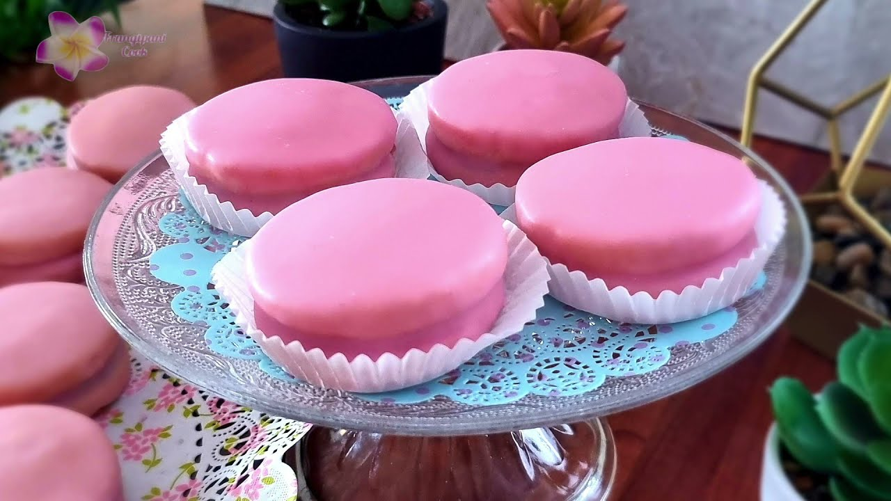

# Napolitaine

*Mauritius's pink-and-jam biscuit: two soft buttery shortbread discs sandwiched with raspberry jam, the whole thing rolled in fondant icing tinted pink. The hot-pink confection from every Mauritian patisserie window, weighing 90 grams of pure sugar-and-butter indulgence per piece.*

**Serves:** Makes 8 napolitaines

**Prep Time:** 35 minutes (plus 30 minutes chilling)

**Cook Time:** 18 minutes

## Overview
Napolitaine is one of the most distinctive sweets in Mauritian patisserie, found at every bakery window in Port Louis, Curepipe and Quatre Bornes: two soft, tender, almost-melting shortbread discs sandwiched with raspberry jam, the whole sandwich dipped or drizzled in a hot-pink fondant icing so the outside goes glossy and the inside stays soft and buttery. The name has nothing to do with Naples; it is a Mauritian-French invention, possibly riffing on an Italian Napolitana biscuit but evolved into something thoroughly Mauritian and unrelated. The biscuits are nearly indecent in their sweetness and richness; each one is about 90 g of butter, sugar, flour and jam, finished with a thick coating of pink icing. Not an after-dinner dessert; a 4pm-with-coffee indulgence or a Sunday treat brought home from the bakery for the kids. The shortbread should be soft and crumbly rather than crisp (the Mauritian style). The icing should be glossy pink rather than matte; proper rolled fondant thinned slightly is traditional, but a tinted icing-sugar glaze substitutes.

## Ingredients

### Shortbread
- 250 g plain flour
- 80 g icing sugar
- ½ teaspoon fine sea salt
- 200 g cold unsalted butter (cubed)
- 1 large egg yolk
- 1 teaspoon vanilla extract
- 2-3 tablespoons cold water (only if needed)

### Filling
- 200 g good raspberry jam (or strawberry; the proper Mauritian version uses bright red raspberry)

### Icing
- 250 g icing sugar
- 3-4 tablespoons just-warm water (or fresh lemon juice)
- A few drops of red or pink food colouring (gel-style colouring gives the brightest pink)
- ½ teaspoon vanilla extract (optional)

## Method

### Stage 1 - Make the shortbread dough
1. Preheat the oven to 180°C (350°F).
2. Line a large baking sheet with parchment paper.
3. In a wide bowl, whisk together the flour, icing sugar and salt.
4. Add the cold cubed butter; rub in with your fingertips till the mixture looks like fine breadcrumbs.
5. In a small bowl, whisk the egg yolk and vanilla; pour into the flour-butter mixture.
6. Stir with a fork till the dough starts to come together; if it seems dry, add 1 tablespoon of cold water and try again.
7. Tip onto a lightly floured surface; press gently into a flat disc.
8. Don't overwork the dough; it should be just-combined.

### Stage 2 - Roll and cut
1. Roll the dough to 5 mm thickness on a lightly floured surface (it's a soft dough; flour both sides and the rolling pin).
2. Cut out 16 circles with a 6 cm round cutter.
3. Re-roll the offcuts once if needed; don't go more than twice (the dough toughens with each re-roll).
4. Place the circles on the prepared baking sheet, leaving 2 cm between them.

### Stage 3 - Bake
1. Bake for 15-18 minutes till the edges are pale gold and the centres are just set.
2. Don't over-brown; the biscuits should stay pale-gold rather than going deeply browned. The shortbread should be soft and tender, not crisp.
3. Cool on the tray for 5 minutes, then lift to a wire rack to cool completely.

### Stage 4 - Sandwich with jam
1. Once the biscuits are fully cool, pair them up by size (try to match similar sizes for tidy sandwiches).
2. Spread 1 generous teaspoon of raspberry jam on the flat (bottom) side of one biscuit from each pair.
3. Sandwich with the other biscuit, flat sides together.
4. Press gently; the jam should peek out at the edges but not squeeze out everywhere.

### Stage 5 - Make the icing
1. Sift the icing sugar into a wide bowl.
2. Add 3 tablespoons of warm water and the vanilla (if using); whisk to a thick smooth glossy paste.
3. Add the food colouring a drop at a time, whisking after each addition, till you reach the desired pink (the traditional Mauritian napolitaine pink is bright, almost candy-pink; don't be timid).
4. The consistency should be thick but pourable; if too thick, add a few drops of water; if too runny, add more icing sugar.

### Stage 6 - Coat with icing
1. Place a sheet of parchment under a wire rack to catch drips.
2. Hold each sandwich by the edge with two fingers; dip the top into the icing, or spoon the icing over the top so it coats the entire top surface and drips down the sides.
3. Place icing-side-up on the wire rack.
4. Repeat with the remaining sandwiches.
5. If you want fully iced sides too: spoon icing over the whole biscuit rotating to coat all sides.

### Stage 7 - Set
1. Let the iced napolitaines set at room temperature for 1-2 hours till the icing is fully firm and no longer sticky to the touch.
2. The icing will go from glossy and slightly translucent to glossy and properly opaque pink.

### Stage 8 - Serve
1. Transfer to a plate or cake stand.
2. Serve with strong tea or coffee.
3. Eat with your hands; the proper way is to bite through and feel the soft shortbread give way to the jam.

## Notes
- **Soft, not crisp:** Mauritian napolitaine shortbread should be soft and tender, not the firm-snap shortbread of Scotland. Underbake slightly rather than overbake; pale gold is the target colour.
- **Don't overwork the dough:** overworking develops gluten and gives a tough shortbread. Mix till just combined; press together rather than knead.
- **Real raspberry jam, not strawberry:** the traditional Mauritian napolitaine uses raspberry; the brightness of the red is part of the look. Strawberry works but is less traditional.
- **Bright pink icing:** Mauritian napolitaine is meant to be bright candy-pink; subtle pastel isn't the look. Use gel-style food colouring for the brightest result.
- **Cool the biscuits completely before sandwiching:** warm biscuits melt the jam; cold biscuits hold the jam firmly without leak.

## Variations
- **Strawberry napolitaine:** swap the raspberry jam for strawberry; the colour is similar but the flavour is sweeter and less tart. Common at some bakeries.
- **Vanilla napolitaine:** swap the jam for a thick vanilla buttercream (40 g butter creamed with 80 g icing sugar and 1 teaspoon vanilla); gives a richer version.
- **Smaller napolitaines:** use a 4 cm cutter instead of 6 cm; makes 16 smaller sandwiches. Common as the "petit napolitaine" sold at tea-time.
- **Chocolate napolitaine:** dip in a chocolate ganache instead of pink icing; gives a darker, less candy-pink version. Common at modern Mauritian bakeries.

## Serving
- With strong tea, milky coffee, or chocolat chaud. Properly served at 4pm or at Sunday afternoon family gatherings. Children love them; adults pretend to be too sensible for them then eat three.

## Storage
- Keeps in a sealed container at room temperature 4 days; the icing sets hard but the shortbread stays soft for the first 2 days. After day 2 the shortbread firms up.
- Don't refrigerate; the icing can sweat and turn slightly tacky.
- Freezes 2 months unfilled (just the baked shortbread discs); thaw, fill with jam, ice fresh.
- Iced napolitaines don't freeze well; the icing cracks.
