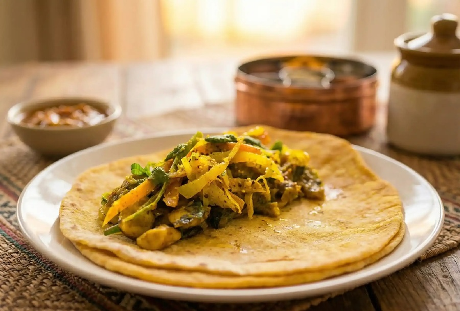

# Dholl Puri

*Mauritius's street flatbread: thin breads stuffed with seasoned ground yellow split peas, griddled hot and folded around bean curry.*

**Serves:** 4 (makes 8 dholl puris)

**Prep Time:** 30 minutes (plus 4 hours soaking)

**Cook Time:** 45 minutes

## Overview
Dholl puri is the bread, not the wrap. What you are making is a soft, lightly elastic flatbread with a stuffing of cooked, drained, finely ground yellow split peas seasoned with turmeric, cumin and a little salt. The dough is wrapped around the filling like a stuffed paratha, then rolled paper-thin (a real Mauritian dholl puri vendor rolls them so thin you can read newsprint through them) and cooked dry on a hot tawa with just a brush of oil. The challenge is keeping the filling completely dry; any moisture and the dholl ruptures when you roll it. Mauritians eat dholl puri folded in half or quartered around a small spoonful each of cari gros pois (butter bean curry), rougaille (tomato sauce) and either a coriander satini or a fiery mazavaroo chilli paste. The dough handling takes practice but is forgiving; a slightly thicker first attempt still tastes excellent.

## Ingredients

### Split-pea filling
- 200 g yellow split peas (toor or chana dal also work, but yellow split peas are traditional)
- 1 tsp ground turmeric
- 1 tsp ground cumin
- ¾ tsp salt
- ½ tsp freshly ground black pepper

### Dough
- 400 g plain flour, plus extra for dusting
- ½ tsp ground turmeric
- ½ tsp salt
- 2 tbsp neutral oil
- 220 ml warm water (approx, add as needed)

### For cooking
- 3-4 tbsp neutral oil, for brushing the tawa

### Typical accompaniments (assemble on the side)
- Butter bean curry (cari gros pois)
- Rougaille tomato sauce
- Coriander satini (or mazavaroo chilli paste)
- Wedge of lime

## Method

### Stage 1 - Cook and dry the split peas
1. Rinse the split peas in cold water until the water runs clear. Soak in plenty of cold water for 4 hours (or overnight).
2. Drain and put the soaked peas in a saucepan with fresh cold water to cover by 2 cm. Bring to a boil, skim off any foam, and simmer 12-15 minutes until tender but not mushy; the peas should still hold their shape and not break when pressed between thumb and finger.
3. Drain very thoroughly. Spread the peas on a tray lined with a clean tea towel and pat them dry. Let them air-dry 10-15 minutes. This is the most important step; wet filling tears the dholl puri.
4. Tip the cooled peas into a food processor with the turmeric, cumin, salt and pepper. Pulse to a fine, dry, crumbly powder that just holds together when squeezed. Do not pulse to a paste; if your peas were too wet, the texture will go gluey. Set aside.

### Stage 2 - Make the dough
1. Mix the flour, turmeric and salt in a wide bowl. Add the 2 tbsp oil and rub through with your fingers.
2. Pour in the warm water gradually, mixing as you go, until you have a soft, slightly sticky dough. You may not need all of the water.
3. Turn out and knead 6-8 minutes until smooth and elastic. The dough should feel softer than a roti dough, closer to a pizza dough.
4. Cover with a damp cloth and rest 20 minutes.

### Stage 3 - Stuff and shape
1. Divide the dough into 8 equal pieces (around 80 g each). Roll each into a smooth ball.
2. Take one ball, flatten it in your palm to a disc about 8 cm across, with the edges slightly thinner than the middle.
3. Place 2 heaped tbsp of the split-pea powder in the centre. Gather the edges of the dough up over the filling and pinch firmly to seal into a parcel. Roll it gently between your palms to even it out, then flatten very lightly. Repeat with the rest.
4. Rest the stuffed balls under a cloth 10 minutes; this lets the dough relax so it rolls without splitting.

### Stage 4 - Roll out
1. Dust a clean surface lightly with flour. Place one stuffed ball, sealed-side down, and dust the top.
2. Roll out gently from the centre outwards, turning a quarter-turn between each pass, into a thin round about 22-24 cm across. Pressure should be even and light; if filling pokes through, dust a bit of flour over the tear and keep rolling.
3. Set the rolled dholl puri on a tray dusted with flour. Do not stack them or they will stick.

### Stage 5 - Cook on the tawa
1. Heat a flat tawa, crepe pan or large frying pan over medium-high heat for 2 minutes until properly hot.
2. Lay a rolled dholl puri onto the dry pan. Cook 30-40 seconds until small bubbles appear on the surface and the underside has light brown spots.
3. Flip with a wide spatula. Brush a teaspoon of oil over the cooked surface and around the edge. Cook 30 seconds.
4. Flip again, brush the other side with a little oil, and cook a final 20-30 seconds. The dholl puri should be soft, pliable and lightly speckled, never crisp.
5. Stack the cooked dholl puris on a plate covered with a clean cloth so they stay soft and warm. Repeat with the rest.

## Notes
- **Dry filling is everything:** any moisture in the split-pea powder is the single most common reason dholl puris tear. Cook the peas just-tender, drain hard, dry on a cloth, and pulse to a powder, not a paste.
- **Soft dough, not stiff:** a stiff dough resists rolling and tears the filling open. The dough should feel slightly tacky to the hand but not gluey.
- **Tawa heat:** medium-high is right. Too cool and the bread dries out before colouring; too hot and the outside browns before the inside cooks through.
- **Keep them soft after cooking:** an upturned bowl or clean tea towel over the stack traps the steam and keeps the dholl puris pliable for serving.

## Variations
- **Chana dal version:** Some Mauritian cooks use chana dal (split chickpeas) for a nuttier, slightly coarser filling. Cooking method is the same; soak overnight.
- **Spicier filling:** A pinch of ground roasted cumin and a tiny pinch of cayenne in the filling powder gives a sharper edge.

## Serving
- Lay a warm dholl puri flat on a plate. Spoon a strip of butter bean curry down the centre, a spoon of rougaille, and a small dab of coriander satini or chilli paste. Fold in half or quarter and eat by hand. A wedge of lime on the side cuts through the spice.

## Storage
- Best eaten fresh from the pan. Will keep soft 4-5 hours wrapped in a clean cloth at room temperature.
- Refrigerated dholl puris go stiff; reheat 20 seconds per side on a dry tawa to soften back up.
- Freeze cooked and cooled dholl puris stacked between sheets of greaseproof paper for up to 1 month; defrost and reheat on a dry pan.
