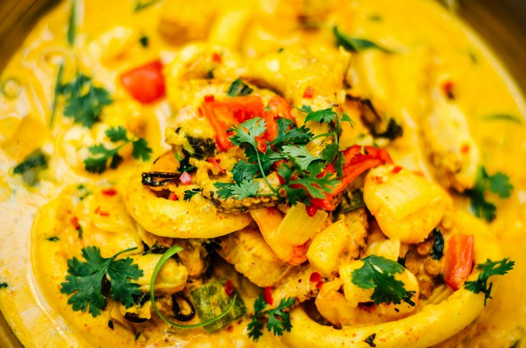

# Octopus Curry (Cari Ourite)

*A Mauritian Creole curry: octopus simmered with thyme, tomato and garam masala till the tentacles are tender and the gravy dark, glossy and smoky.*

**Serves:** 4

**Prep Time:** 25 minutes

**Cook Time:** 1 hour

## Overview
Cari ourite is the dish that turns up at every Mauritian fisherman's Sunday lunch, and at every Creole restaurant on the south coast. The technique is to braise octopus low and slow in a tomato-and-onion masala that leans on fresh thyme and a finishing pinch of garam masala instead of the heavier dried-spice masalas you find in cari boeuf or cari poulet. Octopus has a sweet, slightly mineral flavour that needs space, so the seasoning is restrained: thyme for aroma, tomato for body, ginger and garlic for the base, mild curry powder for depth, garam masala right at the end for top-note warmth. The biggest variable is the octopus itself; small frozen octopus, sold cleaned at most fishmongers and many supermarkets, is reliable, and freezing actually helps tenderise the flesh. Served with plain steamed rice and a satini cotomili (coriander chutney) or a spoon of pickled chilli, with a simple green salad and vinaigrette on the side.

## Ingredients

### Octopus
- 1 kg cleaned octopus (small octopus or a single octopus cut into pieces; frozen is fine and arguably better)
- 1 tbsp white vinegar
- ½ tsp salt

### Masala base
- 3 tbsp neutral oil
- 2 onions (medium, finely chopped)
- 6 garlic cloves (minced)
- 20 g fresh ginger (grated)
- 2 sprigs fresh thyme
- 10 fresh curry leaves (optional but traditional)
- 1 green chilli (slit lengthways)
- 3 tomatoes (medium, about 350 g, finely chopped)
- 1 tbsp tomato paste

### Spices
- 1 ½ tbsp mild [Curry Powder](../../base-ingredients/curry-powder/bir-curry-powder.md) (Mauritian or Madras)
- 1 tsp ground cumin
- ½ tsp ground coriander
- ½ tsp sweet paprika
- ¼ tsp ground turmeric
- 1 tsp [Garam Masala](../../base-ingredients/curry-powder/garam-masala.md) (added at the end)

### To finish
- 250 ml water (or light fish stock)
- Salt, to taste
- Small handful chopped fresh coriander
- Wedge of lime

## Method

### Stage 1 - Prepare the octopus
1. If using frozen octopus, defrost overnight in the fridge. Rinse under cold water.
2. Cut large octopus into 4-5 cm pieces; small octopus can be left whole or halved through the body.
3. Bring a large pot of water to a boil with the vinegar and salt. Drop the octopus in and blanch 2 minutes. Drain and pat dry. This firms the flesh and rinses off any iodine bitterness.

### Stage 2 - Build the masala
1. Heat the oil in a heavy pan or casserole over medium heat.
2. Add the onions and cook 8-9 minutes until soft and just golden at the edges.
3. Stir in the garlic, ginger, thyme sprigs, curry leaves and slit chilli. Cook 1 minute until fragrant.
4. Mix the curry powder, cumin, coriander, paprika and turmeric with 3 tbsp water to make a paste. Stir into the pan and cook 60-90 seconds until the oil shimmers around the edges of the masala. This bloom is what builds the curry's depth.
5. Add the tomato paste and stir 1 minute.

### Stage 3 - Tomato and braise
1. Add the chopped tomatoes and ½ tsp salt. Cover and cook 6-8 minutes, stirring once, until the tomatoes collapse into a thick sauce.
2. Uncover and mash any chunks with the back of a spoon.
3. Add the blanched octopus, turning each piece through the masala. Cook 3-4 minutes, stirring, so the octopus is coated.
4. Pour in the water (or fish stock). Bring to a simmer.
5. Cover and braise on low heat for 40-55 minutes, stirring every 15 minutes, until the octopus is fork-tender. Smaller pieces finish faster; check by piercing a tentacle.

### Stage 4 - Finish
1. Uncover and check the sauce; if too loose, raise the heat and reduce 5 minutes. The gravy should coat the octopus, not pool around it.
2. Taste for salt.
3. Sprinkle the garam masala over and stir through. Take off the heat.
4. Scatter chopped coriander on top.

## Notes
- **Frozen octopus is your friend:** freezing breaks down the muscle fibres, so frozen-then-thawed octopus is more tender than fresh. Look for small octopus or cleaned tentacles at the fishmonger.
- **Cleaning fresh octopus:** if you have whole fresh octopus, remove the beak from the centre of the tentacles and the ink sac and innards from the body. Rinse well, then rub with coarse salt under cold running water to remove the surface slime. Blanch as above.
- **Garam masala at the end:** Mauritian Creole cooks add garam masala in the final minute off the heat so its aromatics don't cook away. Stirring it into a hot pan is enough.
- **Don't overcook:** octopus that is left simmering for too long goes back to rubbery. Check from 40 minutes and stop the moment a tentacle gives easily under a fork.

## Variations
**Cari ourite ti pwa:** Add a handful of cooked white beans or butter beans in the last 10 minutes for a slightly heartier version.
**Coconut version:** A 100 ml splash of coconut milk in the last 5 minutes gives a softer, sweeter gravy. Not classical but common on the west coast.

## Serving
Serve over plain steamed rice with a satini cotomili (coriander chutney) and a spoon of chilli pickle. A wedge of lime to squeeze over at the table. A simple green salad with a sharp vinaigrette on the side balances the richness.

## Storage
- Tastes even better the next day; the octopus continues to relax and absorb the gravy. Keeps 3 days refrigerated.
- Reheat gently on the hob with a splash of water; do not microwave on high or the octopus will toughen.
- Freezes well up to 2 months. Defrost overnight in the fridge and reheat slowly.
