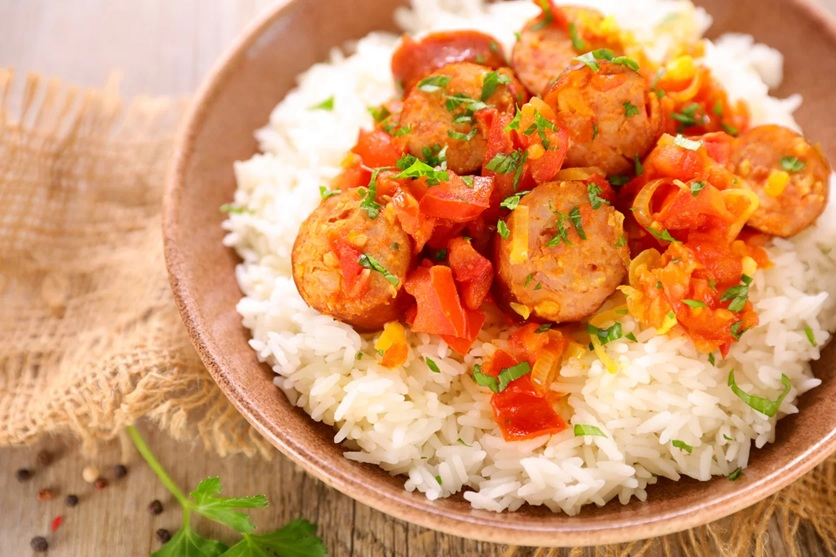

# Rougaille Saucisse

*Mauritius's everyday tomato stew: onion, ginger, garlic and fresh thyme bloomed in oil, simmered long with ripe tomatoes and braised smoked sausages.*

**Serves:** 4

**Prep Time:** 15 minutes

**Cook Time:** 40 minutes

## Overview
Rougaille is the workhorse tomato sauce of Mauritian Creole cooking, used as a condiment with dholl puri, as a sauce for fried fish, and (most often) as the base of a one-pot meal with sausage, salt cod or eggs. The structure is simple but specific: onion softened slowly in oil, then ginger, garlic, chilli and fresh thyme bloomed in that oil, then a long-cooked mound of ripe tomatoes broken down until the oil splits and the sauce darkens. No curry powder, no garam masala, no coconut milk; rougaille belongs to the Creole rather than the Indo-Mauritian tradition, and its identity is the herbal punch of thyme and ginger against tomato. Rougaille saucisse, the version with smoked Mauritian-style sausages, is the textbook home preparation. Use any decent smoked, coarse-cut pork sausage; in the UK, smoked chipolatas or Polish kielbasa are good stand-ins. Difficulty is low and the cook is mostly passive. Serve with rice, a few leaves of bredes (sauteed greens) and a chilli pickle on the side.

## Ingredients

### Sausage
- 500 g smoked pork sausages (Mauritian saucisses if you can find them; smoked chipolatas, kabanos or kielbasa are good substitutes)

### Sauce base
- 3 tbsp neutral oil
- 2 onions (large, about 350 g, halved and thinly sliced)
- 6 garlic cloves (minced)
- 25 g fresh ginger (grated)
- 2-3 sprigs fresh thyme (leaves stripped, plus 1 whole sprig)
- 2 green chillies (or red chillies, 1 slit, 1 finely chopped; adjust to taste)
- 6 ripe medium tomatoes (about 700 g, finely chopped)
- 1 tbsp tomato paste
- 1 tsp sugar (optional, balances tomato acidity)
- ¾ tsp salt (or to taste)
- Freshly ground black pepper
- 150 ml water
- Small handful chopped fresh coriander
- 3 spring onions (thinly sliced)

## Method

### Stage 1 - Brown the sausages
1. Score each sausage with 2-3 shallow diagonal cuts to help the flavour penetrate.
2. Heat 1 tbsp of the oil in a heavy wide pan over medium heat.
3. Brown the sausages on all sides, about 6-8 minutes. They will not be cooked through; you only want colour. Lift out and set aside.

### Stage 2 - Build the sauce
1. Add the remaining 2 tbsp oil to the same pan. Tip in the sliced onions and a small pinch of salt.
2. Cook 10-12 minutes over medium-low heat, stirring occasionally, until the onions are very soft and just turning gold. Do not rush; this is where the body of the sauce comes from.
3. Add the garlic, ginger, picked thyme leaves, whole thyme sprig and slit chilli. Cook 1-2 minutes until fragrant.
4. Stir in the tomato paste and cook 1 minute.

### Stage 3 - Tomato cook-down
1. Add the chopped tomatoes, sugar, salt and a few grinds of black pepper. Stir well.
2. Cover and cook 8-10 minutes until the tomatoes have collapsed.
3. Uncover and mash the tomatoes lightly with the back of a wooden spoon. Cook a further 5-6 minutes until the sauce has darkened and the oil starts to separate at the edges.

### Stage 4 - Braise the sausages
1. Return the browned sausages to the pan along with any juices.
2. Pour in the water and add the finely chopped chilli.
3. Bring to a gentle simmer, cover, and cook 12-15 minutes, turning the sausages once. The sauce should be thick and glossy.
4. Uncover for the last 3 minutes if the sauce needs to reduce further; it should cling to the sausages rather than pool around them.
5. Taste for salt. Discard the whole thyme sprig.

### Stage 5 - Finish
1. Scatter the coriander and spring onions over the top.
2. Serve from the pan to the table.

## Notes
- **Smoked, not fresh:** the sausage needs to be smoked and well-seasoned; a fresh, mild banger gets lost in the sauce. Kabanos, smoked Polish kielbasa or Spanish-style smoked sausages all work well as substitutes.
- **Fresh thyme is non-negotiable:** rougaille without thyme is just tomato sauce. Use at least the stripped leaves of 2 sprigs.
- **Onions first, properly:** the slow soft-cooking of the onions is what gives the sauce its sweetness and body. Rushing this stage gives you a thin, raw-tasting sauce.
- **Tomato quality:** if your tomatoes are pale and watery, supplement with an extra spoon of tomato paste; out-of-season tinned plum tomatoes are better than poor fresh ones.

## Variations
**Rougaille poisson sale:** Replace the sausage with 300 g salt cod (soaked overnight, drained, flaked) added in Stage 4. A classic of the Mauritian east coast.
**Rougaille zef:** Crack 4-6 eggs into divots in the sauce in the final 5 minutes and cover until just set. Breakfast on the island.
**Rougaille boucane:** Use 250 g smoked dried meat (boucane) or lardons in place of sausage for a deeper, smokier sauce.

## Serving
Serve over plain steamed white rice. A side of sauteed bredes (chayote tops, watercress or spinach with garlic), a small bowl of pickled chilli or chatini pomme d'amour (raw tomato chutney) and a wedge of lime complete the plate.

## Storage
- Keeps 3 days refrigerated. The sauce thickens on chilling and reheats beautifully.
- Reheat gently on the hob with a splash of water if needed.
- Freezes up to 2 months. The sausage texture stays excellent.
