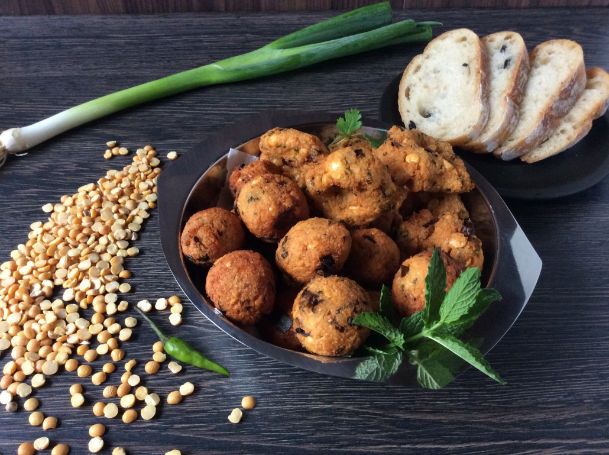

# Gâteau Piment

*Mauritius's signature street snack: small deep-fried fritters of split yellow peas (dahl), fresh coriander, cumin, green chillies and curry leaves. The crisp golden balls served with chilli sauce from every street vendor in Port Louis and Curepipe, eaten with chai or stuffed into a fresh baguette for "pain gâteau piment".*

**Serves:** Makes about 20 fritters

**Prep Time:** 25 minutes (plus 4 hours soaking)

**Cook Time:** 25 minutes

## Overview
Gâteau piment (literally "chilli cake" in Mauritian French) is the iconic street fritter of Mauritius: a small golden ball of seasoned split-yellow-pea mash deep-fried till crisp outside and tender inside. Split yellow peas (dahl) are soaked, coarsely ground with onion, garlic, ginger, coriander, spring onion, green chilli, curry leaves, cumin and turmeric, shaped into small balls and deep-fried till deep golden. They turn up at every street stall across the island, eaten with sweet milky chai or stuffed into a fresh baguette for pain gâteau piment (four or five hot fritters in a split baguette with chutney). The name comes from the chillies in the mix, but the fritters are not particularly hot; they lean savoury-aromatic rather than spicy. The dahl must soak overnight or the grind is gritty. The grind should be coarse, not smooth; a purée compacts rather than crumbles. Fry at 170°C; hotter burns the outside, cooler goes greasy.

## Ingredients

- 250 g split yellow peas (chana dahl; also called chickpea split lentils; soak in cold water 4-8 hours, then drain)
- 1 medium onion (finely chopped)
- 6 garlic cloves (crushed)
- 2 cm fresh ginger (finely grated)
- 1 large handful fresh coriander (about 40 g; finely chopped, stems included)
- 3 spring onions (finely sliced)
- 2-3 fresh green chillies (Mauritian green chillies if available; or jalapeño; finely chopped; deseed for milder)
- 8 fresh curry leaves (finely chopped; or use 1 teaspoon dried curry leaves crumbled)
- 1 teaspoon ground cumin
- ½ teaspoon ground turmeric
- ½ teaspoon ground black pepper
- 1 ½ teaspoons fine sea salt
- 1 teaspoon baking powder
- Vegetable oil for deep-frying (about 1 litre; or enough for 7-8 cm depth in your pan)

### To serve
- Mauritian chilli sauce (or any Indian-Mauritian green chutney; or sriracha)
- Fresh baguettes (if making pain gâteau piment)
- Mauritian milky chai

## Method

### Stage 1 - Soak the dahl
1. Place the split yellow peas in a bowl; cover with cold water by 5 cm.
2. Soak for 4-8 hours (or overnight) till the peas have swollen and softened. They should yield slightly when pressed but still have texture; they don't need to be fully soft (the cooking will finish that).
3. Drain thoroughly; rinse under cold water.

### Stage 2 - Coarsely grind the dahl
1. Place the drained dahl in a food processor.
2. Pulse 8-10 times till the dahl is coarsely ground; you want small visible bits of pea, not a smooth paste.
3. If you don't have a food processor, mash with a potato masher in a wide bowl till you reach a coarse mash with visible texture.

### Stage 3 - Mix the fritter dough
1. Tip the coarsely ground dahl into a wide bowl.
2. Add the chopped onion, crushed garlic, grated ginger, chopped coriander, sliced spring onion, chopped green chillies and chopped curry leaves.
3. Add the cumin, turmeric, black pepper and salt.
4. Mix thoroughly with your hands or a wooden spoon till everything is evenly distributed.
5. Add the baking powder; mix in just before frying (don't add hours ahead; the baking powder loses power if left mixed in too long).
6. Test the consistency: scoop up a tablespoon and squeeze in your hand. It should hold its shape; if it crumbles, add 1-2 tablespoons of water and mix again.

### Stage 4 - Heat the oil
1. Pour vegetable oil into a deep heavy saucepan or wok to a depth of 7-8 cm.
2. Heat over medium-high heat till it reaches 170°C (340°F). Check with a thermometer, or drop a small piece of dough into the oil: it should rise to the surface and bubble immediately but not brown instantly. If the dough sinks and stays put, the oil is too cool; if it browns in seconds, too hot.

### Stage 5 - Shape and fry
1. Scoop heaped teaspoons of the dough and shape into balls about 2-2.5 cm across (slightly smaller than a walnut).
2. Drop into the hot oil one at a time; don't overcrowd; fry in batches of 8-10.
3. Fry 4-5 minutes, turning gently with a slotted spoon, till the fritters are deep golden-brown all over and cooked through.
4. Lift out with the slotted spoon; drain briefly on kitchen paper.
5. Fry the remaining batches the same way.

### Stage 6 - Serve immediately
1. Pile the hot fritters on a serving plate.
2. Serve with chilli sauce or chutney for dipping.
3. For pain gâteau piment: split a fresh baguette lengthwise; stuff with 4-5 hot fritters and a spoonful of chutney.
4. Eat hot; the fritters lose their crispness as they cool.

## Notes
- **Soak the dahl properly:** 4 hours is the minimum; overnight is better. Under-soaked dahl gives gritty fritters. Don't try to skip with hot water.
- **Coarse grind, not smooth:** the traditional Mauritian texture has visible bits of pea, onion and coriander. A smooth purée gives wrong-textured fritters that compact rather than crumble. Pulse the food processor 8-10 times max.
- **Oil at 170°C:** higher and the outside burns; lower and the fritters absorb oil. A thermometer is the easy way; the dough-drop test works too.
- **Don't add the baking powder too early:** baking powder loses potency once mixed into a wet dough. Add it just before frying.
- **Test one fritter first:** before frying the whole batch, fry just one and check the texture and seasoning. Adjust salt or chilli before the next batch.

## Variations
**Curry-leaf-forward version:** double the curry leaves; gives a more aromatic fritter that's properly south-Indian-Mauritian. Particularly good with chai.
**With dried shrimp:** add 1 tablespoon of finely chopped dried shrimp to the dough; gives an umami depth common in coastal Mauritian variants.
**Spicier:** double the chillies and add ½ teaspoon of red chilli powder; gives the properly fierce version that some Mauritian street stalls make.
**Lentil-and-chickpea version:** use a 50/50 mix of split yellow peas and red split lentils; gives a slightly softer fritter with a different colour.

## Serving
With chilli sauce or coriander chutney for dipping. Or stuffed into a fresh baguette with chutney as pain gâteau piment (the Mauritian breakfast sandwich). With a cup of strong milky chai or sweet milky coffee. As an appetiser before a Mauritian curry meal, or as snack food alongside rougaille and rice.

## Storage
- Best eaten immediately while hot and crisp; they go off-texture as they cool.
- Keep refrigerated 3 days in a sealed container; reheat in a hot oven (180°C / 350°F) for 5-7 minutes till crisp again, or in an air fryer for 4 minutes at 180°C.
- Don't microwave; they go limp and rubbery.
- The dough can be made and refrigerated for up to 24 hours before frying; add the baking powder just before shaping and frying.
- Cooked fritters freeze 2 months; reheat from frozen in a hot oven for 8-10 minutes.
