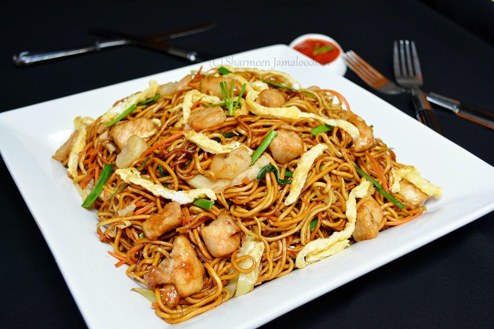

# Mine Frites

*Mauritius's wok-fried noodle dish: yellow egg noodles flash-fried with prawns, chicken or just vegetables in a hot wok with soy, oyster sauce, garlic, fresh chilli, spring onion and bean sprouts. The Mauritian-Chinese street classic eaten at lunch from cardboard containers across Port Louis.*

**Serves:** 4

**Prep Time:** 25 minutes

**Cook Time:** 15 minutes

## Overview
Mine frites is the Mauritian Chinese-style fried noodles, brought to the island by Hakka immigrants in the 19th century and now thoroughly part of Mauritian street-food culture: yellow Hakka-style egg noodles flash-fried in a screaming-hot wok with prawns and chicken (or one, or vegetables only) with garlic, fresh chilli, soy, oyster sauce, a touch of fish sauce, spring onion and bean sprouts, finished with a squeeze of lime and a sprinkle of fried garlic. It is what every Mauritian eats from cardboard noodle boxes at the night markets in Port Louis, Curepipe and Mahébourg, the indispensable lunchtime quick-and-easy. The technique is short and demanding. Two non-negotiables. The noodles must come out of the boiling water just al dente; overcooked noodles turn to mush in the wok. The wok must be properly hot: cold pan gives steamed wet noodles, smoking pan gives proper wok-hei character. If a domestic stove can't get a wok screaming hot, a heavy cast-iron pan helps with residual heat.

## Ingredients

### Noodles
- 500 g fresh yellow Hakka egg noodles (or 300 g dried egg noodles, cooked according to packet instructions to al dente)

### Protein
- 200 g raw prawns (peeled, deveined)
- 250 g chicken thigh (cut into 1 cm strips; marinate in 1 tablespoon soy sauce and 1 teaspoon cornflour for 15 minutes)

### Aromatics
- 6 garlic cloves (finely chopped)
- 1 thumb (2 cm) fresh ginger (finely grated)
- 2 fresh red chillies (finely chopped; deseed for milder)
- 4 spring onions (white parts thinly sliced, green parts cut into 4 cm lengths separately)

### Vegetables
- 200 g fresh bean sprouts
- 1 medium carrot (julienned)
- 1 small green pepper (julienned)
- 100 g pak choi (or Chinese cabbage; roughly chopped)

### Sauce
- 4 tablespoons light soy sauce
- 2 tablespoons oyster sauce
- 1 tablespoon dark soy sauce (for colour)
- 1 tablespoon fish sauce
- 1 tablespoon caster sugar
- 1 teaspoon Chinese black vinegar (or rice vinegar)
- 100 ml chicken stock (or water)

### Cooking oil
- 4 tablespoons vegetable oil (or peanut oil)

### To finish
- 2 tablespoons fried garlic (homemade or shop-bought)
- 1 fresh red chilli (sliced)
- 1 lime (cut into wedges)
- Mauritian chilli sauce (or sriracha)

## Method

### Stage 1 - Cook the noodles
1. Bring a large pot of water to a boil; salt lightly.
2. Add the noodles; cook 60-90 seconds (for fresh) or according to packet instructions to just al dente (for dried).
3. Drain in a colander; rinse briefly under cold water to stop the cooking; drain again thoroughly.
4. Toss the noodles with 1 tablespoon of oil to prevent sticking; set aside.

### Stage 2 - Marinate the chicken
1. In a small bowl, toss the chicken strips with 1 tablespoon soy sauce and 1 teaspoon cornflour.
2. Set aside while you prep other ingredients (15 minutes minimum).

### Stage 3 - Pre-mix the sauce
1. Combine the light soy, oyster sauce, dark soy, fish sauce, sugar, vinegar and stock in a small bowl.
2. Whisk together; set near the stove.

### Stage 4 - Stir-fry the protein
1. Heat 2 tablespoons of the oil in a wok (or wide heavy frying pan) over high heat till smoking.
2. Add the marinated chicken strips; stir-fry 2-3 minutes till just cooked through and lightly browned.
3. Push the chicken to one side of the wok.
4. Add the prawns to the cleared space; stir-fry 90 seconds till pink and curled.
5. Transfer chicken and prawns to a plate; keep warm.

### Stage 5 - Stir-fry the aromatics and vegetables
1. Add the remaining 2 tablespoons of oil to the wok.
2. Add the chopped garlic, grated ginger, chopped chillies and the white parts of the spring onions; stir-fry 30 seconds till fragrant.
3. Add the julienned carrot and green pepper; stir-fry 1 minute.
4. Add the pak choi (or cabbage); stir-fry 1 minute more till just starting to wilt.

### Stage 6 - Add noodles and sauce
1. Tip in the cooked noodles.
2. Pour the pre-mixed sauce around the edges of the wok.
3. Return the chicken and prawns to the wok.
4. Toss everything together over high heat for 2 minutes till the sauce coats the noodles and reduces slightly to a glossy coating. Use tongs and a wooden spoon to lift and turn the noodles continuously; don't let them stick.

### Stage 7 - Finish
1. Add the bean sprouts and the green parts of the spring onions.
2. Toss 30 seconds more; the bean sprouts should warm through but stay crisp.
3. Take off the heat.
4. Taste; adjust with more soy if needed or a splash of vinegar to brighten.

### Stage 8 - Serve
1. Transfer to a serving platter or into individual bowls.
2. Scatter the fried garlic and sliced chilli over.
3. Place lime wedges around the edges.
4. Serve immediately with chilli sauce on the side; eat with chopsticks (or a fork for the proper Mauritian street style).
5. Each diner squeezes their own lime over their portion.

## Notes
- **Noodles al dente, not soft:** the noodles cook again in the wok with the sauce; if you cook them all the way through first, they go to mush in the wok. 60-90 seconds for fresh, just shy of packet time for dried.
- **Screaming-hot wok:** the wok must be smoking before the oil goes in. Cold pan steams the food; hot pan gives proper wok-hei. If your stove can't deliver, use cast iron.
- **Cook the protein first, then the aromatics:** this gives the proper layering of flavour. Throwing everything into the wok at once gives soggy steam-cooked mess.
- **Sauce around the edges:** pouring the sauce around the edges of the hot wok lets it sizzle and reduce slightly as it hits, rather than just sloshing into the noodles; this gives proper wok flavour.
- **Add bean sprouts last:** bean sprouts go from crisp to soggy in 30 seconds. Add them at the very end and toss briefly; the residual heat is enough to take the raw edge off without ruining the crunch.

## Variations
**Vegetable mine frites (vegetarian):** skip the chicken and prawns; add 200 g of cubed firm tofu (pre-fried) and 200 g of mushrooms instead. Add 2 tablespoons of vegetarian "mushroom oyster sauce" in place of regular oyster sauce.
**Mine frites special:** add 2 fried eggs over the top of the noodles just before serving; the runny yolks mix through. Common Port Louis street-stall option.
**Crab mine frites:** swap the prawns for 200 g of fresh crab meat (picked); add 1 extra tablespoon of soy. A more luxurious version sold at Mahébourg waterfront restaurants.
**Spicy mine frites:** double the fresh chillies and add 1 tablespoon of chilli oil to the finished noodles; gives the properly fierce variation that some Mauritian-Chinese restaurants make.

## Serving
On a large platter or in individual cardboard street-food boxes (for the proper Mauritian experience). Lime wedges on the side, chilli sauce in a small bowl. Eat with chopsticks; or a fork. Drink: Phoenix beer (the Mauritian lager), or a chilled glass of vanilla tea.

## Storage
- Best eaten immediately while hot; the noodles go off-texture as they cool.
- Keeps refrigerated 2 days; reheat in a hot wok or pan with 2 tablespoons of water (or stock) for 2-3 minutes till piping hot.
- Don't microwave; the noodles go rubbery.
- Don't freeze; the texture suffers.
- Day-old mine frites makes excellent fried-noodle "omelette": whisk 4 eggs with a teaspoon of soy; pour over the cold noodles in a hot pan; fry till the eggs set; flip and brown the other side.
