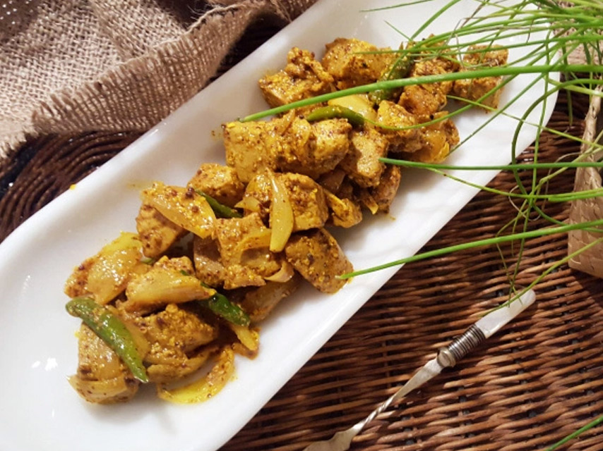

# Vindaye Poule

*The Mauritian pickle-curry: poached chicken steeped in a mustard-yellow paste of vinegar, turmeric, garlic and chilli, folded through softened onions.*

**Serves:** 4

**Prep Time:** 25 minutes (plus 12 hours resting)

**Cook Time:** 25 minutes

## Overview
Vindaye, sometimes written vindaille, is a Mauritian cousin of the Goan vindaloo and the wider Portuguese-Indian vinha d'alhos tradition: meat or fish preserved in vinegar, garlic and spice. On Mauritius it has settled into something very particular, defined by a bright yellow paste of ground mustard, turmeric, ginger and garlic, almost always served cold or at room temperature. Historically made with octopus or fish caught off the lagoon, both of which keep beautifully in the acid bath; vindaye poule, the chicken version, is the everyday weekday or picnic preparation. The chicken is poached, dressed in the paste with sliced onions, slivered ginger and green chillies, and left overnight to settle. By morning the vinegar has cut through the fat, the mustard has bloomed, and the dish is sharp, fragrant and refreshing in a way that hot curry simply isn't. It requires planning: vindaye eaten the day it's made tastes raw. Twelve to twenty-four hours in the fridge is what makes it a Mauritian classic.

## Ingredients

### Chicken
- 800 g boneless skinless chicken thighs
- 1 tsp salt
- 1 bay leaf
- 1 litre water

### Vindaye paste
- 3 tbsp yellow mustard seeds (ground)
- 1 tbsp ground turmeric
- 8 garlic cloves (minced)
- 30 g fresh ginger (half minced, half cut into fine slivers)
- 3 green chillies (slit lengthways)
- 120 ml white wine vinegar
- 60 ml neutral oil
- 1 tsp salt
- ½ tsp ground black pepper

### To finish
- 2 onions (medium, thinly sliced)
- 60 ml neutral oil
- 1 tsp black mustard seeds
- 2 tbsp white wine vinegar (extra, to adjust)

## Method

### Stage 1 - Poach the chicken
1. Bring the water to a simmer in a wide pan with the salt and bay leaf.
1. Add the chicken thighs and poach gently at a bare simmer for 15-18 minutes, until cooked through.
1. Lift the chicken out and let it cool until comfortable to handle. Discard the poaching liquid or save for stock.
1. Shred or cut the chicken into rough 3-4 cm pieces.

### Stage 2 - Make the vindaye paste
1. Combine the ground mustard seeds, turmeric, minced garlic, minced ginger, salt and pepper in a bowl.
1. Stir in the white wine vinegar and 30 ml of the oil to form a loose mustard paste.
1. Taste; it should be sharp and pungent. Set aside.

### Stage 3 - Fry the onions and aromatics
1. Heat the remaining 30 ml oil plus the 60 ml oil in a wide pan over medium heat.
1. Add the black mustard seeds. When they pop, after about 30 seconds, add the sliced onions, slivered ginger and slit green chillies.
1. Cook 6-8 minutes, stirring often, until the onions are soft and translucent but not browned.
1. Pour in the vindaye paste, lower the heat, and cook 2-3 minutes, stirring, until the raw vinegar smell has mellowed and the paste is glossy.

### Stage 4 - Dress and rest
1. Take the pan off the heat. Fold the shredded chicken through the paste and onions until every piece is coated yellow.
1. Taste and add the extra 2 tbsp of vinegar if you want it sharper.
1. Transfer to a non-reactive container (glass or ceramic), press down lightly to compact, cover, and refrigerate at least 12 hours, ideally overnight.
1. Serve cold or at room temperature with fresh pao, farata or plain rice.

## Notes
- **Rest is non-negotiable:** vindaye eaten on the day it is made tastes one-dimensional. Twelve to twenty-four hours in the fridge transforms it.
- **Yellow mustard, not Dijon:** the dish needs whole yellow mustard seeds, ground fresh in a spice grinder. Dijon paste contains acid and salt that throw off the balance.
- **Use a non-reactive container:** the vinegar will pick up metallic notes from aluminium or some stainless steel. Glass or ceramic is correct.
- **Adjust acidity at the end:** the right finish is sharp but not eye-watering. Add the final vinegar only after tasting.

## Storage
- Improves over the first 24-36 hours; keeps 4-5 days refrigerated in a sealed glass container.
- Eat straight from the fridge or let it sit at room temperature for 10 minutes before serving.
- Not suitable for freezing; the onions go limp and the texture suffers.
