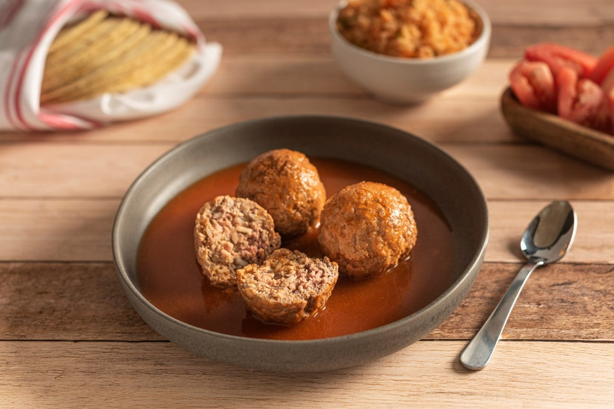

# Albóndigas en Chipotle

*Mexico's smoky chipotle meatballs: tender beef-and-pork meatballs simmered in a chipotle-tomato sauce, served over white rice with refried beans and warm corn tortillas.*

**Serves:** 4-6

**Prep Time:** 25 minutes

**Cook Time:** 45 minutes

## Overview
Albóndigas en chipotle is Mexico's most beloved meatball dish and a staple of Mexican home cooking. The traditional mix is 50/50 ground beef and pork, bound with soaked bread, egg, onion, garlic, Mexican oregano, cumin and a touch of fresh mint (a Spanish-Moorish inheritance that distinguishes the dish from generic meatballs). They simmer raw straight in a vibrant smoky chipotle sauce: blended tomatoes, garlic, onion, chipotles in adobo, cumin and oregano: and absorb its flavour as the sauce reduces to a thick smoky orange-red coating. Chipotles in adobo (smoked-and-canned jalapeños in their tomato-vinegar sauce) are the non-negotiable signature: smoked paprika plus a fresh jalapeño and tomato paste is the workable substitute. Eat over white rice with refried beans, warm corn tortillas, sliced avocado and lime wedges.

## Ingredients

### Meatballs
- 400 g ground beef (15% fat)
- 400 g ground pork
- 1 small onion (very finely chopped or grated)
- 4 garlic cloves (crushed)
- 60 g day-old white bread (no crust; soaked in 80 ml milk; squeezed)
- 1 large egg
- 1 tablespoon chopped fresh mint (or 1 teaspoon dried)
- 2 tablespoons chopped fresh coriander
- 1 tablespoon ground cumin
- 1 tablespoon dried Mexican oregano
- 1 teaspoon ground cinnamon
- 1 teaspoon fine sea salt
- 1 teaspoon ground black pepper

### Chipotle sauce
- 4 tablespoons vegetable oil
- 1 large onion (chopped)
- 6 garlic cloves (crushed)
- 2 tins (each 400 g) chopped tomatoes; or 1 kg fresh tomatoes (chopped)
- 3 tablespoons tomato paste
- 3-5 chipotle peppers in adobo sauce (chopped; from a 200 g tin); plus 2 tablespoons of the adobo sauce
- 1 tablespoon ground cumin
- 1 tablespoon dried Mexican oregano
- 1 teaspoon ground cinnamon
- 1 teaspoon brown sugar
- 1 ½ teaspoons fine sea salt
- 1 teaspoon ground black pepper
- 400 ml hot beef stock or water
- 2 bay leaves

### To finish
- 1 small bunch fresh coriander (chopped)
- 1 small bunch fresh mint (chopped, optional)
- Lime wedges

### To serve
- Plain white rice (or Mexican rice)
- Refried beans
- Warm corn tortillas
- Sliced avocado
- Mexican sour cream (crema)
- Crumbled queso fresco

## Method

### Stage 1 - Make the meatballs
1. In a wide bowl, combine the ground beef, ground pork, grated onion, crushed garlic, squeezed soaked bread, egg, mint, coriander, cumin, oregano, cinnamon, salt and pepper.
2. Mix thoroughly with hands for 2-3 minutes till cohesive and slightly sticky.
3. Refrigerate 15 minutes (firms up for easier shaping).

### Stage 2 - Shape the meatballs
1. With wet hands, shape into meatballs about 4 cm across (3-4 cm; smallish).
2. You should have about 24-28 meatballs.
3. Place on a tray.

### Stage 3 - Build the sauce
1. Heat the oil in a wide heavy pot over medium heat.
2. Add the chopped onion; cook 8 minutes till soft and starting to caramelise.
3. Add the crushed garlic; cook 30 seconds.
4. Add the tomato paste; cook 2 minutes till deepened.
5. Add the chopped tomatoes; cook 5 minutes till they break down.
6. Add the chopped chipotles in adobo (with their adobo sauce).
7. Stir in the cumin, oregano, cinnamon, brown sugar, salt and pepper.
8. Add the bay leaves.
9. Pour in the hot stock or water.
10. Simmer 5 minutes; if you want a smoother sauce, blitz with an immersion blender till smooth (or leave chunky).

### Stage 4 - Add the meatballs and cook
1. Gently lower the meatballs into the simmering sauce.
2. Spoon some sauce over the tops.
3. Reduce heat to low; cover with the lid slightly ajar.
4. Cook 25-30 minutes till the meatballs are cooked through and the sauce has reduced to a thick coating.
5. Don't stir too aggressively; let the meatballs cook gently.

### Stage 5 - Finish
1. Take off the heat.
2. Lift out the bay leaves.
3. Stir in most of the chopped coriander; reserve some for garnish.
4. Taste; adjust salt.

### Stage 6 - Serve
1. Spoon hot rice into deep plates.
2. Place 5-6 meatballs per plate with plenty of sauce.
3. Scatter the reserved coriander, crumbled queso fresco.
4. Sliced avocado, lime wedges, warm corn tortillas alongside.
5. Refried beans on the side.

## Notes
- **Chipotles in adobo:** essential for proper Mexican smoky flavour.
- **Mint in meatballs:** the Mexican touch; small amount but significant.
- **Cook meatballs in the sauce:** absorbs flavour; don't pre-cook in oil.
- **Don't stir aggressively:** the meatballs can break.
- **Bread-and-milk panada:** keeps the meatballs tender.

## Variations
**Chicken meatballs:** swap beef and pork for ground chicken; lighter version; cook 5 minutes less.
**Spicier:** double the chipotles and adobo; add 1 chopped fresh habanero; properly fierce.
**With raisins:** add 50 g of raisins to the meatballs; gives a sweet-savoury Mexican-Moorish touch.
**Soup version (sopa de albóndigas):** thin the sauce with more stock and serve as a brothy soup with the meatballs floating; common Mexican home version.

## Serving
Over hot white rice with the sauce ladled generously. Refried beans, warm corn tortillas, avocado, lime. Drink: cold Tecate or Modelo beer, agua de jamaica (hibiscus), or fresh limeade. As a Mexican weeknight family dinner.

## Storage
- Keeps refrigerated 5 days; flavour deepens.
- Reheat gently in a covered pan.
- Freezes 3 months.
- Day-old albondigas are even better; many Mexican cooks deliberately make a day ahead.
